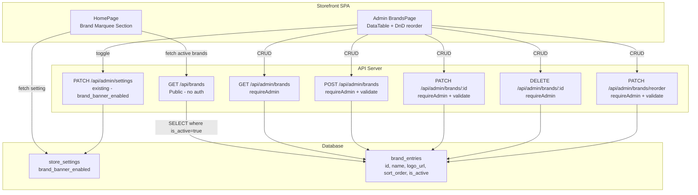

# Design Document: Admin Brand Banner Management

## Overview

This feature migrates the hardcoded brand logo marquee (18 SVG data URIs in `BRAND_LOGOS`) to a database-backed, admin-managed system. It introduces:

1. A `brand_entries` database table storing brand name, logo URL, sort order, and active status.
2. Admin CRUD API routes (`/api/admin/brands`) with Zod validation, audit logging, and reorder support.
3. A public API endpoint (`/api/brands`) for the storefront to fetch active brands.
4. A `brand_banner_enabled` toggle in `store_settings` controlling section visibility.
5. An admin management page (`/admin/brands`) with DataTable, drag-and-drop reorder, and toggle controls.
6. Updated storefront `HomePage` that dynamically fetches brands instead of using the hardcoded array.

## Architecture



## Components and Interfaces

### API Routes

#### Public Route: `GET /api/brands`

- **File**: `artifacts/api-server/src/routes/brands-public.ts`
- **Auth**: None (public, `platformStatus("storefront_read")` gated)
- **Response**: `BrandEntry[]` (active only, ordered by `sort_order` asc)
- **Pattern**: Mirrors existing `GET /api/banners` public endpoint

```typescript
interface BrandEntryPublic {
  id: string;
  name: string;
  logo_url: string;
  sort_order: number;
}
```

#### Admin Routes: `/api/admin/brands`

- **File**: `artifacts/api-server/src/routes/admin/brands-management.ts`
- **Auth**: `requireAdmin` middleware on all endpoints
- **Validation**: `validate(schema)` middleware with Zod schemas
- **Audit**: `writeAudit()` on create/update/delete

| Method | Path | Schema | Description |
|--------|------|--------|-------------|
| GET | `/admin/brands` | — | List all brands (ordered by sort_order) |
| POST | `/admin/brands` | `CreateBrandSchema` | Create brand (auto sort_order) |
| PATCH | `/admin/brands/reorder` | `ReorderBrandsSchema` | Bulk reorder (literal before `:id`) |
| PATCH | `/admin/brands/:id` | `UpdateBrandSchema` | Update single brand |
| DELETE | `/admin/brands/:id` | — | Delete brand |

**Route registration order**: `reorder` MUST be registered before `/:id` to avoid param shadowing (per project convention).

#### Zod Schemas

```typescript
// File: artifacts/api-server/src/routes/admin/schemas.ts (append)

const logoUrlPattern = /^(data:image\/svg\+xml|https:\/\/)/;

export const CreateBrandSchema = z.object({
  name: z.string().min(1).max(100),
  logo_url: z.string().min(1).max(100_000).regex(logoUrlPattern, 
    "Must be a data:image/svg+xml URI or https:// URL"),
  sort_order: z.number().int().min(0).max(999).optional(),
  is_active: z.boolean().optional(),
});

export const UpdateBrandSchema = z.object({
  name: z.string().min(1).max(100).optional(),
  logo_url: z.string().min(1).max(100_000).regex(logoUrlPattern).optional(),
  sort_order: z.number().int().min(0).max(999).optional(),
  is_active: z.boolean().optional(),
});

export const ReorderBrandsSchema = z.object({
  ids: z.array(z.string().uuid()).min(1).refine(
    (arr) => new Set(arr).size === arr.length,
    "Duplicate IDs are not allowed"
  ),
});
```

### Frontend Components

#### Admin Page: `BrandsPage`

- **File**: `artifacts/store/src/pages/admin/BrandsPage.tsx`
- **Route**: `/admin/brands` (registered in `App.tsx`)
- **Pattern**: Uses `useAdminList` hook + `DataTable` + `Pagination`
- **Features**:
  - Banner toggle at top (fetches/updates `brand_banner_enabled` via settings API)
  - DataTable with columns: logo preview, name, status toggle, actions (edit/delete)
  - Add form (dialog or inline) with name + logo_url fields
  - Drag-and-drop reorder with save button (using `@dnd-kit/sortable` or manual drag events)
  - `useConfirm()` + `<ConfirmDialog>` for delete actions

#### Storefront: Updated HomePage Brand Section

- **File**: `artifacts/store/src/pages/storefront/HomePage.tsx` (modify existing)
- **Changes**:
  - Remove `BRAND_LOGOS` import
  - Fetch `brand_banner_enabled` setting and active brands from API
  - Conditionally render marquee section based on setting + non-empty brands
  - Handle fetch errors gracefully (hide section, no error shown to user)
  - Handle individual image load errors (hide that brand entry)

### API Fetch Helpers

```typescript
// Admin: uses existing adminFetch pattern from lib/admin-fetch.ts
// Public: uses apiUrl() from lib/api.ts (no auth needed)
```

## Data Models

### Database Table: `brand_entries`

```sql
CREATE TABLE brand_entries (
  id UUID PRIMARY KEY DEFAULT gen_random_uuid(),
  name TEXT NOT NULL,
  logo_url TEXT NOT NULL,
  sort_order INTEGER NOT NULL DEFAULT 0 CHECK (sort_order >= 0 AND sort_order <= 999),
  is_active BOOLEAN NOT NULL DEFAULT true,
  created_at TIMESTAMPTZ NOT NULL DEFAULT now(),
  updated_at TIMESTAMPTZ NOT NULL DEFAULT now()
);

-- Case-insensitive unique constraint on name
CREATE UNIQUE INDEX brand_entries_name_unique ON brand_entries (LOWER(name));

-- Auto-update updated_at trigger (reuse existing pattern)
CREATE TRIGGER set_brand_entries_updated_at
  BEFORE UPDATE ON brand_entries
  FOR EACH ROW
  EXECUTE FUNCTION update_updated_at_column();

-- RLS
ALTER TABLE brand_entries ENABLE ROW LEVEL SECURITY;

-- Public read for active entries (storefront)
CREATE POLICY "Public can read active brand entries"
  ON brand_entries FOR SELECT
  USING (is_active = true);

-- Service role has full access (admin operations go through service role client)
```

### Seed Data

The 18 existing brands from `BRAND_LOGOS` will be seeded as the default dataset:

```sql
INSERT INTO brand_entries (name, logo_url, sort_order, is_active) VALUES
  ('Apple', 'data:image/svg+xml,...', 0, true),
  ('Samsung', 'data:image/svg+xml,...', 1, true),
  -- ... through index 17
  ('Razer', 'data:image/svg+xml,...', 17, true);
```

### Store Settings Entry

```sql
INSERT INTO store_settings (key, value, description)
VALUES ('brand_banner_enabled', 'true', 'Controls visibility of brand logo marquee on homepage')
ON CONFLICT (key) DO NOTHING;
```

## Correctness Properties

*A property is a characteristic or behavior that should hold true across all valid executions of a system — essentially, a formal statement about what the system should do. Properties serve as the bridge between human-readable specifications and machine-verifiable correctness guarantees.*

### Property 1: Settings Validation Rejects Invalid Values

*For any* string value that is not exactly `"true"` or `"false"`, updating the `brand_banner_enabled` setting SHALL return a 400 validation error; conversely, for `"true"` or `"false"`, it SHALL succeed.

**Validates: Requirements 1.7**

### Property 2: Case-Insensitive Name Uniqueness

*For any* brand name `N` stored in the database, attempting to create a new brand entry with a name that differs from `N` only in letter casing SHALL fail with a 409 conflict error.

**Validates: Requirements 2.2, 3.5**

### Property 3: Brand List Ordering Invariant

*For any* set of brand entries in the database, the GET list endpoint SHALL return them in strictly non-decreasing `sort_order` — that is, for each consecutive pair `(a, b)` in the result, `a.sort_order <= b.sort_order`.

**Validates: Requirements 3.1**

### Property 4: Auto-Increment Sort Order on Creation

*For any* sequence of brand creations (without explicit `sort_order`), each new entry SHALL receive `sort_order = max(existing sort_orders) + 1` (or 0 if no entries exist). The resulting sort_orders form a strictly increasing sequence.

**Validates: Requirements 3.2**

### Property 5: Partial Update Field Isolation

*For any* brand entry and any subset of allowed update fields (`name`, `logo_url`, `sort_order`, `is_active`), a PATCH request SHALL modify exactly those fields and leave all other fields unchanged (except `updated_at`).

**Validates: Requirements 3.3**

### Property 6: Request Body Validation

*For any* POST request body where `name` is missing, empty, or exceeds 100 characters, OR where `logo_url` is missing, empty, or does not start with `data:image/svg+xml` or `https://`, the Brand_API SHALL return a 400 validation error. Conversely, for bodies with a valid name (1–100 chars) and a valid logo_url (matching either prefix), the request SHALL pass validation.

**Validates: Requirements 2.4, 3.6, 3.8**

### Property 7: Reorder Assignment Correctness

*For any* permutation of all existing brand entry IDs submitted to the reorder endpoint, after the operation completes, each brand's `sort_order` SHALL equal its zero-based index position in the submitted array.

**Validates: Requirements 4.1**

### Property 8: Reorder Payload Validation

*For any* reorder payload that is not a non-empty array of unique valid UUID strings, OR that contains IDs not present in the database, OR that does not include every existing brand entry ID, the Brand_API SHALL return a 400 error.

**Validates: Requirements 4.2, 4.3, 4.4**

### Property 9: Marquee Rendering Correctness

*For any* non-empty array of active brand entries, the rendered marquee SHALL contain one link per brand with `href` equal to `/products?brand={name}`, each link SHALL have a `title` attribute equal to the brand name, and each image SHALL have `alt` text equal to the brand name and `src` equal to the brand's `logo_url`.

**Validates: Requirements 5.2, 5.5, 5.6**

## Error Handling

| Scenario | HTTP Status | Response | Client Behavior |
|----------|-------------|----------|-----------------|
| Unauthenticated admin request | 403 | `{ error: "Forbidden" }` | Redirect to login |
| Invalid request body (validation) | 400 | `{ error: "<Zod message>" }` | Show form errors |
| Duplicate brand name | 409 | `{ error: "Brand name already exists" }` | Show conflict message |
| Brand not found (PATCH/DELETE) | 404 | `{ error: "Brand not found" }` | Show not found message |
| Invalid reorder (incomplete/duplicates) | 400 | `{ error: "<description>" }` | Show validation message |
| Invalid `brand_banner_enabled` value | 400 | `{ error: "Value must be \"true\" or \"false\"" }` | Show validation message |
| Public brands API failure | — | — | Storefront hides section silently |
| Settings fetch failure | — | — | Storefront defaults to showing banner |
| Individual logo load failure | — | — | Hide that brand entry (onError handler) |
| Database error (unexpected) | 500 | `{ error: "Internal server error" }` | Generic error state |

**Error propagation strategy:**
- API errors auto-forward to Express 5 `errorHandler` (no manual try/catch for 500s)
- Explicit 4xx responses are inline in route handlers
- Storefront uses `try/catch` around fetch calls, failing gracefully to hidden state
- Image load errors handled via `onError` event on `` elements

## Testing Strategy

### Unit Tests (Property-Based)

Property-based tests using `fast-check` with vitest. Minimum 100 iterations per property.

**Target file**: `artifacts/store/src/__tests__/brand-management.test.ts` (validation logic) and `artifacts/api-server/src/__tests__/brand-routes.test.ts` (API logic)

| Property | What's Tested | Generator Strategy |
|----------|---------------|-------------------|
| P1: Settings validation | Validate accepts only "true"/"false" | `fc.string()` filtered to exclude "true"/"false" |
| P2: Name uniqueness | Case-insensitive comparison | `fc.string()` + random case transformation |
| P3: List ordering | Sort invariant on returned array | `fc.array(fc.record(...))` with random sort_orders |
| P4: Auto-increment | Max+1 assignment | `fc.array(fc.nat({max:999}))` for existing sort_orders |
| P5: Partial update | Field isolation | `fc.subarray(["name","logo_url","sort_order","is_active"])` |
| P6: Body validation | Zod schema boundary | `fc.record(...)` with valid/invalid combinations |
| P7: Reorder correctness | Permutation → index mapping | `fc.shuffledSubarray(ids, {minLength: n, maxLength: n})` |
| P8: Reorder validation | Reject malformed arrays | `fc.array(fc.string())` with injected invalidity |
| P9: Marquee rendering | DOM output verification | `fc.array(brandEntryArbitrary)` |

### Unit Tests (Example-Based)

- Admin auth enforcement (smoke: 403 without token)
- CRUD happy paths (create, read, update, delete)
- Delete with confirmation
- Public endpoint returns only active brands
- Banner toggle persists and reflects state
- Seed data presence (18 brands after migration)

### Integration Tests

- Full flow: create brand → appears in public API → renders on homepage
- Settings toggle: disable → homepage hides section
- Reorder flow: drag-and-drop → save → verify new order persists

### Property Test Configuration

- Library: `fast-check` (already available in project via vitest)
- Iterations: 100 minimum per property
- Tag format: `// Feature: admin-brand-banner-management, Property N: <title>`
