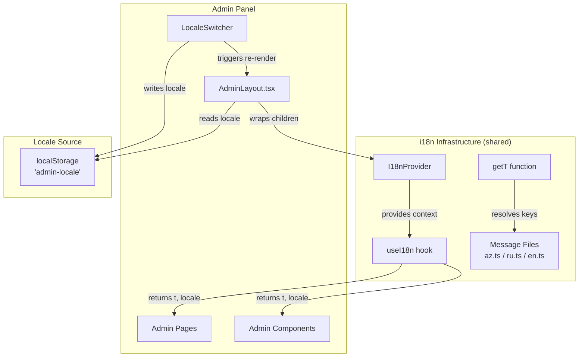

# Design Document: Admin Panel i18n

## Overview

This feature extends the existing storefront i18n infrastructure to cover the entire admin panel (`/admin/*` routes). The admin panel currently uses hardcoded English strings in all 16 pages and 14+ shared components. The design reuses the existing `I18nProvider`, `useI18n()` hook, and `t()` function — adding an admin-specific locale source (localStorage `admin-locale` key) and an `Admin.*` namespace in the message files.

The approach is deliberately non-invasive: no new libraries, no new contexts, no new translation function signatures. The storefront uses URL-based locale (`/az/`, `/ru/`, `/en/`); the admin panel uses localStorage-based locale. Both feed into the same `I18nProvider` → `useI18n()` → `t(key)` pipeline.

### Design Goals

1. **Reuse existing infrastructure** — same `I18nProvider`, `getT()`, `MessageKey` type
2. **Admin-specific locale management** — localStorage `admin-locale` key, independent of storefront URL prefix
3. **Complete coverage** — all 16 admin pages + all shared admin components
4. **Namespace isolation** — `Admin.*` keys never collide with storefront keys
5. **Type safety** — new keys get autocomplete via `MessageKey` union type
6. **Zero runtime regressions** — existing storefront i18n unchanged

## Architecture



### Locale Flow

1. `AdminLayout` mounts → reads `localStorage.getItem("admin-locale")`
2. Validates value is `"az" | "ru" | "en"` → falls back to `"en"` if invalid/missing
3. Wraps children in `<I18nProvider locale={adminLocale}>`
4. `LocaleSwitcher` in sidebar → calls `localStorage.setItem("admin-locale", newLocale)` + `setAdminLocale(newLocale)` state update
5. State change triggers re-render → `I18nProvider` gets new locale → all `t()` calls resolve to new locale

## Components and Interfaces

### AdminLayout Modifications

```typescript
// New state in AdminLayout
const [adminLocale, setAdminLocale] = useState<string>(() => {
  try {
    const stored = localStorage.getItem("admin-locale");
    if (stored && ["az", "ru", "en"].includes(stored)) return stored;
  } catch { /* localStorage unavailable */ }
  return "en";
});

// Persist fallback on mount if invalid/missing
useEffect(() => {
  try {
    const stored = localStorage.getItem("admin-locale");
    if (!stored || !["az", "ru", "en"].includes(stored)) {
      localStorage.setItem("admin-locale", "en");
    }
  } catch { /* ignore */ }
}, []);

// Wrap children
<I18nProvider locale={adminLocale}>
  {/* existing layout content, now using t() */}
</I18nProvider>
```

### LocaleSwitcher Component

```typescript
interface LocaleSwitcherProps {
  current: string;
  onChange: (locale: string) => void;
}

function LocaleSwitcher({ current, onChange }: LocaleSwitcherProps) {
  const locales = ["az", "ru", "en"] as const;
  return (
    <div className="flex gap-1" role="group" aria-label="Language selection">
      {locales.map((loc) => (
        <button
          key={loc}
          onClick={() => onChange(loc)}
          aria-label={`Switch to ${loc === "az" ? "Azerbaijani" : loc === "ru" ? "Russian" : "English"}`}
          className={cn(
            "px-2.5 py-1 rounded-md text-xs font-medium transition",
            loc === current
              ? "bg-primary text-primary-foreground"
              : "text-muted-foreground hover:bg-muted"
          )}
        >
          {loc.toUpperCase()}
        </button>
      ))}
    </div>
  );
}
```

### Translation Key Structure

All admin keys live under the `Admin` top-level namespace:

```typescript
// In each locale file (az.ts, ru.ts, en.ts)
const messages = {
  // ... existing storefront keys ...
  Admin: {
    Nav: {
      dashboard: "Dashboard",
      products: "Products",
      inventory: "Inventory",
      orders: "Orders",
      customers: "Customers",
      coupons: "Coupons",
      banners: "Banners",
      categories: "Categories",
      comments: "Comments",
      audit: "Audit Log",
      pages: "Pages",
      settings: "Settings",
    },
    Layout: {
      adminPanel: "Admin Panel",
      signOut: "Sign Out",
      signInWithPhone: "Sign In with Phone",
      firstTimeSetup: "First-time Setup",
      returnToStore: "Return to Store",
      adminAccessRequired: "Admin Access Required",
      signInDescription: "Sign in with your admin phone number to continue.",
      loading: "Loading...",
      mobileAdmin: "Admin",
    },
    Common: {
      confirm: "Confirm",
      cancel: "Cancel",
      delete: "Delete",
      save: "Save",
      search: "Search...",
      export: "Export CSV",
      prev: "← Prev",
      next: "Next →",
      pageOf: "Page {page} of {total}",
      selected: "{count} selected",
      noResults: "No results found",
      allCategories: "All categories",
    },
    Dashboard: { /* ... */ },
    Orders: { /* ... */ },
    Products: { /* ... */ },
    Categories: { /* ... */ },
    Coupons: { /* ... */ },
    Banners: { /* ... */ },
    Comments: { /* ... */ },
    Audit: { /* ... */ },
    Users: { /* ... */ },
    Settings: { /* ... */ },
    Pages: { /* ... */ },
    PageEditor: { /* ... */ },
    Inventory: { /* ... */ },
    OrderDetail: { /* ... */ },
    ProductForm: { /* ... */ },
    BulkBar: { /* ... */ },
    BulkPriceModal: { /* ... */ },
    Notifications: { /* ... */ },
  },
};
```

### Shared Component Interface Changes

Shared components that currently have hardcoded default props will change to accept translated strings from parents:

| Component | Current Default | New Approach |
|-----------|----------------|--------------|
| `ConfirmDialog` | `confirmLabel="Confirm"`, `cancelLabel="Cancel"` | Parent passes `t("Admin.Common.confirm")` / `t("Admin.Common.cancel")` |
| `Pagination` | Hardcoded "← Prev", "Next →", "Page X of Y" | Accepts `labels` prop or uses `useI18n()` internally |
| `SearchInput` | `placeholder="Search..."` | Parent passes `t("Admin.Common.search")` |
| `CSVExportButton` | Hardcoded "Export CSV" | Uses `useI18n()` internally or accepts `label` prop |
| `BulkBar` | Hardcoded action labels | Uses `useI18n()` internally |
| `BulkPriceModal` | Hardcoded title, labels, buttons | Uses `useI18n()` internally |
| `CategoryFilter` | Hardcoded "All categories" | Uses `useI18n()` internally |
| `TableEmptyState` | Already accepts `message` prop | No change needed (parent provides translated message) |

**Design Decision**: Shared components that render their own text (Pagination, BulkBar, BulkPriceModal, CSVExportButton, CategoryFilter) will call `useI18n()` directly rather than accepting individual label props. This keeps the API clean and avoids prop explosion. Components that already accept text props (ConfirmDialog, TableEmptyState, SearchInput) will continue to receive translated strings from parents.

## Data Models

### Translation Message Schema Extension

The `Admin` namespace is added to the root of each locale file. The `MessageSchema` type (derived from `az.ts`) automatically includes the new keys, and `MessageKey` union expands to cover `Admin.*` paths.

```typescript
// schema.ts remains unchanged — it derives types from az.ts
export type MessageSchema = typeof import("./az").default;
export type MessageKey = DeepKeyOf<MessageSchema>;
// Now includes "Admin.Nav.dashboard", "Admin.Common.confirm", etc.
```

### localStorage Schema

| Key | Type | Valid Values | Default |
|-----|------|--------------|---------|
| `admin-locale` | `string` | `"az"`, `"ru"`, `"en"` | `"en"` |

### String Interpolation Convention

For dynamic values in translations, use `{placeholder}` syntax:

```typescript
// Message file
"Admin.Common.pageOf": "Page {page} of {total}"
"Admin.Common.selected": "{count} selected"

// Usage — simple string replacement at call site
t("Admin.Common.pageOf").replace("{page}", String(page)).replace("{total}", String(total))
```

This matches the existing storefront pattern (e.g., `ProductDetail.onlyLeft`: `"only {count} left"`).


## Correctness Properties

*A property is a characteristic or behavior that should hold true across all valid executions of a system — essentially, a formal statement about what the system should do. Properties serve as the bridge between human-readable specifications and machine-verifiable correctness guarantees.*

### Property 1: Invalid locale fallback

*For any* string stored in localStorage under "admin-locale" that is not one of "az", "ru", or "en" (including empty string, null, undefined, and arbitrary strings), the resolved admin locale SHALL be "en" and "en" SHALL be persisted back to localStorage.

**Validates: Requirements 1.3, 2.3**

### Property 2: Locale selection round-trip

*For any* valid locale value ("az", "ru", or "en") selected via the locale switcher, the system SHALL persist that value to localStorage under "admin-locale" AND the I18nProvider SHALL receive that locale value, causing all subsequent `t()` calls to resolve using that locale's message file.

**Validates: Requirements 2.1, 3.3**

### Property 3: Locale-specific rendering completeness

*For any* admin page or admin shared component rendered with a non-"en" locale ("az" or "ru"), the rendered output SHALL contain zero English-language words in user-visible positions (headings, labels, buttons, table headers, empty states, status text, placeholders, aria-labels), excluding: route paths, CSS classes, data-testid values, currency symbols ("AZN"/"₼"), date/number format patterns, console messages, and object keys.

**Validates: Requirements 4.4, 5.16, 9.1, 9.4**

### Property 4: Active locale visual distinction

*For any* locale set as the current active locale in the LocaleSwitcher, the button for that locale SHALL have a contrasting background/foreground class (primary styling), and all other locale buttons SHALL NOT have that contrasting class.

**Validates: Requirements 3.4**

### Property 5: Translation key structure consistency

*For any* dot-separated key path present in any one of the three locale files (az.ts, ru.ts, en.ts), that same key path SHALL exist in all three locale files with a non-empty, non-whitespace-only string value.

**Validates: Requirements 7.3, 8.1, 8.3**

### Property 6: Admin namespace depth constraint

*For any* key under the "Admin" top-level namespace, the key SHALL have at most 3 dot-separated segments (e.g., `Admin.Orders.title` is valid; a 4th level would violate the constraint).

**Validates: Requirements 7.2**

### Property 7: Missing key fallback identity

*For any* string passed to `t()` that does not correspond to a valid path in the current locale's message object, `t()` SHALL return the input string unchanged (identity function for missing keys).

**Validates: Requirements 8.2**

### Property 8: Shared component translations

*For any* shared admin component (Pagination, BulkBar, BulkPriceModal, CSVExportButton, CategoryFilter) rendered with any supported locale, all internally-rendered text SHALL match the translations defined for that locale in the message files — never the English hardcoded defaults.

**Validates: Requirements 6.2, 6.6, 6.7, 6.4, 6.8**

### Property 9: Locale switcher keyboard accessibility

*For any* locale button in the LocaleSwitcher component, the button SHALL be focusable via Tab navigation, activatable via Enter or Space key, and SHALL include an `aria-label` attribute containing the locale's full language name.

**Validates: Requirements 3.5**

## Error Handling

| Scenario | Handling |
|----------|----------|
| `localStorage` unavailable (private browsing, storage quota) | Catch exception silently, default to `"en"` for current session, no persistence attempted |
| `localStorage` contains invalid value | Replace with `"en"`, persist `"en"` back |
| Translation key missing from message file | `getT()` returns the dot-path key string as visible fallback (existing behavior, unchanged) |
| Admin page loads before message files | Impossible — message files are static imports, bundled at build time |
| Race condition: multiple tabs changing locale | Each tab manages its own state; last write wins in localStorage; no cross-tab sync needed |

### Graceful Degradation

The system never shows an error state to the user for i18n failures. The worst case is:
- Missing key → shows the dot-path (e.g., "Admin.Orders.title") which is clearly a developer issue
- localStorage failure → defaults to English, which is functional

## Testing Strategy

### Unit Tests (Example-Based)

Focus on specific scenarios and edge cases:

1. **AdminLayout locale initialization** — verify default "en" when localStorage empty
2. **LocaleSwitcher rendering** — verify 3 buttons in AZ/RU/EN order
3. **LocaleSwitcher selection** — verify clicking updates parent state
4. **ConfirmDialog defaults** — verify translated default labels
5. **SearchInput placeholder** — verify translated placeholder
6. **CSVExportButton label** — verify translated button text
7. **CategoryFilter default option** — verify translated "All categories"
8. **localStorage unavailable** — verify graceful fallback

### Property-Based Tests

Each property test runs minimum 100 iterations with generated inputs:

- **Property 1 test**: Generate random non-locale strings (including empty, whitespace, numbers, unicode), set as `admin-locale`, verify resolution to `"en"` and persistence
- **Property 5 test**: Extract all keys from all 3 locale files, verify set equality and non-empty values
- **Property 6 test**: For all keys under `Admin.*`, verify segment count ≤ 3
- **Property 7 test**: Generate random strings that are NOT valid message keys, pass to `t()`, verify identity return

**Library**: `fast-check` (already available in project dependencies via vitest ecosystem)

**Tag format**: Each test tagged with `Feature: admin-panel-i18n, Property {N}: {title}`

### Integration Tests

1. **i18n-consistency test** (existing) — extended to validate Admin.* keys
2. **Full page render test** — render each admin page with each locale, verify no English leakage
3. **Locale switcher E2E flow** — click switcher, verify page updates, reload, verify persistence

### Static Analysis Test

A dedicated test scans all admin page/component source files for hardcoded English strings in JSX positions (similar to existing `i18n-hardcoded-strings.test.ts`):

```typescript
// Pattern: find JSX text nodes and string props that contain English words
// Exclude: route paths, classNames, data-testid, console.*, CSS values
```

This test ensures no regressions when new admin features are added.
