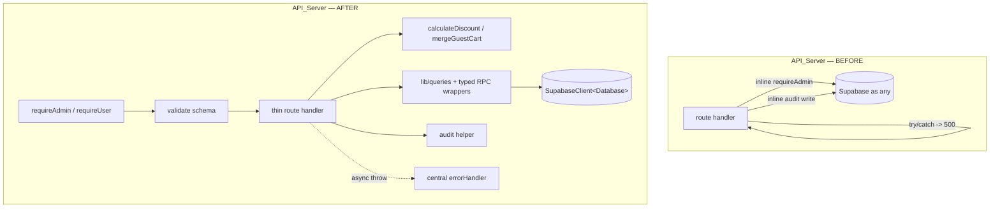
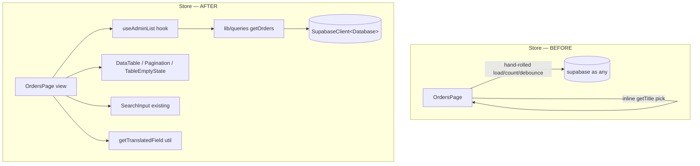
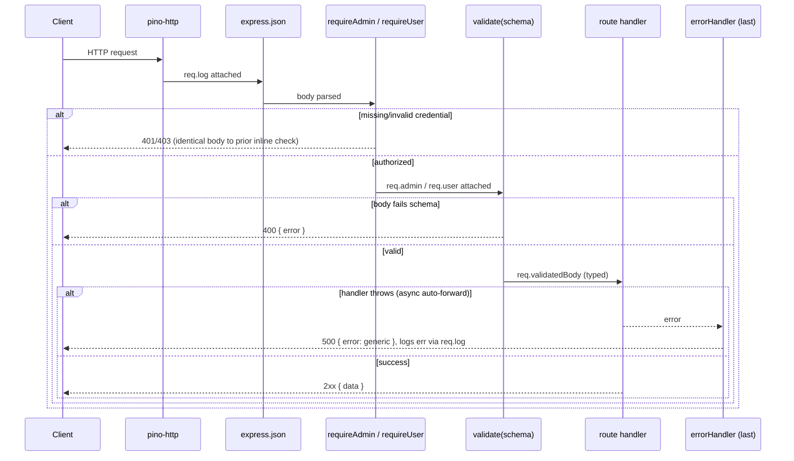
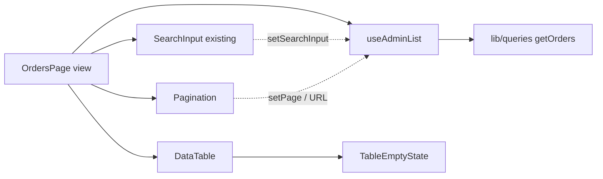
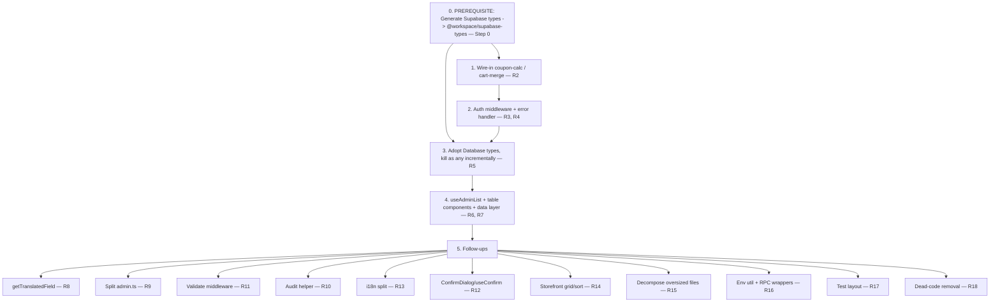

# Design Document

## Overview

This design specifies how the architecture-refactoring effort is implemented while honoring its one governing invariant: **behavior preservation**. Every change in this spec is a refactor — it reorganizes code, removes duplication, and adopts existing-but-unused infrastructure, but it must keep API responses, HTTP status codes, rendered UI, routing, and persisted side effects byte-for-byte identical for identical inputs (Requirement 1). The single deliberate exception is the convergence of three divergent inline reimplementations onto already-tested reference functions (`coupon-calc`, `cart-merge`), where the tested implementation is the authority (Requirement 2).

The work is derived from the audit in `docs/tasks/backlog.md`. The central finding is that the monorepo already ships shared packages — `@workspace/db` (Drizzle schema: exports `db`, table objects such as `todosTable`, and Drizzle-derived insert/select types), `@workspace/api-zod` (Zod schemas/types generated from the OpenAPI spec), and `@workspace/api-client-react` (typed React client) — but they are imported in exactly one file (`routes/health.ts`). The highest-leverage move is **adoption**, not creation. This design leverages every asset listed in the backlog rather than rebuilding it:

- Tested pure functions `lib/coupon-calc.ts` (`calculateDiscount`) and `lib/cart-merge.ts` (`mergeGuestCart`) — wired in, not rewritten.
- Existing components `SearchInput`, `ConfirmDialog`, `ProductCard`, `ProductSkeletonGrid`, `StockCell`, `PriceCell`, `CSVExportButton`, `CategoryFilter`, `SortableHeader` — composed into new shared building blocks, not re-implemented.
- The `@workspace/api-zod` schemas — adopted incrementally.

**Important correction on the Supabase `Database` type.** `@workspace/db` is a **Drizzle** package: it exports the Drizzle `db` instance, the table objects, and the Drizzle schema/types. It does **not** export a Supabase-style `Database` type and does **not** export a `Tables<>` helper. There is no active Supabase `Database` type anywhere in the repo (the only copy lives in `.migration-backup/`, which is inactive). Therefore the typed Supabase client (`SupabaseClient<Database>`, R5.1) and `Tables<"products">`-derived row types have **no source to import from today**. Generating and committing those types is a hard prerequisite for Requirement 5 and for every helper whose signature references `SupabaseClient<Database>` (auth middleware, `lib/queries`, `lib/audit`, `lib/rpc`). This prerequisite is specified as **Step 0** below and is the first node in the Migration/Sequencing plan.

### Step 0 — Prerequisite: Generate Supabase Types

Before any Supabase-client typing work (R5) or any helper that references `SupabaseClient<Database>`:

1. Generate the Supabase TypeScript types from the live schema:

   ```bash
   supabase gen types typescript --project-id "$SUPABASE_PROJECT_ID" > supabase-types/src/database.types.ts
   # (or, against a local stack)
   # supabase gen types typescript --local > supabase-types/src/database.types.ts
   ```

2. **Chosen approach:** commit the generated output to a new shared workspace package **`@workspace/supabase-types`** (`artifacts/supabase-types/`, or `packages/supabase-types/` consistent with the existing shared-package layout). The package re-exports the generated `Database` type and provides the `Tables<>` row-type helper so both `@workspace/store` and `@workspace/api-server` consume one source of truth:

   ```typescript
   // @workspace/supabase-types/src/index.ts
   export type { Database } from "./database.types";

   // Supabase-style row-type helper (the generated file does not export one by default)
   export type Tables<T extends keyof Database["public"]["Tables"]> =
     Database["public"]["Tables"][T]["Row"];
   ```

3. Add the package to both consumers' `dependencies` (e.g. `"@workspace/supabase-types": "workspace:*"`). Regenerating the types is a mechanical, re-runnable step whenever `supabase/schema.sql` changes.

All `Database` and `Tables<...>` imports throughout this design resolve to **`@workspace/supabase-types`** — never to `@workspace/db`. `@workspace/db` (Drizzle) is referenced only where logic is genuinely Drizzle-based (none of the Supabase-client typing in this spec is).

How behavior preservation is *verified* is the backbone of this design: the existing 700+ test suite (vitest unit/property + Playwright E2E) is the regression oracle and must stay green after every merge, and each newly extracted unit gains its own focused tests (nominal + boundary/error). The `pnpm run typecheck` count acts as a monotonic gate for the type-adoption work.

The effort is sequenced (see Migration/Sequencing) so each requirement ships independently in the risk-adjusted order: wire-in (R2) → auth middleware + error handler (R3/R4) → type adoption (R5) → admin-list hook + data layer (R6/R7) → the remaining consolidations (R8–R18).

### Design Principles

1. **The test suite is the contract.** No pre-existing test assertion, input, or fixture is edited. A refactor that requires editing an existing test is, by definition, a behavior change and must be reverted (R1.1, R1.3).
2. **Extract behind an identical surface.** Middleware, hooks, and helpers reproduce the exact status codes and response/render shapes of the code they replace. Parity is asserted by characterization tests written *before* extraction where coverage is thin.
3. **One change unit = one mergeable step.** Type conversions are one file at a time; route splits keep identical paths; page migrations are page-by-page (R5.3, R9, R6).
4. **Adopt, don't reinvent.** Prefer importing the existing package/component/function over writing new logic.

## Architecture

### Layered view — before and after

The refactor introduces explicit layers in both packages without moving any behavior across process boundaries.





**Key architectural decision:** No new runtime layers, servers, or transports are introduced. Express middleware already runs in the request pipeline; the refactor only *relocates* logic that currently lives inline into named middleware/helpers that occupy the same pipeline position. On the frontend, the hook/components are pure composition over the same `wouter` routing and Supabase access already in use. This is what makes behavior preservation tractable — nothing changes *where* code runs, only *how it is organized*.

### Middleware pipeline (API_Server)



The pipeline order is significant and is preserved exactly: logging → CORS → body parse → (per-route) auth guard → (per-route) validation → handler → `errorHandler` registered **after** `app.use("/api", router)` in `app.ts` (R4.1). Express 5 auto-forwards async rejections to the final 4-arg error middleware, so handlers that previously wrapped everything in `try/catch { ... 500 }` simply drop the wrapper (R4.5) while handlers that return specific non-500 statuses keep their explicit `res.status(...)` returns (R4.6).

### Directory structure (target)

```
artifacts/supabase-types/          # NEW shared package @workspace/supabase-types (Step 0)
├── package.json                   # name: @workspace/supabase-types
└── src/
    ├── database.types.ts          # generated via `supabase gen types typescript`
    └── index.ts                    # re-exports Database + Tables<> helper

artifacts/api-server/src/
├── app.ts                      # + errorHandler registered after routes (R4)
├── middlewares/
│   ├── requireAdmin.ts         # R3
│   ├── requireUser.ts          # R3
│   ├── validate.ts             # R11
│   └── errorHandler.ts         # R4
├── lib/
│   ├── coupon-calc.ts          # existing — now imported (R2)
│   ├── cart-merge.ts           # existing — now imported (R2)
│   ├── audit.ts                # R10
│   ├── env.ts                  # shared env resolution (R16)
│   ├── rpc.ts                  # typed RPC wrappers (R16)
│   └── supabase.ts             # SupabaseClient<Database> — Database from @workspace/supabase-types (R5, Step 0)
└── routes/
    ├── admin/
    │   ├── index.ts            # aggregator (R9)
    │   ├── products.ts
    │   ├── coupons.ts
    │   ├── banners.ts
    │   ├── categories.ts
    │   ├── inventory.ts        # stock/bulk ops
    │   ├── orders.ts           # admin order ops + export
    │   ├── users.ts
    │   ├── settings.ts
    │   ├── comments.ts
    │   └── whatsapp.ts
    ├── orders.ts coupons.ts cart.ts ...  # delegate to shared fns (R2)

artifacts/store/src/
├── lib/
│   ├── utils.ts                # + getTranslatedField (R8)
│   ├── api.ts                  # - dead BASE const (R18)
│   ├── user-fetch.ts           # shared userFetch/getAuthHeader (R18)
│   ├── env.ts                  # shared env resolution (R16)
│   ├── queries/                # data layer (R7)
│   │   ├── fragments.ts        # PRODUCT_SELECT, CATEGORY_TREE_SELECT
│   │   ├── products.ts         # getProducts
│   │   ├── categories.ts       # getCategoriesTree
│   │   └── orders.ts           # getOrders
│   ├── hooks/
│   │   ├── useAdminList.ts      # R6
│   │   └── useConfirm.ts        # R12
│   └── i18n/
│       ├── context.tsx          # typed t() (R13)
│       └── messages/
│           ├── az.ts ru.ts en.ts
│           ├── schema.ts        # MessageSchema + MessageKey union (R13)
│           └── index.ts         # getT, key type
├── components/
│   ├── admin/                   # + DataTable, Pagination, TableEmptyState (R6)
│   └── storefront/              # + ProductGrid, SortDropdown (R14)
└── __tests__/ + tests/helpers/  # consolidated layout (R17)
```

## Components and Interfaces

All signatures below are the concrete contracts the implementation must satisfy. Types named `Database` and `Tables<...>` come from `@workspace/supabase-types` (the package generated in Step 0); request/body schemas come from `@workspace/api-zod` where available, otherwise local Zod schemas. (`@workspace/db` remains the Drizzle package and is not the source of these Supabase types.)

### 1. Authentication middleware (R3)

The current `requireAdmin(req)` (in `lib/supabase.ts`) returns `{ user, admin } | null` and is called inline in ~40 handlers; user-token auth boilerplate repeats in ~15 more. The refactor converts these into real Express middleware that attaches typed context and short-circuits with the **identical** status/body the inline checks produced.

```typescript
// middlewares/requireAdmin.ts
import type { Request, Response, NextFunction } from "express";
import type { SupabaseClient } from "@supabase/supabase-js";
import type { Database } from "@workspace/supabase-types";

// Typed Request augmentation (declared once, e.g. src/types/express.d.ts)
declare global {
  namespace Express {
    interface Request {
      user?: { id: string; [k: string]: unknown };
      admin?: SupabaseClient<Database>;       // service-role client, attached by requireAdmin
      authUser?: { id: string };              // attached by requireUser
      validatedBody?: unknown;                // attached by validate()
    }
  }
}

// requireAdmin: reproduces prior inline outcome — 403 when not an admin.
export async function requireAdmin(
  req: Request,
  res: Response,
  next: NextFunction,
): Promise<void> {
  const ctx = await resolveAdmin(req);          // same logic as today's requireAdmin(req)
  if (!ctx) {
    res.status(403).json({ error: "Forbidden" }); // IDENTICAL to prior inline check
    return;
  }
  req.user = ctx.user;
  req.admin = ctx.admin;
  next();
}
```

```typescript
// middlewares/requireUser.ts — reproduces prior inline 401 outcome.
export async function requireUser(
  req: Request,
  res: Response,
  next: NextFunction,
): Promise<void> {
  const token = req.headers.authorization?.replace("Bearer ", "");
  if (!token) { res.status(401).json({ error: "Unauthorized" }); return; }
  const supabase = getSupabase(token);
  const { data: { user } } = await supabase.auth.getUser();
  if (!user) { res.status(401).json({ error: "Unauthorized" }); return; }
  req.authUser = { id: user.id };
  next();
}
```

**Parity rule:** `requireAdmin` returns `403 { error: "Forbidden" }` and `requireUser` returns `401 { error: "Unauthorized" }` because those are the exact shapes the inline checks emit today (verified against `orders.ts`, `cart.ts`, `admin.ts`). Each route adopting the middleware deletes its inline check (R3.5, R3.6). Usage:

```typescript
router.post("/admin/products", requireAdmin, validate(CreateProductBody), async (req, res): Promise<void> => {
  const admin = req.admin!;            // typed SupabaseClient<Database>
  // ... handler body, no inline auth
});

router.post("/orders", requireUser, async (req, res): Promise<void> => {
  const userId = req.authUser!.id;
  // ...
});
```

### 2. Central error handler (R4)

```typescript
// middlewares/errorHandler.ts
import type { Request, Response, NextFunction } from "express";

// 4-arg signature => Express treats it as error middleware.
export function errorHandler(
  err: unknown,
  req: Request,
  res: Response,
  _next: NextFunction,
): void {
  const e = err as { message?: string; stack?: string };
  req.log.error({ err: { message: e?.message, stack: e?.stack } }, "Unhandled error");
  if (res.headersSent) return;          // delegate to default if response started
  res.status(500).json({ error: "Internal server error" }); // generic only — never leaks
}
```

```typescript
// app.ts (excerpt) — registered AFTER routes (R4.1)
app.use("/api", router);
app.use(errorHandler);
```

The generic body field is `error` to match the message text already returned by current 500 paths (`{ error: "Internal server error" }`), keeping behavior identical for existing 500 tests (R4.2, R1.2). `err.message`/`err.stack` go to `req.log` only (R4.3, R4.4). Handlers keep explicit non-500 returns (e.g. `res.status(404).json({ error: "Not found" })`) so those paths are untouched (R4.6).

### 3. Validation middleware (R11)

```typescript
// middlewares/validate.ts
import type { Request, Response, NextFunction } from "express";
import type { ZodType } from "zod";

export function validate<T>(schema: ZodType<T>) {
  return (req: Request, res: Response, next: NextFunction): void => {
    const parsed = schema.safeParse(req.body);
    if (!parsed.success) {
      res.status(400).json({ error: parsed.error.message }); // R11.3
      return;
    }
    req.validatedBody = parsed.data;     // typed payload for handler (R11.4)
    next();
  };
}
```

Applied only to admin write endpoints that **previously lacked validation** (product, coupon, banner) so valid requests keep identical behavior (R11.2, R11.4). Schemas are imported from `@workspace/api-zod` when present, else defined locally beside the route.

### 4. Wire-in: coupon-calc / cart-merge (R2)

**`orders.ts` — coupon math (before vs after).** The deliberate convergence: today `orders.ts` computes the discount and caps at subtotal but **skips `Math.round`**; `calculateDiscount` rounds to 2 decimals and also enforces `min_order_amount`.

```typescript
// BEFORE (orders.ts, divergent — no rounding)
discountAmount = coupon.discount_type === "percentage"
  ? (subtotal * coupon.discount_value) / 100
  : coupon.discount_value;
discountAmount = Math.min(discountAmount, subtotal);

// AFTER (delegates to the tested reference)
import { calculateDiscount } from "../lib/coupon-calc";
const result = calculateDiscount(
  { discount_type: coupon.discount_type,
    discount_value: coupon.discount_value,
    min_order_amount: coupon.min_order_amount },
  subtotal,
);
if (result.ok) { discountAmount = result.discount_amount; couponId = coupon.id; couponData = coupon; }
// result.ok === false => coupon rejected, no discount applied (R2.5)
```

The pre-existing date/usage gates (`notExpired`, `withinMaxUses`) stay in the route; only the math+min-amount+rounding+cap moves to `calculateDiscount` (R2.1, R2.3, R2.4).

**`coupons.ts` — `/coupons/validate`.** Replace the inline percentage/fixed + `Math.min` block with `calculateDiscount`; map `result.ok === false` to the existing `400 { error }` (the function's error string already matches the current min-order message), preserving the documented "400 for invalid, not 404" contract.

**`cart.ts` — `/cart/merge` (before vs after).** Today the route sums quantities with **no cap**. `mergeGuestCart` caps each line at `MAX_QUANTITY = 99`.

```typescript
// BEFORE: existing.quantity + guestItem.quantity   (uncapped — divergent)
// AFTER:
import { mergeGuestCart, type CartEntry } from "../lib/cart-merge";
const merged = mergeGuestCart(
  (userItems ?? []).map(toCartEntry),
  guestItems.map(toCartEntry),
);
// persist merged.mergedCart (capped at 99), response stays { merged: guestItems.length }
```

The response shape (`{ merged: N }`) is unchanged; only the persisted quantity is corrected to respect the cap (R2.6). After this work, `orders.ts`, `coupons.ts`, `cart.ts` contain **zero** inline coupon/merge math (R2.7).

### 5. Shared type adoption (R5)

```typescript
// lib/supabase.ts — AFTER
import { createClient, type SupabaseClient } from "@supabase/supabase-js";
import type { Database } from "@workspace/supabase-types";

export function getSupabase(accessToken?: string): SupabaseClient<Database> { /* ... */ }
export function getAdminSupabase(): SupabaseClient<Database> { /* ... */ }
```

Adoption is **incremental, one file per change unit** (R5.3), and depends on **Step 0** having produced `@workspace/supabase-types`. Per file: remove `(supabase as any)`, `(req: any)`, `.map((x: any) => ...)`; replace with `Tables<"products">`-derived row types (imported from `@workspace/supabase-types`) and typed callbacks; then run the typecheck gate. The `health.ts` file (already importing `@workspace/api-zod`) is the reference for import style.

### 6. Frontend admin-list hook + table components (R6)

```typescript
// lib/hooks/useAdminList.ts
export interface UseAdminListOptions<Row> {
  fetcher: (args: {
    offset: number; limit: number; search: string; signal: AbortSignal;
  }) => Promise<{ rows: Row[]; count: number }>;
  pageSize?: number;            // default 30 (matches existing pages)
  basePath: string;            // e.g. "/admin/orders" — for URL sync
  debounceMs?: number;         // fixed 350 (R6.1) — matches existing admin pages
}

export interface UseAdminListResult<Row> {
  rows: Row[];
  count: number;
  loading: boolean;
  error: Error | null;
  page: number;
  pageSize: number;
  search: string;              // committed (debounced) value
  searchInput: string;        // immediate input value (feeds SearchInput)
  setSearchInput: (v: string) => void;
  setPage: (p: number) => void;
  totalPages: number;
}

export function useAdminList<Row>(opts: UseAdminListOptions<Row>): UseAdminListResult<Row>;
```

Behavior contract: reads `page`/`q` from the URL via `useSearch`, debounces `searchInput → search` at a fixed **350 ms** (R6.1) — matching the current admin pages (`OrdersPage.tsx`, `UsersPage.tsx`) so the debounce timing is preserved exactly and behavior preservation (R1) holds — resets to page 1 on new search, syncs `page`/`pageSize` to query params, and on fetch failure **clears loading, preserves the prior rows, and sets `error`** (R6.7). Requests are abortable to avoid out-of-order results.

```typescript
// components/admin/DataTable.tsx
export interface Column<Row> {
  key: string;
  header: ReactNode;
  cell: (row: Row) => ReactNode;
  align?: "left" | "right";
  className?: string;
}
export interface DataTableProps<Row> {
  columns: Column<Row>[];
  rows: Row[];
  loading: boolean;
  empty: ReactNode;                       // rendered when !loading && rows.length === 0
  getRowKey: (row: Row) => string;
}
export function DataTable<Row>(props: DataTableProps<Row>): JSX.Element;

// components/admin/Pagination.tsx
export interface PaginationProps {
  page: number;
  totalPages: number;
  buildHref: (page: number) => string;   // preserves wouter <Link> URL behavior
}
export function Pagination(props: PaginationProps): JSX.Element;  // null when totalPages <= 1

// components/admin/TableEmptyState.tsx
export interface TableEmptyStateProps { message: ReactNode; colSpan: number; }
export function TableEmptyState(props: TableEmptyStateProps): JSX.Element;
```



**OrdersPage migration:** the page keeps its status-tab filters and CSV export untouched; the bespoke `useState`/`useEffect`/debounce/`buildHref`/pagination map blocks are replaced by `useAdminList({ fetcher: getOrders, basePath: "/admin/orders" })` + `<DataTable>`/`<Pagination>`/`<TableEmptyState>` + the existing `<SearchInput>` (replacing the hand-rolled input, R6.4). Columns render identical cells/labels so rows are byte-identical (R6.3, R6.5, R6.6).

### 7. Data layer (R7)

```typescript
// lib/queries/fragments.ts — defined once, reused everywhere (R7.3, R7.4)
export const PRODUCT_SELECT =
  "id, slug, price, stock, brand, product_images(*), product_translations(*), product_categories(category_id)";
export const CATEGORY_TREE_SELECT =
  "id, slug, parent_id, icon_url, category_translations(*)";

// lib/queries/products.ts
import type { Tables, Database } from "@workspace/supabase-types";
import type { SupabaseClient } from "@supabase/supabase-js";
export type ProductRow = Tables<"products"> & {
  product_images: Tables<"product_images">[];
  product_translations: Tables<"product_translations">[];
};
export function getProducts(client: SupabaseClient<Database>, args: {
  offset?: number; limit?: number; search?: string; categoryId?: string;
}): Promise<{ rows: ProductRow[]; count: number }>;

// lib/queries/categories.ts
export function getCategoriesTree(client: SupabaseClient<Database>): Promise<CategoryNode[]>;

// lib/queries/orders.ts
export function getOrders(client: SupabaseClient<Database>, args: {
  offset?: number; limit?: number; search?: string; status?: string;
}): Promise<{ rows: OrderRow[]; count: number }>;
```

Each wrapper reproduces the exact `select(...)` string, `.order()`, `.range()`, and `.or(...)` filters currently inline in the calling pages so the returned shape and contents are unchanged (R7.2).

### 8. Translation-picker util (R8)

```typescript
// lib/utils.ts
interface TranslationByLangCode { lang_code: string; [field: string]: unknown }
interface TranslationByLocale   { locale: string;    [field: string]: unknown }
type Translation = TranslationByLangCode | TranslationByLocale;

export function getTranslatedField(
  translations: Translation[] | null | undefined,
  locale: string,
  field: string,
  fallback: string,
): string;
```

Resolution order, matching the ~20 inline call sites (`t => t.lang_code === locale ? .title ?? translations[0]?.title ?? "Untitled"`): (1) the translation whose `lang_code` **or** `locale` equals `locale` (R8.2) → its `field`; (2) else the first translation's `field` (R8.4); (3) else `fallback`. A present-but-empty/whitespace value is treated the same way the inline code treated it (it returned the value as-is), so the util returns the stored value to preserve display parity (R8.5).

### 9. Audit helper (R10)

```typescript
// lib/audit.ts
import type { Request } from "express";
import type { SupabaseClient } from "@supabase/supabase-js";
import type { Database } from "@workspace/supabase-types";

export interface AuditInput {
  admin: SupabaseClient<Database>;
  req: Request;
  actorId: string;
  action: string;             // e.g. "product.update"
  entityType: string;
  entityId?: string | null;
  details?: Record<string, unknown> | null;
}

// Fire-and-forget, logged-on-failure — never blocks/fails the request (R10.1, R10.3)
export function writeAudit(input: AuditInput): void;
```

Internally inserts into `audit_log` with equivalent columns to today's inline writes (R10.2); `.catch(err => input.req.log.error({ err }, "audit write failed"))`. Migrating the ~25 call sites replaces all three current styles with this one API.

### 10. i18n split with typed keys (R13)

```typescript
// lib/i18n/messages/schema.ts
export type MessageSchema = typeof import("./az").default;   // az is the canonical shape
// Recursive dotted-key union, e.g. "HomePage.hero.title"
export type MessageKey = DeepKeyOf<MessageSchema>;

// lib/i18n/messages/index.ts
const messages: Record<string, MessageSchema> = { az, ru, en };
export function getT(locale: string): (key: MessageKey) => string;

// context.tsx
interface I18nContextValue { locale: string; t: (key: MessageKey) => string; }
```

`getT`'s runtime resolution (split key on `.`, walk object, return key string on miss) is **unchanged** so existing translations resolve identically (R13.3); only the key *type* tightens from `string` to `MessageKey` (R13.2). Existing consistency tests (`i18n-consistency`, `i18n-preservation`) keep passing because the three locale objects retain identical structure (R13.4).

### 11. Storefront grid + sort (R14)

```typescript
// components/storefront/ProductGrid.tsx
export interface ProductGridProps {
  products: ProductCardData[];
  loading: boolean;                 // routes through existing ProductSkeletonGrid
  locale: string;
}
export function ProductGrid(props: ProductGridProps): JSX.Element;

// components/storefront/SortDropdown.tsx
export type SortOption = "newest" | "price_asc" | "price_desc" | "name";
export interface SortDropdownProps { value: SortOption; onChange: (v: SortOption) => void; }
export function SortDropdown(props: SortDropdownProps): JSX.Element;
```

`ProductGrid` renders the existing `ProductCard`; `loading` renders the existing `ProductSkeletonGrid` (R14.2). CategoryPage's hardcoded Azerbaijani strings move into `messages.ts` (all three locales) and render via `t()` (R14.3), satisfying the project i18n rule.

### 12. Confirmation hook (R12), env util + RPC wrappers (R16), dead-code helpers (R18)

```typescript
// lib/hooks/useConfirm.ts (R12)
export interface ConfirmState { open: boolean; title: string; message: string; onConfirm: () => void; }
export function useConfirm(): {
  confirm: (opts: { title: string; message: string; onConfirm: () => void }) => void;
  dialogProps: ConfirmDialogProps;   // spread into existing <ConfirmDialog/>
};

// lib/env.ts (shared by store + api-server + test setup) (R16.1)
export function resolveSupabaseEnv(source: Record<string, string | undefined>): {
  url: string; anonKey: string; serviceKey: string;   // VITE_* -> non-prefixed normalization
};

// lib/rpc.ts (api-server) (R16.3)
export function decrementStockSafe(c: SupabaseClient<Database>, productId: string, qty: number): Promise<{ error: unknown }>;
export function incrementStock(c: SupabaseClient<Database>, productId: string, qty: number): Promise<{ error: unknown }>;
export function searchProducts(c: SupabaseClient<Database>, term: string): Promise<{ data: unknown; error: unknown }>;

// lib/user-fetch.ts (store) (R18.3) — shared auth-header logic
export function getAuthHeader(): Promise<{ Authorization: string }>;
export function userFetch(url: string, options?: RequestInit): Promise<Response>;
```

RPC wrappers call the **same** `decrement_stock_safe` / `increment_stock` / `search_products` RPCs with identical args (R16.4), honoring the stock-change-via-RPC rule. Dead code removed: duplicate `GET /profile/orders` in `cart.ts` (the `orders.ts` copy is the live one) (R18.1) and the unused `BASE` const in `lib/api.ts` (R18.2).

### 13. admin.ts split (R9)

`routes/admin.ts` (648 lines, ~40 endpoints across 8 domains) splits into `routes/admin/{products,coupons,banners,categories,inventory,orders,users,settings,comments,whatsapp}.ts`, each exporting a `Router`, aggregated by `routes/admin/index.ts`:

```typescript
// routes/admin/index.ts
import { Router, type IRouter } from "express";
import products from "./products"; /* ...others */
const router: IRouter = Router();
router.use(products); /* router.use(coupons); ... */
export default router;
```

Route **paths and registration order are preserved exactly** — notably ordering-sensitive routes (`/admin/orders/export` and `/admin/products/bulk-*` before `/:id` variants) keep their relative order within their module and the module mount order keeps them ahead of any conflicting `:id` route (R9.3). No path strings change.

## Data Models

No database schema changes. All domain types are **adopted** from generated sources rather than redefined:

- **`Database`** — the Supabase-style type **generated in Step 0** (`supabase gen types typescript`) and exported from the new `@workspace/supabase-types` package; used to parameterize `SupabaseClient<Database>` (R5.1). It is **not** sourced from `@workspace/db` (Drizzle). The canonical schema remains `supabase/schema.sql`, and the types are regenerated from it.
- **Row types** — derived via the `Tables<...>` helper exported from `@workspace/supabase-types` (`Tables<"products">`, `Tables<"orders">`, `Tables<"categories">`, `Tables<"coupons">`, etc.), replacing ad-hoc `any` shapes. Relationship shapes (e.g. `product_images(*)`) are expressed as intersections in `lib/queries` (see `ProductRow`).
- **Request/response bodies** — Zod schemas/types from `@workspace/api-zod` where available (e.g. `HealthCheckResponse` already used by `health.ts`); local Zod schemas for admin-write bodies that have none today (R11).

Module-local data contracts introduced by the refactor (no DB impact):

| Type | Module | Purpose |
|------|--------|---------|
| `Database`, `Tables<>` | `@workspace/supabase-types` (Step 0, generated) | Supabase client + row typing source |
| `CartEntry`, `MergeResult` | `lib/cart-merge.ts` (existing) | guest-cart merge IO |
| `Coupon`, `DiscountResult` | `lib/coupon-calc.ts` (existing) | discount calc IO |
| `Column<Row>`, `UseAdminListResult<Row>` | store hooks/components | admin list composition |
| `MessageSchema`, `MessageKey` | `lib/i18n/messages` | typed translation keys |
| `AuditInput` | `lib/audit.ts` | audit write payload |

## Correctness Properties

*A property is a characteristic or behavior that should hold true across all valid executions of a system — essentially, a formal statement about what the system should do. Properties serve as the bridge between human-readable specifications and machine-verifiable correctness guarantees.*

For this refactoring spec, most acceptance criteria are structural (split a file, remove dead code, register one middleware) or are behavior-preservation parity checks whose oracle is the **existing test suite** — those are covered in the Testing Strategy, not here. The properties below capture the behaviors that genuinely hold "for all inputs": the pure functions being wired in (the deliberate convergence point of Requirement 2), the extracted utilities, and the no-leak guarantee of the error handler. Each is implemented as a single property-based test running ≥100 iterations.

### Property 1: Discount is bounded and rounded to 2 decimals

*For any* coupon (percentage or fixed) and any non-negative subtotal for which the coupon is accepted (`ok === true`), the returned `discount_amount` satisfies `0 ≤ discount_amount ≤ subtotal` **and** equals `Math.round(min(rawDiscount, subtotal) * 100) / 100` (at most two decimal places). This encodes the deliberate convergence that corrects `orders.ts` skipping `Math.round`.

**Validates: Requirements 2.3, 2.4**

### Property 2: Coupons below minimum order are rejected with no discount

*For any* coupon whose `min_order_amount` is set and any subtotal strictly below it, `calculateDiscount` returns `{ ok: false }` (an error indication) and yields no discount.

**Validates: Requirements 2.5**

### Property 3: The error handler never leaks internal error detail

*For any* error carrying arbitrary `message` and `stack` strings, the response body produced by `errorHandler` contains neither the `message` nor the `stack` substring and consists only of the generic `{ error: "Internal server error" }`, while the full detail is passed to `req.log`.

**Validates: Requirements 4.2, 4.3, 4.4**

### Property 4: Merged cart quantities never exceed MAX_QUANTITY

*For any* user cart and any guest cart (including overlapping `product_id`s and arbitrarily large quantities), every line item in `mergeGuestCart(...).mergedCart` has `quantity ≤ MAX_QUANTITY` (99) and equals `min(userQty + guestQty, 99)` for that product. This encodes the convergence that corrects the uncapped inline cart-merge path.

**Validates: Requirements 2.6**

### Property 5: Translation lookup returns the matching locale's field for both key shapes

*For any* translation list that contains an entry for the requested `locale` — whether entries are keyed by `lang_code` or by `locale` — `getTranslatedField(translations, locale, field, fallback)` returns that matching entry's `field` value.

**Validates: Requirements 8.2, 8.3, 8.5**

### Property 6: Translation lookup falls back deterministically

*For any* non-empty translation list with no entry matching the requested locale, `getTranslatedField` returns the first entry's `field`; and *for any* empty, null, or undefined translation list, it returns the provided `fallback`.

**Validates: Requirements 8.4**

### Property 7: Admin-list URL state round-trips

*For any* page number (≥1) and any search string, building the list URL from that state and then parsing the resulting query parameters yields the same page number and search string (and a new search always resets to page 1).

**Validates: Requirements 6.1, 6.5**

### Property 8: Validation middleware partitions inputs correctly

*For any* request body, `validate(schema)` either (a) passes schema validation, calls `next()` exactly once, and attaches the parsed value to `req.validatedBody`, or (b) fails validation, responds with HTTP 400 and an `{ error }` body, and does not call `next()` — never both.

**Validates: Requirements 11.3, 11.4**

### Property 9: Translation function preserves resolved strings across the split

*For any* message key present in the canonical `MessageSchema` and any supported locale, `getT(locale)(key)` returns the same string the per-locale module stores for that key; and *for any* key absent from the schema, it returns the key unchanged.

**Validates: Requirements 13.3**

### Property 10: Env resolution preserves the prior precedence

*For any* environment source map with arbitrary presence or absence of the `VITE_`-prefixed and non-prefixed Supabase variables, `resolveSupabaseEnv` returns the same `url`/`anonKey`/`serviceKey` values the prior per-file resolution produced (VITE-prefixed taking precedence, then non-prefixed, then empty string).

**Validates: Requirements 16.2**

## Error Handling

### Server (API_Server)

- **Central handler, single source of 500s (R4).** `errorHandler` is the only place that builds a generic 500 for unhandled errors. Express 5 auto-forwards async rejections, so handlers drop `try/catch` blocks whose sole purpose was returning 500 (R4.5). The handler logs `err.message`/`err.stack` via `req.log` and returns `{ error: "Internal server error" }` only — never the detail (R4.2–R4.4). It checks `res.headersSent` and delegates to the default Express handler if a response has already begun.
- **Preserved domain errors (R4.6).** Explicit non-500 responses remain inline and unchanged: `400` for missing/invalid input (orders, coupons), `401 { error: "Unauthorized" }` (auth), `403 { error: "Forbidden" }` (admin), `404 { error: "Not found" }`, `409` for stock race conditions in order creation. The refactor must not reroute these through the central handler.
- **Auth failures (R3).** `requireAdmin` → `403 { error: "Forbidden" }`; `requireUser` → `401 { error: "Unauthorized" }`, matching the exact shapes the inline checks emit today. Failure short-circuits without calling `next()`.
- **Validation failures (R11).** `validate(schema)` → `400 { error: <zod message> }`. Applied only where no validation existed before, so valid requests are unaffected.
- **Coupon rejection (R2.5).** `calculateDiscount` returning `{ ok: false }` maps to the existing `400 { error }` in `/coupons/validate` and to "no discount applied" in order creation — preserving the "400 for invalid, not 404" contract.
- **Audit failures (R10.3).** `writeAudit` is fire-and-forget; a failed insert is logged via `req.log.error` and never propagates to fail the originating request.
- **Stock changes.** Continue to go through `decrement_stock_safe` / `increment_stock` RPCs (now via typed wrappers); the existing best-effort fallback + 409 rollback path in order creation is preserved verbatim.

### Client (Store)

- **List load failures (R6.7).** `useAdminList` catches fetcher rejections, clears `loading`, **preserves the prior `rows`**, and sets `error`; aborted (superseded) requests are ignored, not surfaced as errors.
- **Query layer.** `lib/queries` wrappers surface Supabase `error` objects to callers unchanged so existing error handling in pages is preserved.
- **Translation/env utilities** are total functions (always return a string / resolved value); they do not throw, matching the inline code they replace.

## Testing Strategy

### The existing suite is the regression oracle

The defining test for this spec is that the **pre-existing 700+ tests pass unchanged after every merge** (R1.1, R1.5). No existing assertion, input, or fixture is edited. Commands:

- `pnpm run typecheck` — the monotonic gate for type adoption (R5.5, R5.6): record the error count before a file conversion; the conversion is accepted only if the count is ≤ baseline, else reverted.
- `pnpm run test` — vitest unit/property (the fast gate, ~415 unit tests).
- `pnpm --filter @workspace/store run test:e2e` — Playwright E2E.
- Run focused projects during iteration: `pnpm exec vitest --run --project store-unit`.

Where a code path slated for extraction has thin coverage, a **characterization test** is added *first* (capturing current behavior), so the parity requirement (R1.2) has an executable witness before the refactor begins.

### Dual approach for new units

Each newly extracted module gets unit tests (nominal + boundary/error per R1.4) and, where a universal property exists, a property-based test.

**Property-based tests (PBT applies).** Use the project's existing PBT setup (`fast-check` with vitest, already used by `cart-validation.test.ts` and the api-server `*.property.test.ts` files). Each property test:
- runs a **minimum of 100 iterations**;
- is tagged with a comment: **Feature: architecture-refactoring, Property {n}: {property text}**;
- maps 1:1 to a property in the Correctness Properties section.

| Property | Module under test | Location |
|----------|-------------------|----------|
| P1, P2 | `lib/coupon-calc.ts` (calculateDiscount) | `api-server/tests/coupon-calc.property.test.ts` |
| P3 | `middlewares/errorHandler.ts` | `api-server/tests/error-handler.test.ts` |
| P4 | `lib/cart-merge.ts` (mergeGuestCart) | `api-server/tests/cart-merge.property.test.ts` |
| P5, P6 | `lib/utils.ts` (getTranslatedField) | `store/src/__tests__/translated-field.property.test.ts` |
| P7 | `lib/hooks/useAdminList.ts` (URL helpers) | `store/src/__tests__/admin-list.property.test.ts` |
| P8 | `middlewares/validate.ts` | `api-server/tests/validate.property.test.ts` |
| P9 | `lib/i18n/messages` (getT) | `store/src/__tests__/i18n-split.property.test.ts` |
| P10 | `lib/env.ts` (resolveSupabaseEnv) | shared test |

Note: `coupon-calc` and `cart-merge` already have passing tests; those stay green (R2.8) and the new property tests above complement them while new **endpoint** tests assert the routes now delegate to the shared functions (e.g. an order with a coupon yields a 2-decimal-rounded discount; a merge over 99 caps at 99).

**Example / edge-case unit tests** (PBT not appropriate — specific scenarios, mocks, or UI):
- Auth middleware (R3.7): per middleware, one valid-credential (next called, context attached), one invalid-credential, one missing-credential case — mock the Supabase auth call.
- Error handler (R4.7): a throwing route returns 500 with the generic field; `req.log` spy asserts detail logged.
- Audit helper (R10.4): entry-content assertion via mocked insert; failure path asserts `req.log.error` and no throw.
- `useAdminList` transitions (R6.8): loading on→off, empty-state render (R6.6), failure preserves rows (R6.7) — React Testing Library with a mocked fetcher.
- `DataTable`/`Pagination`/`TableEmptyState`, `ProductGrid`/`SortDropdown` (R6, R14.5): render tests with fixed datasets; parity snapshots against pre-refactor output.
- `useConfirm` (R12.5): confirm fires `onConfirm` on accept, not on cancel.
- Typed RPC wrappers (R16.4): `client.rpc` spy asserts correct RPC name + params.

**Integration / parity tests** (the existing suite plus targeted additions):
- Admin endpoint paths unchanged after the `admin.ts` split (R9.4) — existing admin route tests.
- Converted-file runtime parity (R5.4), decomposed-page render parity (R15.3), data-layer shape parity (R7.2, R7.5), i18n consistency (R13.4), dead-code removal (R18.4) — all gated by the existing suite staying green.

### Why some areas use no property tests

IaC is not present. UI rendering (DataTable, ProductGrid, ConfirmDialog, page decomposition) uses snapshot/render parity tests, not PBT. Middleware adoption parity, route splitting, data-layer wrappers, RPC wiring, and dead-code removal are verified by the existing differential suite plus example/mocked tests, because their correctness is "produces the identical observable outcome as before," which the existing tests already encode and which does not vary meaningfully with randomized input.

## Migration / Sequencing

The work follows the backlog's risk-adjusted order. Each step is independently mergeable and leaves the full suite green (R1.5). Steps 1–4 capture ~80% of the value.



0. **Step 0 — generate Supabase types (hard prerequisite).** Run `supabase gen types typescript`, commit the output to the new `@workspace/supabase-types` package, and wire it into both consumers' dependencies. This MUST land before R5 and before any helper whose signature references `SupabaseClient<Database>` — auth middleware (R3), `lib/queries` (R7), `lib/audit` (R10), and `lib/rpc` (R16). Auth-middleware *behavior* (status/body parity) can be wired in step 2 with the typed client signature depending on this package being present; R5's incremental `as any` removal consumes it directly.
1. **R2 — wire-in (lowest risk, fixes correctness divergence).** Import `calculateDiscount`/`mergeGuestCart` into `orders.ts`, `coupons.ts`, `cart.ts`. The deliberate behavior convergence (rounding, 99-cap) is the only sanctioned behavior change; new endpoint + property tests lock it in.
2. **R3 + R4 — auth middleware + central error handler.** Removes the most boilerplate and unifies security/error responses while reproducing exact status/bodies. Adopt route-by-route so each adoption is independently green.
3. **R5 — type adoption.** Requires Step 0's `@workspace/supabase-types`. One file per change unit, each behind the typecheck gate. Start with `lib/supabase.ts`, then the routes touched in steps 1–2, then storefront/admin pages.
4. **R6 + R7 — admin-list hook + shared table/pagination + data layer.** Collapses 7 admin pages; migrate one page at a time (OrdersPage first as the reference), each verified by render parity.
5. **Follow-ups (R8–R18), independently mergeable in any order:** translation util (R8), `admin.ts` split (R9), audit helper (R10), validate middleware (R11), confirm dialog (R12), i18n split (R13), storefront grid/sort (R14), file decomposition (R15), env util + RPC wrappers (R16), test layout consolidation (R17), dead-code removal (R18).

**Per-step checklist (applied to every merge):** (a) existing suite green with zero test edits; (b) `pnpm run typecheck` error count ≤ baseline; (c) new unit/property tests for any extracted unit (nominal + boundary); (d) modified API paths conform to Express 5 / `req.log` / RPC / i18n steering rules (R1.6). If any check fails, the step is reverted to a green state (R1.3).
