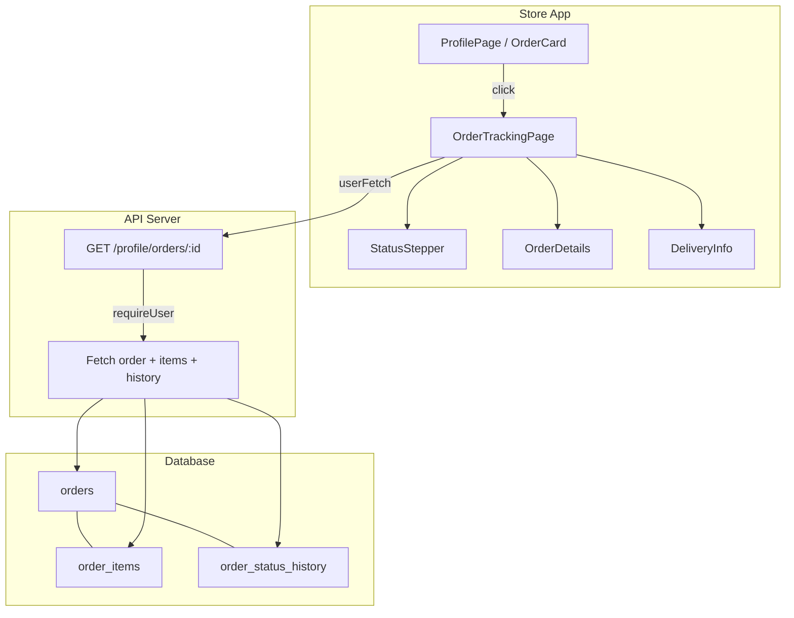

# Design Document: Order Status Tracking Timeline

## Overview

This feature adds a dedicated order tracking page with a visual timeline stepper showing order progression. It introduces:

1. A new `order_status_history` table to persist timestamps for each status transition
2. A user-facing API endpoint (`GET /profile/orders/:id`) returning order details + status history
3. A `StatusStepper` component rendering completed/active/future steps with timestamps
4. A routable page at `/{locale}/orders/{shortId}` accessible from the profile OrderCard and via direct link
5. Full i18n support (az/ru/en) and mobile-first responsive layout

The design leverages existing patterns: `requireUser` middleware for auth, `getAdminSupabase()` for data access, wouter routing with locale prefix, Tailwind v4 mobile-first styling, and the `useI18n()` hook for translations.

## Architecture



**Data flow:**
1. User clicks OrderCard → navigates to `/{locale}/orders/{shortId}`
2. `OrderTrackingPage` resolves shortId to full UUID via prefix match
3. Page calls `GET /api/profile/orders/:id` with auth header
4. API validates ownership, fetches order + items + history, returns combined response
5. `StatusStepper` maps current status to step states, overlays timestamps from history
6. `OrderDetails` renders items list, totals, delivery address
7. `DeliveryInfo` conditionally shows estimated/actual delivery based on status

## Components and Interfaces

### API Endpoint

**`GET /profile/orders/:id`** (new route in `routes/orders.ts`)

Request:
- Auth: Bearer token (enforced by `requireUser` middleware)
- Params: `id` — full order UUID or short ID (first 8 chars)

Response (200):
```typescript
{
  id: string;
  status: string;
  customer_name: string;
  customer_phone: string;
  delivery_address: string;
  total_azn: number;
  discount_azn: number;
  created_at: string;
  order_items: Array<{
    id: string;
    product_id: string;
    quantity: number;
    product_price_snapshot: number;
    product_title_snapshot: string;
    line_total: number; // Computed: quantity * product_price_snapshot (not stored, calculated in API response)
  }>;
  status_history: Array<{
    id: string;
    old_status: string | null;
    new_status: string;
    changed_at: string;
    changed_by: string;
  }>;
}
```

Error responses:
- 401: Unauthenticated (via `requireUser`)
- 404: Order not found OR belongs to another user (same response to prevent enumeration)

### Status History Insertion (admin status change)

The existing `PATCH /admin/orders/:id/status` handler will be augmented to insert a history row after updating the order status. The insertion is wrapped in a try/catch — if it fails, the status change still succeeds (non-blocking).

### Status History Insertion (order creation)

The existing `POST /orders` handler will insert an initial history record (`old_status: null`, `new_status: "pending"`) after the order is created. Also non-blocking.

### Frontend Components

| Component | Location | Purpose |
|-----------|----------|---------|
| `OrderTrackingPage` | `pages/storefront/OrderTrackingPage.tsx` | Route page: fetches data, orchestrates layout |
| `StatusStepper` | `components/storefront/order/StatusStepper.tsx` | Visual timeline with steps and timestamps |
| `OrderDetails` | Inline in `OrderTrackingPage` | Items list, totals, address display |

### OrderTrackingPage Props

```typescript
interface OrderTrackingPageProps {
  locale: string;
  shortId: string;
}
```

### StatusStepper Props

```typescript
interface StatusStepperProps {
  status: string;
  history: Array<{
    old_status: string | null;
    new_status: string;
    changed_at: string;
  }>;
  locale: string;
}
```

### Route Registration

In `App.tsx` `StorefrontRoutes`:
```tsx
<Route path={`/${locale}/orders/:shortId`}>
  {(params) => <OrderTrackingPage locale={locale} shortId={params.shortId} />}
</Route>
```

### OrderCard Navigation

The existing `OrderCard` component will be updated to wrap the card in a `Link` (or use `useLocation` to navigate) to `/{locale}/orders/{order.id.slice(0, 8)}` on click instead of only expanding.

**Design decision:** Keep the expand/collapse for item preview, add a dedicated "Track Order" link/button inside the expanded section that navigates to the tracking page. This preserves the existing quick-view UX while adding the tracking entry point.

## Data Models

### order_status_history Table

```sql
CREATE TABLE order_status_history (
  id UUID PRIMARY KEY DEFAULT gen_random_uuid(),
  order_id UUID NOT NULL REFERENCES orders(id) ON DELETE CASCADE,
  old_status TEXT,
  new_status TEXT NOT NULL,
  changed_at TIMESTAMPTZ NOT NULL DEFAULT now(),
  changed_by UUID
);

CREATE INDEX idx_order_status_history_order_id ON order_status_history(order_id);
CREATE INDEX idx_order_status_history_changed_at ON order_status_history(order_id, changed_at);

-- RLS (defense in depth — API uses service role but this protects against direct client access)
ALTER TABLE order_status_history ENABLE ROW LEVEL SECURITY;

CREATE POLICY "Users can read history for their own orders"
  ON order_status_history FOR SELECT
  USING (order_id IN (SELECT id FROM orders WHERE user_id = auth.uid()));
```

**Design decisions:**
- `old_status` is nullable for the initial "pending" record (no prior state)
- `changed_by` is nullable to handle system-initiated transitions
- `ON DELETE CASCADE` ensures history is cleaned up if an order is deleted
- Composite index on `(order_id, changed_at)` optimizes the common query pattern (fetch history for an order sorted by time)

### Status Step Mapping (Frontend)

```typescript
const HAPPY_PATH_STEPS = [
  { key: "pending", labelKey: "OrderTracking.stepPending" },
  { key: "phone_verified", labelKey: "OrderTracking.stepVerified" },
  { key: "courier_assigned", labelKey: "OrderTracking.stepCourierAssigned" },
  { key: "shipped", labelKey: "OrderTracking.stepShipped" },
  { key: "delivered", labelKey: "OrderTracking.stepDelivered" },
] as const;

const STEP_INDEX: Record<string, number> = {
  pending: 0,
  phone_verified: 1,
  courier_assigned: 2,
  shipped: 3,
  delivered: 4,
};
```

### Step State Derivation Logic

```typescript
type StepState = "completed" | "active" | "future" | "success" | "failure";

function deriveStepStates(status: string, history: StatusHistoryEntry[]): StepState[] {
  if (status === "delivered") return Array(5).fill("success");
  if (status === "cancelled" || status === "refused_at_delivery") {
    // Derive last completed step from history before terminal state
    const completedStatuses = new Set(history.map(h => h.new_status));
    return HAPPY_PATH_STEPS.map((step) => {
      if (completedStatuses.has(step.key) && step.key !== status) return "completed";
      return "future";
    });
    // Component renders a separate failure badge at the terminal point
  }
  const currentIdx = STEP_INDEX[status] ?? 0;
  return HAPPY_PATH_STEPS.map((_, i) => {
    if (i < currentIdx) return "completed";
    if (i === currentIdx) return "active";
    return "future";
  });
}
```

**Fallback for orders without history:** Orders created before this feature will have an empty `status_history` array. The stepper still renders based on the current `status` field — it just won't show timestamps beneath completed steps.

### DeliveryInfo Component Logic

```typescript
function getDeliveryMessage(status: string, history: StatusHistoryEntry[], t: TFunction): string | null {
  switch (status) {
    case "shipped":
      return t("OrderTracking.estimatedDelivery"); // "1-3 business days"
    case "courier_assigned":
      return t("OrderTracking.courierPreparing"); // "Courier is preparing your delivery"
    case "delivered": {
      const deliveredEntry = history.find(h => h.new_status === "delivered");
      return deliveredEntry
        ? t("OrderTracking.deliveredAt", { date: formatDate(deliveredEntry.changed_at, locale) })
        : t("OrderTracking.delivered");
    }
    case "cancelled":
    case "refused_at_delivery":
      return null; // Hide section entirely
    default:
      return t("OrderTracking.processingOrder"); // "Your order is being processed"
  }
}
```

### Short ID Resolution

The API endpoint accepts a short ID (8-char prefix) using a Supabase `like` query:
```typescript
.filter("id", "like", `${shortId}%`)
```

This is safe because UUID v4 prefixes have sufficient entropy (~4 billion combinations for 8 hex chars). The query returns at most one row for practical purposes.

## Correctness Properties

*A property is a characteristic or behavior that should hold true across all valid executions of a system — essentially, a formal statement about what the system should do. Properties serve as the bridge between human-readable specifications and machine-verifiable correctness guarantees.*

### Property 1: Status history is sorted by changed_at ascending

*For any* order with multiple status history entries, the API response `status_history` array SHALL be sorted by `changed_at` in ascending chronological order.

**Validates: Requirements 2.2**

### Property 2: Delivered status renders all steps as complete

*For any* order data with status "delivered", rendering the StatusStepper SHALL produce all five steps in the "success" state (none in "active" or "future" state).

**Validates: Requirements 3.6**

### Property 3: Terminal failure status renders failure indicator

*For any* order data with status "cancelled" or "refused_at_delivery", rendering the StatusStepper SHALL produce a failure indicator with destructive styling and display the terminal state label.

**Validates: Requirements 3.7**

### Property 4: Completed steps display their history timestamp

*For any* StatusStepper rendered with a status history array, each step marked as "completed" or "success" SHALL display the `changed_at` timestamp from the history entry where `new_status` matches that step's key.

**Validates: Requirements 3.8**

### Property 5: All order items are displayed with required fields

*For any* array of order items, the rendered order details section SHALL display each item's product title, quantity, and line total. The number of rendered item rows SHALL equal the length of the items array.

**Validates: Requirements 5.3**

### Property 6: Discount section visibility follows non-zero rule

*For any* order data, the discount section is visible if and only if `discount_azn > 0`. When `discount_azn === 0`, the discount section SHALL NOT appear in the rendered output.

**Validates: Requirements 5.5**

### Property 7: Date formatting respects active locale

*For any* valid timestamp and any locale in {az, ru, en}, the formatted date output SHALL use the corresponding locale identifier when calling `toLocaleDateString` / `toLocaleString` (e.g., "az-AZ", "ru-RU", "en-US").

**Validates: Requirements 8.3**

## Error Handling

| Scenario | Behavior |
|----------|----------|
| API: order not found | Return 404 `{ error: "Not found" }` |
| API: order belongs to another user | Return 404 `{ error: "Not found" }` (same as not-found to prevent enumeration) |
| API: unauthenticated | Return 401 via `requireUser` middleware |
| API: history insertion fails | Log error via `req.log.error`, continue with status update |
| Frontend: API returns 401 | Show sign-in prompt (LoginModal) |
| Frontend: API returns 404 | Show "Order not found" message with link back to profile |
| Frontend: network failure | Show generic error state with retry button |
| Frontend: short ID has no match | Same as 404 — "Order not found" |

**Design decision:** The API returns 404 for both "not found" and "not owned" to prevent order ID enumeration. The requirements specify separate messages in the UI (Req 4.4), but since the API intentionally conflates these cases for security, the frontend will show a single "Order not found" message for 404 responses. This is a deliberate security-UX tradeoff.

## Testing Strategy

### Unit Tests (vitest)

Test file: `artifacts/store/src/__tests__/order-tracking.test.ts`

**Property-based tests** (using `fast-check`):
- Each correctness property above gets a dedicated property test with minimum 100 iterations
- Tag format: `Feature: order-tracking-timeline, Property {N}: {description}`
- Properties 2–6 test pure derivation/rendering logic (step state computation, item rendering, discount visibility)
- Property 7 tests date formatting utility

**Example-based tests:**
- StatusStepper renders correct step order (Req 3.1)
- Completed steps have check icon (Req 3.2)
- Active step has distinct indicator (Req 3.3)
- Future steps have muted styling (Req 3.4)
- aria-label describes progress (Req 9.1)
- aria-current on active step (Req 9.2)
- Heading hierarchy (Req 9.3)

### API Tests

Test file: `artifacts/api-server/src/__tests__/order-tracking-api.test.ts`

**Property-based test:**
- Property 1 (history sorting) with generated history records

**Integration tests:**
- Auth guard returns 401 for unauthenticated (Req 2.4)
- Ownership check returns 404 for other user's order (Req 2.3)
- Status history insertion on admin status change (Req 1.2)
- Initial history record on order creation (Req 1.3)

### Property-Based Testing Configuration

- Library: `fast-check` (already available in the monorepo's test infrastructure)
- Minimum iterations: 100 per property
- Each test tagged with its design property reference
- Generators: custom arbitraries for order data, status history arrays, order items, locale selection

### Test Coverage Focus

- **Unit/property tests**: Pure logic (step state derivation, date formatting, discount visibility, items rendering)
- **Integration tests**: API behavior (auth, ownership, history insertion, sorting)
- **Smoke tests**: Route registration, i18n key consistency (covered by existing test suite)
- **E2E**: Navigation from OrderCard → tracking page (optional, low priority)
