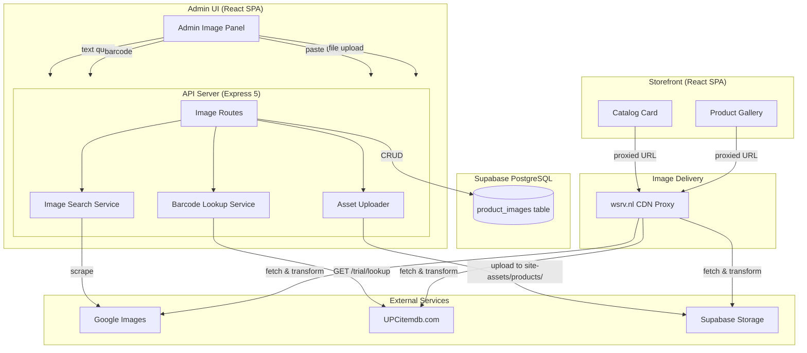

# Design Document: Product Image Management

## Overview

This feature transforms the existing single-image product system into a multi-image management platform with intelligent sourcing, on-the-fly optimization, and an interactive storefront gallery.

### Key Design Decisions

1. **wsrv.nl as image proxy** — Free, Cloudflare CDN-backed, open-source (BSD-3). No self-hosted infrastructure needed. Images are resized, converted to WebP, and cached at the edge. The storefront never stores multiple image sizes.

2. **scrape-google-images for text search** — MIT-licensed npm package. Uses Cheerio for HTML parsing (NOT Puppeteer — lightweight, no headless browser needed). If the library breaks after a Google HTML change, the feature gracefully degrades: admin still has paste/upload/barcode methods. A 3-second cooldown is enforced between search requests to avoid Google rate-limiting/CAPTCHA.

3. **UPCitemdb.com for barcode lookup** — Free tier (100 requests/day, no key). Sufficient for a small-to-medium catalog. Rate limit tracked server-side with a daily counter.

4. **Max 5 images enforced at API level** — Keeps product pages performant and UX clean. The constraint is enforced server-side (source of truth) and reflected in the admin UI.

5. **Existing product_images table reused** — Only a `source` column is added. No schema redesign needed since the table already supports multi-image via sort_order.

6. **File uploads reuse existing asset-uploader.ts** — Extended with a `product` category. Uploads go to `products/` folder in the `site-assets` Supabase Storage bucket.

7. **HTTPS-only URLs** — Only HTTPS image URLs are accepted. This prevents mixed-content warnings and ensures wsrv.nl can proxy them (wsrv.nl requires https sources). Data URIs, blob URLs, and http:// URLs are rejected at the API level.

## Architecture



## Degradation Strategy

| Service Down | Impact | Fallback |
|--------------|--------|----------|
| wsrv.nl | Images not resized/cached | Render raw URL directly (accept larger downloads) |
| Google Images scraping | Search tab returns errors | Admin uses paste/upload/barcode tabs |
| UPCitemdb.com | Barcode tab returns errors | Admin uses paste/upload/search tabs |
| Supabase Storage | Upload tab fails | Admin uses paste/search/barcode tabs |

The system is designed so that no single external service failure prevents image management entirely — at minimum, URL paste always works (zero external dependencies).

### Data Flow Summary

| Flow | Path |
|------|------|
| Image search | Admin UI → `POST /api/admin/products/:id/images/search` → scrape-google-images → Google Images |
| Barcode lookup | Admin UI → `POST /api/admin/products/:id/images/barcode` → UPCitemdb.com API |
| URL paste | Admin UI → `POST /api/admin/products/:id/images` with source=paste |
| File upload | Admin UI → `POST /api/admin/products/:id/images/upload` → asset-uploader → Supabase Storage |
| Storefront render | Component → `getProxyUrl(rawUrl, preset)` → `https://wsrv.nl/?url=...` → Cloudflare CDN |
| Fallback | On proxy error/timeout → render raw URL directly |

## Components and Interfaces

### API Routes (`artifacts/api-server/src/routes/product-images.ts`)

| Method | Path | Purpose |
|--------|------|---------|
| `GET` | `/api/admin/products/:id/images` | List all images for a product (sorted by sort_order) |
| `POST` | `/api/admin/products/:id/images` | Add image(s) from URL paste or selection (body: `{ url, alt_text?, source }`) |
| `POST` | `/api/admin/products/:id/images/search` | Search Google Images (body: `{ query }`, returns candidate URLs) |
| `POST` | `/api/admin/products/:id/images/barcode` | Barcode lookup (body: `{ barcode }`, returns candidate URLs) |
| `POST` | `/api/admin/products/:id/images/upload` | File upload via multipart form data |
| `PATCH` | `/api/admin/products/:id/images/reorder` | Update sort_order (body: `{ image_ids: string[] }` in desired order) |
| `DELETE` | `/api/admin/products/:id/images/:imageId` | Delete a single image |

All admin routes use `requireAdmin()` middleware.

### Frontend Components

#### Admin Components (`artifacts/store/src/components/admin/`)

| Component | Purpose |
|-----------|---------|
| `ProductImagePanel.tsx` | Main orchestrator — tabs for search/barcode/paste/upload, image list with reorder |
| `ImageSearchTab.tsx` | Text search input + candidate grid |
| `ImageBarcodeTab.tsx` | Barcode input + validation + candidate grid |
| `ImagePasteTab.tsx` | URL input + preview + confirm |
| `ImageUploadTab.tsx` | Drag-and-drop file upload zone |
| `ImageGrid.tsx` | Reorderable grid of current product images with delete/badge |
| `ImageCandidateGrid.tsx` | Selectable grid for search/barcode results |

#### Storefront Components (`artifacts/store/src/components/storefront/`)

| Component | Purpose |
|-----------|---------|
| `ProductGallery.tsx` | Main image + thumbnail strip + swipe + lightbox |
| `ProductCard.tsx` (existing) | Updated to use `getProxyUrl()` for thumbnail |

### Utility Modules

#### `artifacts/store/src/lib/image-proxy.ts`

```typescript
export type ImagePreset = "thumbnail" | "gallery" | "lightbox";

export interface PresetConfig {
  width: number;
  height: number;
  quality: number;
  fit: "cover" | "inside";
}

export const PRESETS: Record<ImagePreset, PresetConfig> = {
  thumbnail: { width: 300, height: 300, quality: 80, fit: "cover" },
  gallery:   { width: 1000, height: 1000, quality: 85, fit: "inside" },
  lightbox:  { width: 1600, height: 1600, quality: 90, fit: "inside" },
};

export function getProxyUrl(rawUrl: string, preset: ImagePreset): string;
// Returns: `https://wsrv.nl/?url={encoded_url}&w={width}&h={height}&output=webp&q={quality}&fit={preset.fit}`
export function extractOriginalUrl(proxyUrl: string): string | null;
```

#### `artifacts/api-server/src/lib/image-search.ts`

```typescript
export async function searchImages(query: string): Promise<string[]>;
```

#### `artifacts/api-server/src/lib/barcode-lookup.ts`

```typescript
export interface BarcodeResult {
  title: string;
  images: string[];
}
export function validateBarcode(barcode: string): boolean;
export async function lookupBarcode(barcode: string): Promise<BarcodeResult | null>;
```

#### `artifacts/api-server/src/lib/rate-limiter.ts`

```typescript
/**
 * Simple daily counter stored in Supabase.
 * Tracks API call counts per service per day.
 */
export async function checkDailyLimit(service: string, maxPerDay: number): Promise<boolean>;
export async function incrementDailyCount(service: string): Promise<void>;
```

Usage:
- Image search: 3-second cooldown between requests (in-memory timestamp)
- Barcode lookup: 100/day stored in DB row (`rate_limits` table with `service`, `count`, `reset_date`)

#### `artifacts/api-server/src/lib/asset-uploader.ts` (extended)

Add `"product"` to `AssetCategory` type. Product uploads go to `products/` folder with 5 MB limit, same MIME validation as existing.

## Data Models

### Existing Table: `product_images`

```sql
CREATE TABLE product_images (
  id UUID PRIMARY KEY DEFAULT gen_random_uuid(),
  product_id UUID NOT NULL REFERENCES products(id) ON DELETE CASCADE,
  url TEXT NOT NULL,
  alt_text TEXT,
  sort_order INTEGER NOT NULL DEFAULT 0,
  created_at TIMESTAMPTZ DEFAULT now()
);
```

### Migration: Add `source` column

```sql
ALTER TABLE product_images
  ADD COLUMN source TEXT NOT NULL DEFAULT 'paste'
  CHECK (source IN ('search', 'barcode', 'paste', 'upload'));
```

```sql
-- Prevent duplicate URLs per product
CREATE UNIQUE INDEX idx_product_images_url ON product_images(product_id, url);
```

The default `'paste'` ensures backward compatibility with existing rows (previously images were added via URL in the product form).

### Data Invariants

- `sort_order` values for a given `product_id` are always a contiguous sequence starting at 0
- A product has at most 5 rows in `product_images`
- `source` is always one of: `search`, `barcode`, `paste`, `upload`
- `url` for `source = 'upload'` is always a Supabase Storage public URL
- A product SHALL NOT have duplicate URLs in `product_images` (enforced by unique index)
- URLs must be HTTPS (`http://`, `data:`, `blob:` are rejected)

## Correctness Properties

*A property is a characteristic or behavior that should hold true across all valid executions of a system — essentially, a formal statement about what the system should do. Properties serve as the bridge between human-readable specifications and machine-verifiable correctness guarantees.*

### Property 1: Proxy URL format correctness

*For any* valid image URL and *any* image preset (thumbnail, gallery, lightbox), the generated proxy URL SHALL contain the base `https://wsrv.nl/?url=`, the URL-encoded original URL, and the correct width, height, quality, and format parameters matching the preset configuration.

**Validates: Requirements 1.1, 1.2, 1.3**

### Property 2: Proxy URL round-trip encoding

*For any* valid image URL (including URLs with query parameters, fragments, and special characters), generating a proxy URL and then extracting the original URL parameter SHALL produce the original URL unchanged.

**Validates: Requirements 1.4, 1.5**

### Property 3: Maximum images constraint

*For any* product with N existing images (where 0 ≤ N ≤ 5), attempting to add K images SHALL result in exactly min(K, 5 - N) images being added, and the total count SHALL never exceed 5.

**Validates: Requirements 7.1, 3.3, 7.4**

### Property 4: Barcode validation

*For any* string, the barcode validator SHALL return true if and only if the string is a valid EAN-8, EAN-13, UPC-A, or UPC-E format with a correct check digit. All other strings SHALL be rejected.

**Validates: Requirements 4.6**

### Property 5: Sort order contiguity invariant

*For any* sequence of add, delete, and reorder operations on a product's images, the resulting sort_order values SHALL always form a contiguous integer sequence starting at 0 (i.e., [0, 1, 2, ..., n-1] where n is the number of images).

**Validates: Requirements 8.2, 8.4, 9.3**

### Property 6: Source tracking completeness

*For any* image creation operation (regardless of sourcing method), the resulting Product_Image record SHALL have a `source` field set to exactly one of: `"search"`, `"barcode"`, `"paste"`, or `"upload"`.

**Validates: Requirements 12.1**

### Property 7: Duplicate URL rejection

*For any* product, adding an image with a URL that already exists for that product SHALL be rejected, leaving the existing images unchanged.

**Validates: Data Invariant (unique URL per product)**

### Property 8: Uploaded file cleanup on deletion

*For any* Product_Image with source='upload', deleting the image record SHALL also trigger deletion of the corresponding file from Supabase Storage. If storage deletion fails, the DB record SHALL still be deleted (log warning, don't block).

**Validates: Requirements 9.4**

### Property 9: Search result deduplication

*For any* image search response, the returned candidate URLs SHALL contain no duplicates.

**Validates: Requirements 3.1**

### Property 10: Proxy URL idempotence

*For any* URL and preset, calling getProxyUrl multiple times with the same inputs SHALL always return identical output strings.

**Validates: Requirements 1.3**

## Error Handling

| Scenario | HTTP Status | Error Response | User-Facing Message |
|----------|-------------|----------------|---------------------|
| Add image when product has 5 | 400 | `{ error: "Maximum 5 images per product" }` | "This product already has the maximum number of images (5/5)" |
| Invalid barcode format | 400 | `{ error: "Invalid barcode format" }` | "Please enter a valid EAN-8, EAN-13, UPC-A, or UPC-E barcode" |
| UPCitemdb daily limit exceeded | 429 | `{ error: "Barcode lookup daily limit exceeded" }` | "Barcode lookup limit reached. Please try again tomorrow" |
| Image search returns no results | 200 | `{ images: [] }` | "No images found for this search" |
| Image search service error | 502 | `{ error: "Image search unavailable" }` | "Image search is temporarily unavailable. Please try again" |
| Barcode not found in UPCitemdb | 200 | `{ images: [] }` | "No images found for this barcode" |
| Pasted URL not a valid image | 400 | `{ error: "URL does not resolve to a valid image" }` | "This URL doesn't appear to be a valid image" |
| File too large (> 5 MB) | 413 | `{ error: "File exceeds 5 MB limit" }` | "Image file must be under 5 MB" |
| Unsupported file type | 415 | `{ error: "Unsupported image type" }` | "Accepted formats: JPEG, PNG, WebP, AVIF" |
| Upload to Supabase Storage fails | 500 | `{ error: "Upload failed" }` | "Upload failed. Please try again" |
| Product not found | 404 | `{ error: "Product not found" }` | — |
| Unauthorized (no admin token) | 403 | `{ error: "Forbidden" }` | Redirects to login |
| wsrv.nl proxy timeout (5s) | — | (client-side) | Falls back silently to raw URL |
| Reorder with invalid image IDs | 400 | `{ error: "Image IDs do not match product images" }` | "Could not reorder images. Please refresh and try again" |
| Duplicate image URL for product | 409 | `{ error: "This image is already added to the product" }` | "This image is already added" |
| Search query too short (<2 chars) | 400 | `{ error: "Search query must be at least 2 characters" }` | "Please enter at least 2 characters" |
| Search query too long (>200 chars) | 400 | `{ error: "Search query is too long" }` | "Search query is too long" |
| URL is not HTTPS | 400 | `{ error: "Only HTTPS image URLs are accepted" }` | "Only HTTPS URLs are supported" |
| URL is a data URI / blob | 400 | `{ error: "Data URIs and blob URLs are not supported" }` | "Please provide a regular image URL" |
| Google CAPTCHA/rate limit | 429 | `{ error: "Search temporarily blocked. Try again in 60 seconds" }` | "Search temporarily unavailable. Wait 60 seconds" |
| Search cooldown active | 429 | `{ error: "Please wait before searching again" }` | "Please wait a few seconds before searching again" |

## Testing Strategy

### Property-Based Tests (fast-check)

The project uses **fast-check** for property-based testing. Each property test runs a minimum of 100 iterations.

| Property | Test File | What's Generated |
|----------|-----------|------------------|
| 1: Proxy URL format | `image-proxy.property.test.ts` | Random URLs × all presets |
| 2: Round-trip encoding | `image-proxy.property.test.ts` | URLs with query params, special chars, unicode |
| 3: Max images constraint | `product-images.property.test.ts` | Random current counts (0-5) × random add counts (1-10) |
| 4: Barcode validation | `barcode-validation.property.test.ts` | Random strings, valid EANs, valid UPCs, near-valid barcodes |
| 5: Sort order contiguity | `product-images.property.test.ts` | Random operation sequences (add/delete/reorder) |
| 6: Source tracking | `product-images.property.test.ts` | Random source types × random image data |

**Configuration:**
- Library: `fast-check` (already in devDependencies)
- Runner: `vitest --run`
- Iterations: 100 minimum per property
- Tag format: `// Feature: product-image-management, Property {N}: {title}`

### Unit Tests (vitest)

| Area | Coverage |
|------|----------|
| `getProxyUrl()` | Specific presets produce expected URLs |
| `extractOriginalUrl()` | Edge cases: malformed URLs, missing params |
| `validateBarcode()` | Known valid/invalid barcodes (EAN-8, EAN-13, UPC-A, UPC-E) |
| Fallback behavior | Component renders raw URL on proxy error |
| Admin UI states | Empty results, disabled controls at max, counter display |

### Integration Tests

| Area | Coverage |
|------|----------|
| `POST /api/admin/products/:id/images` | Create image, verify DB record with source |
| `DELETE /api/admin/products/:id/images/:imageId` | Delete and verify sort_order recompaction |
| `PATCH /api/admin/products/:id/images/reorder` | Reorder and verify DB state |
| `POST /api/admin/products/:id/images/upload` | Upload flow with mocked Supabase Storage |
| `POST /api/admin/products/:id/images/search` | Mocked scrape-google-images response |
| `POST /api/admin/products/:id/images/barcode` | Mocked UPCitemdb response |

### Component Tests

| Component | Key Scenarios |
|-----------|--------------|
| `ProductGallery` | Single image (no nav), multiple images (thumbnails + swipe), lightbox |
| `ProductCard` | Proxied URL, no-image placeholder, fallback on error |
| `ProductImagePanel` | Tab switching, image count display, disabled states at max |
| `ImageCandidateGrid` | Selection limit enforcement, visual feedback |

### Edge Case Tests

| Scenario | Expected |
|----------|----------|
| Add same URL twice to same product | 409 Conflict, no duplicate created |
| Concurrent adds that would exceed max 5 | Only first succeeds, second gets 400 |
| Empty/whitespace search query | 400 error |
| URL > 2000 chars | 400 error ("URL too long") |
| `http://` URL (not https) | 400 error |
| `data:image/png;base64,...` URL | 400 error |
| Delete uploaded image → storage file removed | File no longer accessible |
| Product deleted → cascade deletes images | All product_images rows gone |
| Product deleted → orphan storage files | Storage files cleaned up via cascade hook |
| Gallery with 1 image | No thumbnails, no swipe controls |
| Gallery with 5 images | All show, navigation wraps from last→first |
| Search returns URLs that are already on the product | Those URLs disabled/greyed in candidate grid |
