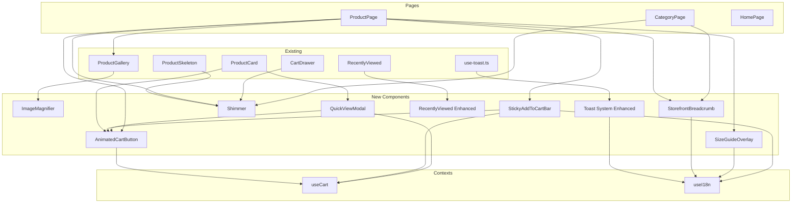

# Design Document: Storefront UX Improvements

## Overview

This design covers 9 UI/UX enhancement components for the white-label e-commerce storefront. Each component integrates with the existing React 19 SPA architecture (TypeScript strict, Vite 7, Tailwind v4) and leverages existing primitives: `useCart()` for cart operations, `useI18n()` for translations, shadcn/ui for base components, and Radix UI for accessible dialog/overlay patterns.

The enhancements span four user-experience domains:
1. **Product inspection** — Image magnifier, quick view modal
2. **Cart interaction** — Sticky add-to-cart bar, animated feedback, toast notifications
3. **Perceived performance** — Skeleton shimmer loading states
4. **Navigation & discovery** — Breadcrumb navigation, size guide overlay, recently viewed carousel

All components follow these cross-cutting constraints:
- CSS transitions/keyframes only (no external animation libraries)
- `prefers-reduced-motion` support across all animated components
- Full i18n via `t()` keys in all 3 locale files (az/ru/en)
- Keyboard accessibility with aria attributes and focus management
- Mobile-first responsive design with touch gesture support

## Architecture



### Integration Strategy

| Component | Modifies Existing | New File(s) |
|-----------|------------------|-------------|
| Image Magnifier | `ProductGallery.tsx` | `components/storefront/ImageMagnifier.tsx` |
| Sticky Add-to-Cart | — | `components/storefront/StickyAddToCartBar.tsx` |
| Quick View Modal | `ProductCard.tsx` | `components/storefront/QuickViewModal.tsx` |
| Animated Cart Button | `ProductCard.tsx`, `Header.tsx` | `components/storefront/AnimatedCartButton.tsx` |
| Skeleton Shimmer | `ProductSkeleton.tsx`, `ProductPage.tsx` | `components/ui/shimmer.tsx` |
| Breadcrumb Navigation | `ProductPage.tsx`, `CategoryPage.tsx` | `components/storefront/StorefrontBreadcrumb.tsx` |
| Size Guide Overlay | — | `components/storefront/SizeGuideOverlay.tsx` |
| Recently Viewed | `RecentlyViewed.tsx` | — (enhanced in-place) |
| Toast System | `hooks/use-toast.ts` | — (extended in-place) |

## Components and Interfaces

### 1. ImageMagnifier

```typescript
interface ImageMagnifierProps {
  src: string;
  alt: string;
  naturalWidth: number;
  naturalHeight: number;
  magnification?: number; // default 2.5
  lensSize?: number;      // default 150 (px)
  onImageClick?: () => void;
}
```

**Behavior:**
- Desktop (≥768px): On mouse enter, show lens overlay tracking cursor at 60fps via `requestAnimationFrame`. Lens displays `background-image` at `magnification×` scale, positioned to center on cursor. Clamped so lens stays within image bounds.
- Mobile (<768px): Pinch-to-zoom via `touchstart`/`touchmove`/`touchend` tracking two finger distance. CSS `transform: scale()` between 1× and 4×.
- Resolution check: Compare `naturalWidth` against `displayWidth × magnification`. If insufficient, do not activate.
- Mounted inside `ProductGallery.tsx` wrapping the main image `<div>`.

### 2. StickyAddToCartBar

```typescript
interface StickyAddToCartBarProps {
  product: {
    product_id: string;
    slug: string;
    title: string;
    price: number;
    image: string | null;
    stock: number;
  };
  primaryCtaRef: React.RefObject<HTMLElement>;
}
```

**Behavior:**
- Uses `IntersectionObserver` on `primaryCtaRef` to detect when the main CTA leaves viewport.
- Fixed to bottom with `z-index: 45` (above content z-40, below modal z-50, but below MobileBottomNav z-50).
- Positioned with `bottom: 64px` (4rem) to sit above the existing `MobileBottomNav` component which is `h-16 fixed bottom-0 z-50`. This prevents overlap with the bottom navigation.
- Slide-up/down transition via `transform: translateY()` with 200ms duration.
- Only renders on viewports <1024px (CSS `lg:hidden` + observer cleanup).
- Calls `addItem()` from `useCart()` on tap.
- Checks `stock === 0` to show disabled "Out of Stock" state.
- On md+ viewports (≥768px) where MobileBottomNav is hidden (`md:hidden`), the bar positions at `bottom: 0`.

### 3. QuickViewModal

```typescript
interface QuickViewModalProps {
  productSlug: string;
  open: boolean;
  onClose: () => void;
  triggerRef: React.RefObject<HTMLButtonElement>;
  locale: string;
}
```

**Data Fetching:**
- QuickViewModal fetches product details on open using the existing Supabase query pattern from `ProductPage.tsx`.
- Fetches from `products` table with `product_images` and `product_translations` joins, filtered by slug.
- Uses `@tanstack/react-query` with `queryKey: ["quick-view", productSlug]` and `enabled: open` so the fetch only fires when the modal is opened.
- While loading, shows a compact skeleton inside the modal (shimmer on image + text blocks).
- Data shape after fetch:

```typescript
interface QuickViewProduct {
  product_id: string;
  slug: string;
  title: string;
  price: number;
  original_price?: number | null;
  image: string | null;
  stock: number;
  variants: Array<{
    id: string;
    label: string;
    stock: number;
    price?: number;
  }>;
}
```

**Note:** The current product data model doesn't have a `variants` table. For the initial implementation, the QuickViewModal will show product info without variant selection. Variant support will be added when the product variants feature is implemented. The interface is designed forward-compatibly.

**Behavior:**
- Built on existing `Dialog` component from `components/ui/dialog.tsx` (Radix `@radix-ui/react-dialog`).
- Inherits focus trapping, `role="dialog"`, `aria-modal="true"` from Radix primitives.
- On close, returns focus to `triggerRef`.
- Variant selector: radio group for single-attribute variants. If variants exist and none selected, inline error blocks `addItem()`. (Future — see note above.)
- Trigger button in `ProductCard`: visible on hover (desktop) or always visible at smaller size (mobile <768px).

### 4. AnimatedCartButton

```typescript
interface AnimatedCartButtonProps {
  onAdd: () => Promise<void> | void;
  disabled?: boolean;
  className?: string;
  label?: string;
  size?: "sm" | "md" | "lg";
}

// State machine: idle → loading → success → idle (after 1800ms)
//                idle → loading → error → idle (after 600ms)
type ButtonState = "idle" | "loading" | "success" | "error";
```

**Behavior:**
- Morph animation using CSS `transition` on width/background-color/border-radius.
- Loading state: spinner (only if `onAdd` is async).
- Success: checkmark icon + green-500 background, 300ms bounce on cart badge via custom event `cart-badge-bounce`.
- The Header component (`components/storefront/Header.tsx`) must be modified to listen for this event on the cart badge `<span>` element (line ~142). On receiving the event, apply a CSS class `animate-badge-bounce` (scale 1→1.3→1 over 300ms) and remove it after animation completes.
- Error: shake animation (3 oscillations, 4px displacement, 400ms).
- `pointer-events: none` during animation to prevent double-clicks.
- `prefers-reduced-motion`: Skip transitions, show final state immediately.
- Shared across: ProductCard, QuickViewModal, StickyAddToCartBar, product page CTA.

### 5. Shimmer Component

```typescript
interface ShimmerProps {
  className?: string;
  children?: React.ReactNode;
}
```

**Behavior:**
- Wraps children with a `<div>` that applies the existing `.shimmer` CSS class.
- The `@keyframes shimmer` animation already exists in `artifacts/store/src/index.css` (line 246). No new keyframe definition needed.
- Accepts `className` for layout customization (width, height, border-radius).
- `prefers-reduced-motion` media query: renders a static `Spinner` component instead.
- Replaces direct `.shimmer` class usage in `ProductSkeleton`.
- Single `@keyframes shimmer` definition (already exists in `index.css`).

### 6. StorefrontBreadcrumb

```typescript
interface BreadcrumbSegment {
  label: string;
  href: string;
}

interface StorefrontBreadcrumbProps {
  segments: BreadcrumbSegment[];
  currentLabel: string;
}
```

**Behavior:**
- Built on existing `components/ui/breadcrumb.tsx` shadcn primitives (Breadcrumb, BreadcrumbList, BreadcrumbItem, BreadcrumbLink, BreadcrumbPage, BreadcrumbSeparator).
- Resolves category hierarchy using `getCategoriesTree()` from `lib/queries/categories.ts`.
- Renders JSON-LD `<script type="application/ld+json">` with BreadcrumbList schema.
- Final segment uses `aria-current="page"` (already built into `BreadcrumbPage` component).
- `nav` element has `aria-label="Breadcrumb"` (already built into `Breadcrumb` component).
- All labels translated via `t()` for "Home" and category names via `getTranslatedField()`.

### 7. SizeGuideOverlay

```typescript
interface SizeGuideData {
  headers: string[];         // e.g. ["Size", "Chest (cm)", "Waist (cm)"]
  rows: Array<string[]>;     // max 20 rows
  unit: "cm" | "inches";
}

interface SizeGuideOverlayProps {
  categoryId: string;
  open: boolean;
  onClose: () => void;
  triggerRef: React.RefObject<HTMLElement>;
}
```

**Behavior:**
- Built on Radix Dialog (via `components/ui/dialog.tsx`). Focus trap, `role="dialog"`, `aria-modal="true"`.
- Fetches size guide data from API by category ID. Cached via `@tanstack/react-query`.
- If no data exists for category → "Size Guide" link not rendered.
- If fetch fails after click → shows error state with close button.
- Table rendered with semantic `<table>`, `<thead>`, `<tbody>` elements.

**API Dependency:**
- Requires a new API endpoint: `GET /api/size-guides/:categoryId?locale={locale}` returning `SizeGuideResponse`.
- For initial implementation, size guide data will be stored in a new `size_guides` table (columns: `id`, `category_id`, `headers JSONB`, `rows JSONB`, `measurement_unit`, `created_at`, `updated_at`).
- The API route belongs in `artifacts/api-server/src/routes/admin/` with a public read endpoint.
- Admin configures data per-category via a future admin page (out of scope for this feature — but the DB schema and API endpoint are in scope).

### 8. RecentlyViewed Enhanced

Enhances existing `RecentlyViewed.tsx` in-place:

**New CSS properties on scroll container:**
- `scroll-snap-type: x mandatory`
- `scroll-behavior: smooth`

**New CSS properties on each card:**
- `scroll-snap-align: start`

**Arrow navigation (≥768px):**
- Left/right buttons positioned at container edges, visible on hover.
- `scrollBy({ left: containerWidth, behavior: 'smooth' })` on click.
- Hidden when no overflow (`scrollWidth <= clientWidth`).
- Left arrow hidden at `scrollLeft === 0`.
- Right arrow hidden at `scrollLeft + clientWidth >= scrollWidth`.
- Recalculated on scroll and resize events.
- `aria-label` with locale-appropriate "previous"/"next" text.

### 9. Toast System Enhancement

Extends existing `use-toast.ts` (located at `artifacts/store/src/hooks/use-toast.ts`):

```typescript
// New exported helpers — accept `t` function as parameter for i18n access
function toastCartAdd(t: (key: string) => string, productName: string): void;
function toastWishlist(t: (key: string) => string, productName: string): void;
function toastCouponApplied(t: (key: string) => string, description: string): void;
function toastOutOfStock(t: (key: string) => string, productName: string): void;

// Enhanced toast options
interface EnhancedToastOptions {
  duration?: number;  // 1000-10000ms, default 3000
  variant?: "default" | "destructive" | "success";
}
```

**Note on i18n access:** The helper functions are plain functions (not hooks), so they cannot call `useI18n()`. They accept `t` as a parameter. Call sites (components) pass their own `t` reference: `toastCartAdd(t, product.title)`.

**Changes to existing hook:**
- Increase `TOAST_LIMIT` from 1 to 3 (currently `const TOAST_LIMIT = 1` at line 7).
- Change `TOAST_REMOVE_DELAY` from 1000000 (effectively infinite) to be based on `duration` parameter (default 3000ms).
- Stacking with `gap-2` (8px) vertical offset between notifications.
- Oldest dismissed when 4th arrives.
- Animation: CSS keyframes `slide-in-from-top` on mobile (<640px), `slide-in-from-bottom-right` on desktop (≥640px). Duration 200-400ms.
- Close button triggers immediate `DISMISS_TOAST` with animate-out.

## Data Models

### Category Tree (existing — used by Breadcrumb)

```typescript
// From lib/queries/categories.ts
type CategoryNode = {
  id: string;
  slug: string;
  parent_id: string | null;
  icon_url: string | null;
  category_translations: Array<{
    id: string;
    category_id: string;
    locale: string;      // "az" | "ru" | "en"
    name: string;
    description: string | null;
  }>;
  subcategories: CategoryNode[];
};
```

### Size Guide Data (new — fetched from API)

```typescript
interface SizeGuideResponse {
  category_id: string;
  headers: string[];            // Column headers (localized)
  rows: Array<string[]>;        // Size data rows (max 20)
  measurement_unit: "cm" | "inches";
  updated_at: string;
}
```

### Cart Item (existing — used by Sticky Bar, Quick View, Animated Button)

```typescript
// From lib/cart/context.tsx
interface CartItem {
  product_id: string;
  slug: string;
  title: string;
  price: number;
  image: string | null;
  quantity: number;
}
```

### Toast State (enhanced)

```typescript
interface EnhancedToasterToast {
  id: string;
  title?: React.ReactNode;
  description?: React.ReactNode;
  action?: ToastActionElement;
  variant?: "default" | "destructive" | "success";
  duration?: number;           // ms, 1000-10000
  open: boolean;
  onOpenChange?: (open: boolean) => void;
}
```

### Product for Quick View

```typescript
interface QuickViewProduct {
  product_id: string;
  slug: string;
  title: string;
  price: number;
  image: string | null;
  stock: number;
  variants: Array<{
    id: string;
    label: string;
    stock: number;
    price?: number;
  }>;
}
```

### Breadcrumb JSON-LD Schema

```typescript
interface BreadcrumbJsonLd {
  "@context": "https://schema.org";
  "@type": "BreadcrumbList";
  itemListElement: Array<{
    "@type": "ListItem";
    position: number;
    name: string;
    item: string;  // absolute URL
  }>;
}
```


## Correctness Properties

*A property is a characteristic or behavior that should hold true across all valid executions of a system — essentially, a formal statement about what the system should do. Properties serve as the bridge between human-readable specifications and machine-verifiable correctness guarantees.*

### Property 1: Magnifier lens position is clamped within image bounds

*For any* image dimensions (width, height), any lens size, any magnification factor, and any cursor position (x, y) within the image bounds, the computed lens position SHALL keep the entire lens rectangle within the image boundary (lensX ≥ 0, lensY ≥ 0, lensX + lensSize ≤ imageWidth, lensY + lensSize ≤ imageHeight) AND the background-position SHALL center the zoomed region on the cursor coordinates.

**Validates: Requirements 1.1, 1.2**

### Property 2: Pinch-to-zoom scale is proportional and clamped

*For any* initial finger distance > 0 and any current finger distance ≥ 0, the computed zoom level SHALL equal `clamp(currentDistance / initialDistance, 1.0, 4.0)` — never below 1× and never above 4×.

**Validates: Requirements 1.4**

### Property 3: Quick View addItem uses correct variant data

*For any* product with N variants (N ≥ 1) and any valid selected variant index (0 ≤ i < N), clicking Add to Cart in the Quick View SHALL call `addItem` with that variant's `id`, `price`, and `label`. For any product with zero variants, `addItem` SHALL be called with the default product data.

**Validates: Requirements 3.3, 3.4**

### Property 4: AnimatedCartButton ignores clicks while not idle

*For any* button state that is not "idle" (i.e., state ∈ {"loading", "success", "error"}), any simulated click event SHALL NOT trigger the `onAdd` callback and SHALL NOT dispatch an `addItem` action to the cart context.

**Validates: Requirements 4.8**

### Property 5: Breadcrumb path resolution produces valid ancestor chain

*For any* category tree with depth ≤ 10 and any target category within that tree, the resolved breadcrumb path SHALL start with the root ancestor and end with the target category, where each consecutive pair (segments[i], segments[i+1]) satisfies: segments[i+1].parent_id === segments[i].id. The path length SHALL equal the depth of the target category in the tree plus one (for "Home").

**Validates: Requirements 6.1, 6.2, 6.4**

### Property 6: JSON-LD BreadcrumbList has correct structure

*For any* non-empty list of breadcrumb segments (1 to 10 segments), the generated JSON-LD object SHALL have `@type: "BreadcrumbList"`, an `itemListElement` array of length equal to the segment count, positions numbered sequentially from 1, each item having a non-empty `name` string and a valid absolute URL as `item`.

**Validates: Requirements 6.7**

### Property 7: Toast duration is clamped to valid range

*For any* numeric duration value (including negative, zero, and very large numbers), the effective toast auto-dismiss duration SHALL be `clamp(value, 1000, 10000)`. When no duration is provided, the effective duration SHALL be 3000ms.

**Validates: Requirements 9.6**

### Property 8: Toast stack never exceeds maximum limit

*For any* sequence of N toast additions (1 ≤ N ≤ 100) with no dismissals, the toast state array length SHALL never exceed 3. When a 4th toast is added, the oldest toast SHALL be removed before the new one is appended.

**Validates: Requirements 9.9, 9.10**

## Error Handling

### Image Magnifier
- **Low-resolution source**: If `naturalWidth < displayWidth × magnification`, magnifier does not activate. No error shown — graceful degradation.
- **Image load failure**: Falls through to existing `ProxiedImage` `onError` fallback (raw URL). Magnifier disabled if image fails to load.

### Sticky Add-to-Cart Bar
- **IntersectionObserver unsupported**: Feature not activated. Bar remains hidden (progressive enhancement).
- **addItem failure**: Delegates to AnimatedCartButton error state (shake animation).

### Quick View Modal
- **Product data fetch failure**: Modal shows error state with "Unable to load product details" message and close button.
- **No variant selected**: Inline validation error message, `addItem` not called. Non-blocking — user can select and retry.

### Animated Cart Button
- **onAdd() rejects**: Button transitions to error state (shake), then resets to idle after 600ms. No error toast — the button itself communicates failure.
- **onAdd() throws synchronously**: Caught in try/catch, same error state.

### Shimmer Component
- **prefers-reduced-motion**: Renders Spinner component instead. No error state needed.

### Breadcrumb Navigation
- **Category not found in tree**: Breadcrumb renders only "Home" segment. No error — graceful degradation.
- **getCategoriesTree() returns empty**: Same as above — "Home" only.
- **Product has no category**: Breadcrumb renders "Home > Product Title" without category segments.

### Size Guide Overlay
- **No size guide data for category**: "Size Guide" link not rendered. No error state.
- **Fetch failure after click**: Overlay opens with error message "Size guide data is currently unavailable" and a close button.
- **Malformed response data**: Treated as fetch failure — shows error message.

### Recently Viewed Carousel
- **No products in history**: Component returns `null` (existing behavior preserved).
- **Scroll API unavailable**: Arrows render but `scrollBy` gracefully no-ops in older browsers.
- **Resize/scroll event errors**: Wrapped in try/catch, arrows default to hidden.

### Toast System
- **TOAST_LIMIT exceeded**: Oldest toast auto-dismissed before new one added (spec behavior, not error).
- **Invalid duration passed**: Clamped to [1000, 10000] range silently.
- **Translation key missing**: Falls through to key string display (existing i18n behavior).

## Testing Strategy

### Unit Tests (Vitest)

All unit tests run via `pnpm exec vitest --run --project store-unit`.

**Pure logic functions to test:**
- `computeLensPosition(imageRect, cursorPos, lensSize, magnification)` — magnifier math
- `computePinchZoom(initialDistance, currentDistance)` — pinch scale
- `resolveBreadcrumbPath(categoryTree, targetCategoryId)` — ancestor chain resolution
- `generateBreadcrumbJsonLd(segments, baseUrl)` — JSON-LD serialization
- `clampDuration(value)` — toast duration clamping
- Toast reducer with TOAST_LIMIT=3 — state machine

**Component rendering tests (jsdom):**
- Shimmer renders `.shimmer` class on children
- ProductSkeleton uses Shimmer internally
- StickyAddToCartBar shows/hides based on observer state
- QuickViewModal renders variant selector and validates selection
- AnimatedCartButton state transitions (idle→loading→success→idle, idle→loading→error→idle)
- StorefrontBreadcrumb renders correct segments with JSON-LD script tag
- RecentlyViewed arrows visibility based on scroll state
- Toast stacking and auto-dismiss

### Property-Based Tests (Vitest + fast-check)

Property-based testing library: **fast-check** (already commonly used with Vitest in this project).

Each property test runs **minimum 100 iterations** with randomly generated inputs.

Tests tagged with: `Feature: storefront-ux-improvements, Property {N}: {title}`

| Property | Test File | Generator Strategy |
|----------|-----------|-------------------|
| 1: Lens position clamping | `storefront-ux.property.test.ts` | Random image dims (100-4000px), random cursor (x,y) within bounds, random lens size (50-300px) |
| 2: Pinch zoom clamping | `storefront-ux.property.test.ts` | Random initial distance (10-500px), random current distance (0-2000px) |
| 3: Quick View variant selection | `storefront-ux.property.test.ts` | Random product with 0-10 variants, random selected index |
| 4: Button non-idle ignores clicks | `storefront-ux.property.test.ts` | Random non-idle state, simulate click |
| 5: Breadcrumb path resolution | `storefront-ux.property.test.ts` | Random category trees (depth 1-5, breadth 1-4), random target leaf |
| 6: JSON-LD structure | `storefront-ux.property.test.ts` | Random segment lists (1-10 items) with random labels and paths |
| 7: Toast duration clamping | `storefront-ux.property.test.ts` | Random integers (-10000 to 100000) |
| 8: Toast stack limit | `storefront-ux.property.test.ts` | Random sequences of 1-50 toast additions |

### E2E Tests (Playwright)

Key user journeys to validate end-to-end:
- Product page: hover magnifier activates → click opens lightbox
- Mobile product page: scroll past CTA → sticky bar appears → tap add to cart
- Category page: hover card → Quick View opens → select variant → add to cart → toast appears
- Breadcrumb navigation: click category segment → navigates to category page
- Recently Viewed: swipe carousel on mobile, arrow navigation on desktop

### Accessibility Testing
- Lighthouse accessibility audit on product page and category page
- Manual testing with screen reader for focus management (Quick View, Size Guide)
- `prefers-reduced-motion` verification for all animated components
