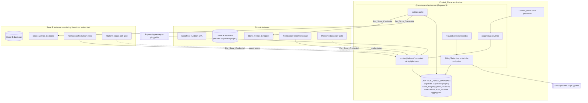
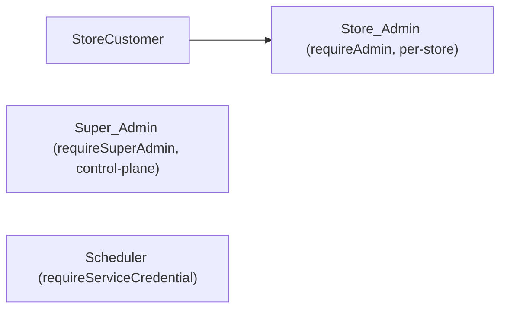

# Design Document: Super Admin Platform

## Overview

The Super Admin Platform is a standalone **Control_Plane** application — its own frontend surfaces, its own backend route group, and its **own separate database** — that the single platform owner (Super_Admin) uses to run a white-label store **leasing** business. It is not a multi-tenant rewrite of the existing store.

Each leased **Store** is a **physically isolated instance** with its **own database** (a separate Supabase project / separate datastore). The existing live store is one such instance and is left **essentially untouched**: there is **no schema migration**, no per-table discriminator column, no row-level-security retrofit, and no auth-hook claim change. The only store-side additions are two small **additive hooks**:

1. a **platform-status self-gate** — the store learns its own `Platform_Status` (`onboarding`/`active`/`suspended`/`disabled`) and gates itself accordingly, and
2. a **notification fetch** — the store admin panel pulls platform notifications addressed to it from the Control_Plane.

Plus the store exposes a small read-only **Store_Metrics_Endpoint** that returns aggregate numbers only.

### Why this model (lowest failure risk)

The previous draft proposed shared-schema multi-tenancy (`tenant_id` on every table + RLS + an application `tenantScope()` layer). That design has now been **replaced entirely**. The chosen control-plane + physical-isolation model was selected to minimize failure risk to the live, revenue-generating store:

- **No migration of the live store's schema.** The riskiest work in the old design — adding `tenant_id` to every domain table, backfilling, converting global unique constraints to per-tenant, and bringing up RLS — is gone. The live store keeps its current schema and behavior.
- **Isolation is physical, not logical.** Because each Store owns a separate database and the Control_Plane never connects to any Store's domain database, cross-store data exposure is **structurally impossible** rather than dependent on a correct `WHERE tenant_id = …` on every query. There is no shared datastore between two Stores, and none between any Store and the Control_Plane.
- **The Control_Plane holds only platform-owner data.** It stores a registry of Stores, subscription/plan/billing/invoice records, platform notifications, the audit log, and **at most cached aggregate numbers** about a Store (order count, revenue, optional traffic, quota usage) — **never a Store's raw records**.

This design aligns with established stack patterns: Express 5 REST API in `@workspace/api-server` (domain route files, middleware-based auth, `validate(schema)` Zod bodies, `writeAudit()` fire-and-forget, typed `SupabaseClient<Database>`), React 19 SPA in `@workspace/store` (`useAdminList`/`DataTable`/`Pagination`, `useI18n()` with az/ru/en, admin-style areas with no locale prefix), and Supabase (Postgres + Auth + Storage).

### Requirements-to-design map

| Requirement | Primary design area |
|---|---|
| 1 Super Admin auth/authz | `requireSuperAdmin` middleware, `platform_admins`, `control_plane_sessions` |
| 2 Cross-store dashboard + intel | Store_Dashboard service, metrics aggregation by polling Store_Metrics_Endpoints, `store_metrics_cache` |
| 3 Suspension & reactivation | Suspension_Service sets `stores.platform_status`; enforcement is in the Store |
| 4 Suspended-state UX | Store-side self-gate (503 storefront notice, order rejection, admin write block) |
| 5 Store lifecycle | `stores.platform_status` FSM, create/activate/disable endpoints, registry-only creation |
| 6 Subscription status tracking | `stores.subscription_status`, atomic update, filtering |
| 7 Store notification feed | `platform_notifications` + targets + per-store reads, store-side fetch via Per_Store_Credential |
| 8 Super Admin broadcasting | Targeting (single/set/all), content validation, audit-before-success |
| 9 Physical store isolation | Separate databases, Per_Store_Credential auth, aggregate-only endpoints, no direct DB access |
| 10 Impersonation | `impersonation_sessions`, read-only via Store endpoint/support link, time-bound, audited |
| 11 Platform audit logging | Control-plane `audit_log` with `scope='platform'` marker, filtered reads |
| 12 i18n of platform surfaces | Split-locale message modules, `az` fallback chain |
| 13 Subscription plans | `subscription_plans`, archive/delete guards, assignment |
| 14 Automated billing lifecycle | `invoices`, `billing_config.trial_days`, billing anchor, scheduler via `requireServiceCredential` |
| 15 Plan-based quota | Control_Plane records the limit; the Store enforces usage against its own data |
| 16 Offboarding & retention | `store_offboarding` tracking, export, restore, purge with confirmation |
| 17 MFA & session security | Supabase MFA (TOTP), control-plane session lifetime/idle |
| 18 Multi-channel email delivery | `notification_deliveries`, preferences, email adapter, retries |
| 19 Platform analytics | MRR + counts + revenue-by-plan from Control_Plane records only |

## Architecture

### High-level shape — two planes, separate databases



The single most important architectural invariant: **the Control_Plane never opens a connection to any Store's domain database.** All Control_Plane → Store interaction goes over authenticated HTTP to that Store's two Control_Plane-facing endpoints, and the Control_Plane persists at most cached aggregates.

### Control_Plane backend — same codebase, separate database

The Control_Plane backend is a new route group `routes/platform/*` (aggregated by `routes/platform/index.ts`, mounted under `/api/platform`) inside the **same `@workspace/api-server` codebase**, but backed by a **separate Supabase project/database** from any store:

```typescript
// artifacts/api-server/src/lib/control-plane-supabase.ts
import { createClient, type SupabaseClient } from "@supabase/supabase-js";
import type { ControlPlaneDatabase } from "@workspace/supabase-types"; // separate generated type

const url = process.env.CONTROL_PLANE_SUPABASE_URL!;
const serviceKey = process.env.CONTROL_PLANE_SUPABASE_SERVICE_KEY!;

// Returns a client bound to the CONTROL PLANE database only — never a store DB.
export function getControlPlaneSupabase(): SupabaseClient<ControlPlaneDatabase> {
  return createClient<ControlPlaneDatabase>(url, serviceKey, {
    auth: { autoRefreshToken: false, persistSession: false },
  });
}
```

The existing `getSupabase()`/`getAdminSupabase()` (store database) are **unchanged** and are never used by `routes/platform/*`. The separation is enforced by client construction: platform routes only ever receive `getControlPlaneSupabase()`. This is the central, load-bearing separation of the whole feature.

**Alternative considered — separate deployable.** The Control_Plane backend could instead be a wholly separate service/deployment. That buys process isolation but adds a second deploy pipeline, a second env surface, and duplicated middleware/logger/audit plumbing. **Recommendation: same codebase, separate database.** It keeps one Express app, one set of house middleware (`validate`, `errorHandler`, `req.log`, `writeAudit`), and one deploy, while the *database* separation — the property that actually delivers physical isolation between platform-owner data and store data — is preserved. The route group can be extracted into its own service later without changing the data model.

### Control_Plane frontend

A `/platform/*` SPA area in `artifacts/store/src/pages/platform/*` (no locale prefix, mirroring the `/admin/*` convention). It reuses the existing admin building blocks: `useAdminList()` for list/pagination/filter state, `DataTable`/`Pagination`/`TableEmptyState`, and `useI18n()` `t(key)` for every string (az/ru/en). It talks only to `/api/platform/*`. The per-store **Notification_Center** and **suspended-state notice** are NOT here — they live inside each Store's own SPA (additive store hooks).

### Per-store integration contract

Every leased Store exposes a small Control_Plane-facing surface, all authenticated by that Store's **Per_Store_Credential** (a per-store shared secret). The Control_Plane holds only a **hash/reference** of each credential; the raw secret is provisioned to the Store out of band.

**Auth scheme.** The Control_Plane sends the secret in a bearer header; the Store compares it in **constant time** against its own configured secret. A Store rejects any credential that is not its own.

```
Authorization: Bearer <per-store-secret>      # Control_Plane -> Store (metrics, notification fetch)
X-Store-Id:    <store-uuid>                    # which Store the caller claims to be
```

```
Store-side verification (in each Store instance):
  1. read configured STORE_PLATFORM_SECRET + STORE_ID from the Store's own env
  2. if header X-Store-Id != STORE_ID            -> 403 (another store's credential)
  3. if bearer missing                           -> 401 { error: "authentication required" }
  4. if !timingSafeEqual(bearer, STORE_PLATFORM_SECRET) -> 403
  5. else proceed, returning ONLY this store's own data
```

**(a) Store_Metrics_Endpoint** — read-only, aggregates only:

```
GET {store.metrics_endpoint_url}?from=<ISO date>&to=<ISO date>
->
{
  "order_count":   <non-negative integer>,
  "revenue_total": "<monetary, 2 decimals>",        // string to preserve precision
  "traffic_count": <non-negative integer | null>,   // optional (R2.3)
  "quota_usage":   { "<resource>": <non-negative integer>, ... },  // for dashboard display (R15.7)
  "range":         { "from": "<ISO>", "to": "<ISO>" }
}
```
The endpoint computes these aggregates from the Store's own database and returns **no raw records** (no individual orders, customers, or products). Both range endpoints are inclusive (R2.5).

**(b) Notification fetch + mark-read** — these are served by the **Control_Plane** (the notifications live in the Control_Plane database), called by the Store's admin panel using the Store's Per_Store_Credential:

```
GET  /api/platform/store-feed/notifications        # returns only this store's notifications + unread count
POST /api/platform/store-feed/notifications/:id/read
```
Both are authenticated by Per_Store_Credential (not `requireSuperAdmin`); the resolved store id comes from the credential, so a Store can only ever fetch/mark its own notifications.

### Store-side additive hooks (minimal change to the existing store)

These are the only changes inside a Store instance. They are additive integrations, not schema migrations.

**(i) Platform_Status self-gate.** The Store must know its own status and gate itself: `suspended` → storefront returns a localized 503 notice and blocks admin writes + new orders (403); `disabled` → all storefront/admin access denied; `active`/`onboarding` → normal.

How the Store learns its status — two options were considered:

- **Pull (recommended):** the Store periodically pulls its status from the Control_Plane using its own Per_Store_Credential and caches it locally with a short TTL.
- **Push:** the Control_Plane pushes status to a store-local `platform_status` setting via an authenticated store endpoint whenever it changes.

**Decision: pull-with-short-cache + fail-safe-to-active.** The Store calls `GET /api/platform/store-status` (Per_Store_Credential auth) on a short cadence and caches the last known status (TTL ~60s) in a store-local cache/setting. The self-gate reads the cached value. Critically, the **default is fail-safe to `active`**: if the Control_Plane is unreachable and there is no fresh value, the Store keeps serving (last known status, or `active` if never fetched). This guarantees a Control_Plane outage can **never** take a paying Store down. Push was rejected as the primary mechanism because it makes Store availability depend on the Control_Plane successfully reaching the Store; pull-with-cache inverts that dependency in the safe direction. (Push remains available as an optional latency optimization: a push simply warms the same store-local cache.)

```
Store status resolution (in each Store instance):
  cached = storeLocalStatusCache.get()
  if cached and not expired -> use cached
  else try GET /api/platform/store-status (Per_Store_Credential):
        on success -> cache { status, fetched_at }, use it
        on failure -> use last known cached status if present, else 'active'   # FAIL-SAFE
```

The store-local status value lives in the **Store's** own cache/setting (e.g. a `platform_status` row in the Store's `site_settings`-style store or an in-memory TTL cache). It is described here as a store-side hook and is deliberately **not** part of the Control_Plane data model.

**(ii) Notification fetch.** The Store admin panel fetches platform notifications from the Control_Plane (the two `store-feed` endpoints above) and renders them in a Notification_Center with read/unread state.

**(iii) Store_Metrics_Endpoint.** The Store exposes the aggregate-only metrics endpoint described above for the dashboard.

### Super_Admin auth tier



- Existing per-store `requireAdmin` is unchanged and lives inside each Store.
- New `requireSuperAdmin` middleware guards every interactive `/api/platform/*` route: it verifies the Supabase user against `platform_admins`, verifies the `control_plane_sessions` row is MFA-satisfied and within lifetime (8h) / idle (15m) bounds, then attaches `req.superAdmin`. On any failure → `403` + a denial audit entry (R1.3–1.5, R1.9). Super_Admin is its own tier and never grants direct access to any Store database (R1.8).
- The machine-invoked scheduler entrypoints (`POST /api/platform/billing/run`, retention sweep, metrics poll trigger) are guarded by a distinct **`requireServiceCredential`** middleware (a shared-secret header compared in constant time against `PLATFORM_SCHEDULER_SECRET`), **not** `requireSuperAdmin` — they have no interactive session or MFA and attach a `system` actor marker for audit.
- The store-feed and store-status endpoints are guarded by **Per_Store_Credential** verification (resolves the calling Store), distinct from all three above.

### Route ordering & Express 5

Literal platform sub-paths (e.g. `/platform/stores/export`, `/platform/store-feed/notifications`) are registered **before** `/platform/stores/:id` to avoid param shadowing. All async handlers are typed `Promise<void>`, use early-return (`res.status(...).json(...); return;`), validate bodies with `validate(schema)`, log via `req.log`, and let async errors auto-forward to the central `errorHandler`.

## Components and Interfaces

All endpoints are under `/api`. Interactive control-plane endpoints require `requireSuperAdmin`; scheduler endpoints require `requireServiceCredential`; store-facing endpoints require Per_Store_Credential verification. Responses follow the house format (`res.json({ data })` / `{ error }` / `{ data, total, page, pageSize }`). Bodies are validated with `validate(schema)`; mutations are audited with `writeAudit({ ..., details })` carrying `scope: 'platform'`. Every platform route uses `getControlPlaneSupabase()` — never a store client.

### 1. Auth & MFA — `routes/platform/auth.ts` (`requireSuperAdmin` except where noted)

| Method | Path | Purpose | Statuses |
|---|---|---|---|
| POST | `/platform/auth/mfa/enroll` | Begin TOTP enrollment | 200 / 403 |
| POST | `/platform/auth/mfa/verify` | Verify second factor, mark MFA enabled | 200 / 400 |
| POST | `/platform/auth/session` | Begin control-plane session (requires verified 2FA) | 200 / 401 / 403 |
| DELETE | `/platform/auth/session` | End control-plane session | 204 |

MFA uses Supabase Auth TOTP factors. Session lifetime (8h) and idle (15m) are enforced server-side in `requireSuperAdmin` by comparing `control_plane_sessions.started_at`/`last_seen_at` against config; expiry forces re-sign-in (R17.5, R17.7). Sign-in attempts and enrollment outcomes are audited (R17.1, R17.2, R17.6).

### 2. Store Registry, Dashboard & Metrics — `routes/platform/stores.ts`, `routes/platform/metrics.ts`, `routes/platform/analytics.ts`

| Method | Path | Purpose |
|---|---|---|
| GET | `/platform/stores` | Paginated Store list (name, platform_status, subscription_status, plan); filter `?subscription_status=` (R6.6/6.7); `page`/`pageSize` default 20 (R2.8) |
| GET | `/platform/stores/:id` | Single Store detail + latest cached metrics (R2.4) |
| GET | `/platform/stores/:id/metrics?from=&to=` | Per-store aggregates for a range, read from `store_metrics_cache` (R2.2, R2.5) |
| GET | `/platform/analytics?from=&to=` | MRR, status counts, new/churned, revenue-by-plan from Control_Plane records (R19) |

The dashboard reads Store_Registry fields directly from the Control_Plane database and reads **cached aggregates** from `store_metrics_cache` (populated by the metrics poller; see Background Processing). When a Store's cached metric is missing/stale because its endpoint was unreachable, the Store still appears with its registry fields and its metric fields **marked unavailable** rather than being dropped (R2.10). Empty registry → empty list (R2.9). Time ranges are inclusive, default last 30 days; `start > end` or malformed/over-366-day ranges → `400` (R2.6, R2.7, R19.4–19.7). Revenue/MRR formatted to 2 decimals. Analytics are derived only from persisted Control_Plane records (Store_Registry, plans, invoices) — never any Store's raw records (R19.8).

### 3. Suspension & Lifecycle — `routes/platform/lifecycle.ts`

| Method | Path | Purpose |
|---|---|---|
| POST | `/platform/stores` | Create Store_Registry record (name, owner email, instance_url, metrics_endpoint_url, per_store_credential ref) → `onboarding` + `trialing` (R5.1, R6.2) |
| POST | `/platform/stores/:id/activate` | `onboarding`→`active` (R5.2) |
| POST | `/platform/stores/:id/suspend` | →`suspended` ≤5s; idempotent (R3.1, R3.8) |
| POST | `/platform/stores/:id/reactivate` | `suspended`→`active` ≤5s; idempotent (R3.2, R3.9) |
| POST | `/platform/stores/:id/disable` | →`disabled` (R5.4) |
| PATCH | `/platform/stores/:id/subscription-status` | Set subscription_status atomically (R6.3, R6.9) |
| PUT | `/platform/stores/:id/plan` | Assign/change plan (must exist + not archived) (R13.8, R13.14) |

`platform_status` is a finite-state machine (see Data Models). Illegal transitions → `409`, state unchanged (R5.3). Unknown store → `404` (R3.10). Case-insensitive name collision → `409` (R5.6). Schema failures → `400` naming offending fields (R5.7). Every status change writes an audit entry with prior/new status + UTC timestamp (R3.6, R5.8, R6.4). **Creating a Store is purely recording its registry entry** — the Control_Plane does NOT provision Store infrastructure; that may be manual (R5.10).

**Suspension is set in the Control_Plane but enforced in the Store.** The Suspension_Service only flips `stores.platform_status`. The Store learns the new status via its pull-with-cache self-gate and enforces it locally: blocks admin writes (403) and new orders (403, atomically — no order row, no stock decrement), serves a 503 storefront notice, while still allowing admin reads (R3.3–3.5, R4). Reactivation restores pre-suspension behavior with the Store's data intact, because the Control_Plane never touched that data (R3.7).

### 4. Store-side endpoints & middleware (added inside each Store instance)

| Method | Path (on the Store) | Purpose | Auth |
|---|---|---|---|
| GET | `{metrics_endpoint_url}` | Return aggregate-only metrics for a range (R9.5) | Per_Store_Credential |
| — | (storefront + admin routes) | Self-gate by cached `platform_status` (R3.3–3.5, R4, R5.5) | store middleware |

Store-side middleware `platformStatus` runs early in the Store's request pipeline:
- `suspended` + admin write → `403`; `suspended` + storefront GET → `503` localized notice; `suspended` + order submit → `403` with no order/stock change.
- `disabled` → deny all storefront/admin requests.
- Reads while `suspended` are permitted for admins.
- Status is read from the store-local cache populated by the pull hook, **fail-safe to `active`** on Control_Plane unavailability.

The Control_Plane-hosted store-feed endpoints (also Per_Store_Credential) live in `routes/platform/store-feed.ts`:

| Method | Path | Purpose |
|---|---|---|
| GET | `/platform/store-status` | Return calling Store's current `platform_status` |
| GET | `/platform/store-feed/notifications` | Calling Store's notifications (newest-first, id tie-break) + unread count |
| POST | `/platform/store-feed/notifications/:id/read` | Mark calling Store's notification read; else `404` |

### 5. Subscription Plans — `routes/platform/plans.ts`

| Method | Path | Purpose |
|---|---|---|
| GET | `/platform/plans` | List plans (archived excluded from assignable set) |
| POST | `/platform/plans` | Create plan (name, price, billing_interval, feature flags, quota limits) (R13.1) |
| PATCH | `/platform/plans/:id` | Edit price/interval/limits/flags (R13.5) |
| POST | `/platform/plans/:id/archive` | Archive only if no assigned Stores (R13.6, R13.13) |
| DELETE | `/platform/plans/:id` | Delete only if no assigned Stores (R13.9) |

Validation via `validate(schema)` (R13.2, R13.3). Case-insensitive name collision → `409` (R13.4). Archive/delete with assigned Stores → `409` (R13.9, R13.13). Assign to missing/archived plan → `409` distinguishing the two reasons (R13.14). Each Store references exactly one plan (R13.7). All plan mutations + assignments audited (R13.10).

### 6. Billing & Invoices — `routes/platform/billing.ts` + `lib/billing/scheduler.ts`

| Method | Path | Purpose | Guard |
|---|---|---|---|
| GET | `/platform/stores/:id/invoices` | List a Store's invoices | `requireSuperAdmin` |
| POST | `/platform/invoices/:id/pay` | Record payment manually (also called by gateway webhook) | `requireSuperAdmin` (webhook: signature-verified) |
| POST | `/platform/billing/run` | Run a billing cycle | `requireServiceCredential` |

Manual payment recording is always available and drives `past_due`→`active`, grace end, and auto-reactivation; automated transitions are additive to it (R6.10, R14.9). See Background Processing for the scheduler.

### 7. Notifications & Broadcasting — `routes/platform/notify.ts` + `lib/notifications/service.ts`

Super_Admin:

| Method | Path | Purpose |
|---|---|---|
| POST | `/platform/notifications` | Send Platform_Message: target single / set(2–1000) / broadcast (R8.1–8.3) |
| GET/PUT | `/platform/stores/:id/notification-preferences` | Per-store/per-type delivery prefs (R18.3) |

Content validation: non-empty, non-whitespace, ≤5000 chars → else `400`, nothing created (R8.5). Any non-existent target Store id → whole request `404`, nothing created (R8.6). Non-super-admin → `403` (R8.7). Send action audited **before** the success response (R8.4). Broadcast targets only non-`disabled` Stores (R8.3). A notification is fetchable only by its targeted Stores (R8.8) — enforced by the store-feed endpoint resolving the caller's store id from its credential and returning only rows targeted at that store. Store_Event_Notifications are a store-local concern and are NOT created or stored by the Control_Plane (R7.9).

### 8. Multi-channel / Email Delivery — `lib/notifications/delivery.ts` + email adapter

When a notification of a multi-channel type is created, the Notification_Service initiates in-app (store feed) + email delivery within 60s (R18.1). Each attempt records `{succeeded|failed}` per channel in `notification_deliveries` (R18.4). Email is rendered via i18n in the Store's locale, falling back to `az` (R18.5, R18.6). Failed email is retried up to 3 more times ≥60s apart; the in-app notification is preserved regardless (R18.7, R18.9). Mandatory types ignore suppression preferences (R18.8). Missing/malformed owner email → no email attempt, error recorded, in-app preserved (R18.10). Billing/suspension notifications use email so they reach the owner even while the Store is suspended — email is sent by the Control_Plane independently of the Store instance (R18.2). The email provider is a **pluggable adapter** (`EmailProvider.send(...)`), swappable and mockable.

### 9. Impersonation / Support Access — `routes/platform/impersonation.ts`

| Method | Path | Purpose |
|---|---|---|
| POST | `/platform/impersonation` | Start read-only support session for a Store ≤2s (R10.1) |
| DELETE | `/platform/impersonation/:id` | End session, revoke access ≤5s (R10.6) |

Support access is obtained **through that Store's authenticated endpoint or a generated support link** — never through direct database access (R10, isolation). An active session is read-only: any write → `403`, data unchanged (R10.3); access is confined to the single Store (R10.4); the session expires 60 minutes from start (R10.5) and requests on an ended/expired session are rejected (R10.7). Start (success + rejection) and end (super-admin + expiry) are audited (R10.1, R10.2, R10.5, R10.6).

### 10. Offboarding & Retention — `routes/platform/offboarding.ts`

| Method | Path | Purpose |
|---|---|---|
| POST | `/platform/stores/:id/offboard` | Start 30-day retention of Control_Plane records (R16.1) |
| GET | `/platform/stores/:id/export` | Download the Store's Control_Plane records ≤60s (R16.2, R16.9) |
| POST | `/platform/stores/:id/restore` | Restore before retention ends (R16.3, R16.5) |
| POST | `/platform/stores/:id/purge` | Destructive purge with typed confirmation (R16.6, R16.7) |

These operate **only on Control_Plane records** for the Store; the Store instance teardown/hand-off is recorded as a distinct step (R16.7). Retention end triggers purge within 24h (scheduler, R16.4). Purge requires explicit confirmation matching the target Store (R16.6). Export after retention → rejected (R16.9). Purged Store ids are never reused in a way that exposes prior records (R16.8). All offboarding actions audited.

### 11. Platform Audit Log — `routes/platform/audit.ts`

| Method | Path | Purpose |
|---|---|---|
| GET | `/platform/audit?store_id=` | Newest-first, ≤100 entries, optional Store filter (R11.3, R11.4) |

Every control-plane mutation writes exactly one entry via `writeAudit()` (using the **Control_Plane** database client) with `scope='platform'` (R11.1, R11.2). Invalid Store filter → error, no entries (R11.5). Audit-write failure never fails the operation (fire-and-forget, R11.6).

### Frontend pages (`artifacts/store/src/pages/platform/*` and store instances)

- **Control_Plane (`/platform/*`):** `StoreDashboardPage` (uses `useAdminList`/`DataTable`/`Pagination`, page size 20), `StoreDetailPage`, `PlansPage`, `BillingPage`, `AnalyticsPage`, `NotificationComposerPage`, `PlatformAuditPage`, `ImpersonationBar`, MFA enroll/sign-in screens.
- **Inside each Store (additive):** `NotificationCenter` (inbox + unread badge + preferences, fetched from the Control_Plane), `SuspendedNotice` (503 state), platform-status self-gate.
- All strings via `useI18n()` `t(key)`; keys added to all three locale modules `lib/i18n/messages/{az,ru,en}.ts` with identical key sets and `az` default/fallback (R2.11, R7.7, R12, R13.12, R15.10, R19.11).

## Data Models

Unless explicitly marked as a Store-side hook, **every table below lives in the CONTROL_PLANE_DATABASE only** (its own Supabase project). None of these are new columns on any Store table, and none hold a Store's raw records. The existing Store schema is **unchanged**. The Store-side additions are only the metrics + notification endpoints and the platform-status self-gate (a store-local setting/cache, described under Store-side hooks — not modeled here).

Tables follow house conventions: `uuid` PKs via `gen_random_uuid()`, `created_at`/`updated_at` (trigger-managed), RLS enabled on the Control_Plane database. The Control_Plane Supabase `Database` type is generated into `@workspace/supabase-types` as a separate `ControlPlaneDatabase` export.

### Store Registry

```sql
-- Platform_Status FSM: onboarding, active, suspended, disabled
-- Subscription_Status: trialing, active, past_due, cancelled
create table public.stores (
  id                    uuid primary key default gen_random_uuid(),
  name                  text not null,
  name_normalized       text not null,                 -- lower(name) for case-insensitive uniqueness (R5.6)
  instance_url          text not null,                  -- the Store's storefront/admin base URL
  metrics_endpoint_url  text not null,                  -- Store_Metrics_Endpoint location (R9.5)
  per_store_credential_hash text not null,              -- hash/reference ONLY; raw secret provisioned out of band (R9.2)
  owner_email           text not null,                  -- owner contact (used for email delivery while suspended, R18.2)
  owner_name            text,
  locale                text default 'az' check (locale in ('az','ru','en')),
  platform_status       text not null default 'onboarding'
                          check (platform_status in ('onboarding','active','suspended','disabled')),
  subscription_status   text not null default 'trialing'
                          check (subscription_status in ('trialing','active','past_due','cancelled')),
  subscription_plan_id  uuid references public.subscription_plans(id),
  billing_anchor        date,                            -- trial-end date; anchors all subsequent billing periods (R14.1)
  grace_period_days     integer,                         -- per-store override; null => platform default (R14.4)
  suspended_at          timestamptz,
  status_before_suspend text,                            -- to restore pre-suspension state (R3.7)
  created_at            timestamptz not null default now(),
  updated_at            timestamptz not null default now()
);
create unique index stores_name_norm_uniq on public.stores (name_normalized);
```

The Per_Store_Credential is stored **only as a hash/reference** (`per_store_credential_hash`); the raw secret is provisioned to the Store out of band and never persisted in the Control_Plane (R9.2). Each Store has its own distinct credential. Rotating it (e.g. on offboarding) replaces this hash.

### Super_Admin tier & sessions

```sql
create table public.platform_admins (            -- Super_Admin tier marker (R1)
  user_id      uuid primary key,                  -- Control_Plane Supabase auth user id
  mfa_enabled  boolean not null default false,
  created_at   timestamptz not null default now()
);

create table public.control_plane_sessions (     -- R17 lifetime/idle enforcement
  id           uuid primary key default gen_random_uuid(),
  user_id      uuid not null references public.platform_admins(user_id) on delete cascade,
  mfa_verified boolean not null default false,
  started_at   timestamptz not null default now(),
  last_seen_at timestamptz not null default now(),
  ended_at     timestamptz,
  end_reason   text                                 -- lifetime_expiry | idle_timeout | signout
);
```

### Subscription plans, invoices, grace periods, billing config

```sql
create table public.subscription_plans (
  id                uuid primary key default gen_random_uuid(),
  name              text not null,
  name_normalized   text not null,                   -- case-insensitive uniqueness (R13.4)
  price             numeric(12,2) not null check (price >= 0 and price <= 999999999.99),
  billing_interval  text not null check (billing_interval in ('monthly','yearly')),
  feature_flags     jsonb not null default '{}',     -- { capability: boolean }
  quota_limits      jsonb not null default '{}',     -- { resource: int 0..2147483647 } — LIMIT only; Store enforces (R15.1)
  archived          boolean not null default false,
  created_at        timestamptz not null default now(),
  updated_at        timestamptz not null default now()
);
create unique index plans_name_norm_uniq on public.subscription_plans (name_normalized);

create table public.invoices (
  id            uuid primary key default gen_random_uuid(),
  store_id      uuid not null references public.stores(id) on delete cascade,
  plan_id       uuid not null references public.subscription_plans(id),
  period_start  date not null,
  period_end    date not null,
  issue_date    date not null,
  due_date      date not null,
  amount        numeric(12,2) not null,
  status        text not null default 'open' check (status in ('open','paid','void')),
  paid_at       timestamptz,
  created_at    timestamptz not null default now(),
  unique (store_id, period_start, period_end)        -- exactly one invoice per interval (R14.1, R14.11)
);

create table public.grace_periods (                  -- R14.3/14.5 tracking
  id            uuid primary key default gen_random_uuid(),
  store_id      uuid not null references public.stores(id) on delete cascade,
  invoice_id    uuid not null references public.invoices(id) on delete cascade,
  started_at    timestamptz not null,
  ends_at       timestamptz not null,
  resolved      boolean not null default false
);

create table public.billing_config (                 -- platform-wide defaults (single row)
  id                int primary key default 1 check (id = 1),
  trial_days        int not null default 14 check (trial_days between 0 and 365),  -- first invoice at trial end (R14.1)
  due_days          int not null default 14 check (due_days between 1 and 90),     -- R14.1
  grace_period_days int not null default 7  check (grace_period_days between 0 and 365), -- R14.4
  currency          text not null default 'AZN'                                    -- platform billing currency (R19.1)
);
```

### Platform notifications (Control_Plane authored; fetched by Stores)

```sql
create table public.platform_notifications (         -- one platform message (Control_Plane concept)
  id            uuid primary key default gen_random_uuid(),
  type          text not null,                          -- platform_message | billing.* | suspension.*
  scope         text not null check (scope in ('single','set','broadcast')),  -- target scope (R8.4)
  mandatory     boolean not null default false,         -- R18.8
  multichannel  boolean not null default false,         -- R18.1
  content       text not null,
  created_by    uuid references public.platform_admins(user_id),  -- super-admin author
  created_at    timestamptz not null default now()
);

create table public.platform_notification_targets (  -- which Stores a notification is addressed to (R8.1-8.3, R8.8)
  notification_id uuid not null references public.platform_notifications(id) on delete cascade,
  store_id        uuid not null references public.stores(id) on delete cascade,
  primary key (notification_id, store_id)
);
create index pnt_store_idx on public.platform_notification_targets (store_id);

create table public.platform_notification_reads (    -- per-store read state — the Store is the consumer (R7.3)
  notification_id uuid not null references public.platform_notifications(id) on delete cascade,
  store_id        uuid not null references public.stores(id) on delete cascade,
  read_at         timestamptz not null default now(),
  primary key (notification_id, store_id)
);

create table public.notification_deliveries (        -- per-channel attempts (R18.4, R18.9)
  id              uuid primary key default gen_random_uuid(),
  notification_id uuid not null references public.platform_notifications(id) on delete cascade,
  store_id        uuid not null references public.stores(id) on delete cascade,
  channel         text not null check (channel in ('in_app','email')),
  attempt_no      integer not null default 1,
  outcome         text not null check (outcome in ('succeeded','failed')),
  error           text,
  attempted_at    timestamptz not null default now()
);

create table public.notification_preferences (       -- per-store/per-type delivery prefs (R18.3)
  store_id   uuid not null references public.stores(id) on delete cascade,
  type       text not null,
  channel    text not null check (channel in ('in_app','email')),
  enabled    boolean not null default true,
  primary key (store_id, type, channel)
);
```

Read state is **per-store** (the Store is the consumer of its feed), so `platform_notification_reads` is keyed by `(notification_id, store_id)`. The store-feed fetch returns notifications joined through `platform_notification_targets` filtered to the calling Store, ordered `created_at desc, id desc`, with an unread count = targeted notifications having no read row for that Store (R7.5, R7.6, R7.8).

### Cached store metrics (aggregates only — never raw records)

```sql
create table public.store_metrics_cache (            -- cached aggregates polled from Store_Metrics_Endpoints (R2, R9.2)
  store_id      uuid primary key references public.stores(id) on delete cascade,
  order_count   integer,                               -- nullable: null => unavailable (R2.10)
  revenue_total numeric(12,2),
  traffic_count bigint,                                -- optional (R2.3)
  quota_usage   jsonb not null default '{}',           -- { resource: int } for dashboard display (R15.7)
  available     boolean not null default true,         -- false when last poll failed/unreachable (R2.10)
  fetched_at    timestamptz                            -- when these aggregates were obtained
);
```

This is the **only** Store-derived data the Control_Plane persists, and it holds **aggregate numbers only** — no orders, customers, or products (R9.2, R9.8). `available=false` (or stale `fetched_at`) marks the Store's metrics unavailable on the dashboard without dropping the Store (R2.10).

### Impersonation & offboarding

```sql
create table public.impersonation_sessions (
  id             uuid primary key default gen_random_uuid(),
  super_admin_id uuid not null references public.platform_admins(user_id),
  store_id       uuid not null references public.stores(id) on delete cascade,
  started_at     timestamptz not null default now(),
  expires_at     timestamptz not null,                  -- started_at + 60 min (R10.5)
  ended_at       timestamptz,
  end_reason     text                                    -- expiry | super_admin_action
);

create table public.store_offboarding (
  store_id          uuid primary key references public.stores(id) on delete cascade,
  initiated_at      timestamptz not null default now(),
  retention_ends_at timestamptz not null,                -- initiated_at + 30 days (R16.1)
  status_before     text not null,                       -- for restore (R16.3)
  purged            boolean not null default false,
  purged_at         timestamptz
);
```

### Control_Plane audit log

The Control_Plane database has its **own** `audit_log` table, reusing the existing `writeAudit()` shape/mechanism (same `{ actor_id, action, entity, entity_id, changes }` columns) plus a platform-scope marker. It is a separate physical table in the Control_Plane database from any Store's `audit_log`.

```sql
create table public.audit_log (                       -- Control_Plane audit trail (R11)
  id          uuid primary key default gen_random_uuid(),
  actor_id    uuid,                                     -- super-admin id; null + changes.actor='system' for automated (R14.8)
  action      text not null,                            -- suspend | assign_plan | send_notification | ...
  entity      text not null,                            -- store | plan | invoice | notification | ...
  entity_id   uuid,
  changes     jsonb not null default '{}',              -- { before:{...}, after:{...} } (R11.1)
  scope       text not null default 'platform' check (scope in ('platform')),  -- marker (R11.2)
  store_id    uuid references public.stores(id),        -- affected Store for filtering (R11.4)
  created_at  timestamptz not null default now()
);
create index audit_log_created_idx on public.audit_log (created_at desc);
create index audit_log_store_idx on public.audit_log (store_id, created_at desc);
```

`writeAudit()` is reused as-is for the Control_Plane by passing it `getControlPlaneSupabase()` as its `admin` client and adding `scope`/`store_id` to the inserted row. The mapping mirrors the existing helper:

| Platform audit need | `audit_log` column |
|---|---|
| Acting Super_Admin / system identity | `actor_id` (null + `changes.actor='system'` for automated) |
| Action performed | `action` |
| Affected entity type | `entity` |
| Affected entity id | `entity_id` |
| Before/after state | `changes` jsonb |
| Recorded timestamp | `created_at` |
| Platform-scope marker (R11.2) | `scope` (always `'platform'` in this DB) |
| Affected Store for filtering (R11.4) | `store_id` |

### Note on quota usage (computed and enforced in the Store)

Quota **usage** is computed and enforced **in the Store**, against the Store's own data. The Control_Plane records only the plan **limit** (`subscription_plans.quota_limits`) and reads usage **via the Store_Metrics_Endpoint** for display only (`store_metrics_cache.quota_usage`). There is no quota-usage table in the Control_Plane database. The Store fetches its effective limits from the Control_Plane (derived from its assigned plan; treated as 0 when no plan is assigned) and enforces create operations against its own live counts, atomically, never exceeding the limit (R15.1–15.12).

## Correctness Properties

*A property is a characteristic or behavior that should hold true across all valid executions of a system — essentially, a formal statement about what the system should do. Properties serve as the bridge between human-readable specifications and machine-verifiable correctness guarantees.*

These properties were derived from the acceptance-criteria prework and consolidated to remove redundancy (the many "audit on mutation" criteria collapse into one comprehensive property; the many physical-isolation criteria collapse into credential, aggregate-only, and per-store-fetch properties; the locale criteria collapse into one resolver property). Each is intended to be implemented as a single property-based test (vitest + fast-check, **≥100 runs**). Pure logic (FSM transitions, range validation, targeting, quota math, billing reducer, locale fallback, credential compare, analytics aggregation) is tested directly; the cross-database and credential boundaries are additionally covered by integration tests with a mock Store endpoint.

### Property 1: Server-side super-admin authorization

*For any* request credential (varying presence, tier, expiry, and revocation), the authorization decision SHALL grant access if and only if the credential is present, identifies the Super_Admin tier, is unexpired, and is not revoked; every denied request SHALL return 403 and leave all target resources unchanged, and any valid Super_Admin SHALL also be authorized for Store_Admin-tier operations. The decision SHALL never grant the Super_Admin direct access to a Store's database.

**Validates: Requirements 1.1, 1.2, 1.3, 1.4, 1.5, 1.6, 1.7, 1.8, 8.7**

### Property 2: Every control-plane mutation and denial produces exactly one platform-scoped audit entry

*For any* successful control-plane mutation (lifecycle, subscription status, plan create/edit/archive/delete/assign, notification send, impersonation start/end, offboarding/restore/purge, MFA enroll, sign-in) and *for any* authorization denial, exactly one Control_Plane `audit_log` entry SHALL be written carrying the acting identity (or automated/`system` marker), action, affected entity, affected `store_id`, timestamp, before/after change detail where applicable, and `scope = 'platform'`.

**Validates: Requirements 1.9, 3.6, 5.8, 6.4, 8.4, 10.1, 10.2, 10.5, 10.6, 11.1, 11.2, 13.10, 14.8, 14.9, 16.1, 16.3, 16.7, 17.1, 17.2, 17.6**

### Property 3: Audit-write failure never fails the operation

*For any* control-plane operation whose audit write fails, the operation SHALL still complete successfully and surface no audit error to the caller (fire-and-forget).

**Validates: Requirements 11.6**

### Property 4: Audit query ordering, cap, and store filter

*For any* set of audit entries, a Platform_Audit_Log read SHALL return entries ordered by recorded timestamp descending capped at 100; when filtered by a valid Store it SHALL return only that Store's entries (empty when none match), and a missing/invalid Store filter SHALL return an error and no entries.

**Validates: Requirements 11.3, 11.4, 11.5**

### Property 5: The Control_Plane persists only aggregate numbers from a Store, never raw records

*For any* metrics payload returned by a Store_Metrics_Endpoint — including payloads that contain extra raw-record-shaped fields — the Control_Plane's metrics ingest SHALL persist into `store_metrics_cache` only the whitelisted aggregate fields (order count, revenue total, optional traffic count, quota-usage integers) and SHALL discard any raw store records; the Control_Plane SHALL never store an individual order, customer, or product.

**Validates: Requirements 9.2, 9.8**

### Property 6: A Store exposes only its own aggregates and rejects foreign or missing credentials

*For any* request to a Store's Control_Plane-facing endpoint, the Store SHALL grant it only when the bearer Per_Store_Credential matches that Store's own secret (constant-time compare) and the claimed Store id is that Store; a credential belonging to a different Store SHALL be rejected with no data returned, and a missing/invalid credential SHALL be rejected with an authentication-required error and no data; and *for any* store data, a successful Store_Metrics_Endpoint response SHALL contain only aggregate numbers and no raw store records.

**Validates: Requirements 9.3, 9.4, 9.5, 9.6**

### Property 7: Per-store notification fetch returns only the calling Store's notifications

*For any* set of platform notifications with arbitrary target assignments, a store-feed fetch on behalf of a Store (resolved from its Per_Store_Credential) SHALL return exactly the notifications targeted at that Store and exclude every notification targeted at any other Store; the unread count SHALL be a non-negative integer equal to the number of that Store's targeted notifications having no read row for that Store; marking an own-targeted notification read SHALL persist across subsequent fetches; and marking a notification that is non-existent or not targeted at the Store SHALL return 404 leaving all read state unchanged.

**Validates: Requirements 7.1, 7.3, 7.4, 7.5, 7.6**

### Property 8: Notification inbox ordering and item shape

*For any* set of notifications targeted at a Store, the fetched feed SHALL be ordered by creation timestamp descending with ties broken deterministically by notification id, and every item SHALL expose its content, creation time, and read/unread state.

**Validates: Requirements 7.2, 7.8**

### Property 9: Platform-message targeting addresses exactly the intended Stores

*For any* Platform_Message targeted at a single Store, a set of 2–1000 Stores, or a broadcast, the created notification's target set SHALL be exactly the intended Stores (broadcast = all Stores whose platform_status is not `disabled`) and no other Store, making it fetchable only by those Stores.

**Validates: Requirements 8.1, 8.2, 8.3, 8.8**

### Property 10: Platform-message content and target validation is all-or-nothing

*For any* Platform_Message whose content is empty, whitespace-only, or longer than 5000 characters, the request SHALL be rejected with 400 and create no notification; and *for any* target set containing a Store id absent from the Store_Registry, the entire request SHALL be rejected with 404 and create no notifications.

**Validates: Requirements 8.5, 8.6**

### Property 11: Platform_Status lifecycle transitions form a valid state machine

*For any* Store platform_status and requested transition, a transition in the allowed set SHALL be applied and produce the expected resulting status, a transition not in the allowed set SHALL be rejected with 409 leaving the status unchanged, an operation on a non-existent Store SHALL return 404 changing no Store, re-applying a terminal transition (suspend on `suspended`, reactivate on `active`) SHALL be idempotent and succeed, and a case-insensitive name collision on create SHALL be rejected with 409. A newly created Store SHALL start `onboarding` with subscription_status `trialing`.

**Validates: Requirements 3.1, 3.2, 3.8, 3.9, 3.10, 5.1, 5.2, 5.3, 5.4, 5.6, 6.1, 6.2**

### Property 12: The Store enforces suspended and disabled status (self-gate), fail-safe to active

*For any* cached platform_status and operation kind, the Store-side self-gate SHALL: when `suspended`, reject admin writes and new orders with 403 while permitting admin reads; when `disabled`, deny every storefront and admin request; otherwise permit normally. *For any* unavailable or stale status from the Control_Plane, the gate SHALL fall back to the last known status, or to `active` when none is known, so that a Control_Plane outage never blocks a Store.

**Validates: Requirements 3.3, 3.4, 5.5**

### Property 13: Reactivation restores pre-suspension behavior with data intact

*For any* Store, suspending and then reactivating SHALL restore the Store's self-gate to its pre-suspension behavior, and because the Control_Plane never modified the Store's data, all of the Store's pre-suspension data SHALL remain present.

**Validates: Requirements 3.7**

### Property 14: Suspended-Store order rejection is atomic

*For any* order submission to a Store whose status is `suspended`, the outcome SHALL be a single atomic result: HTTP 403, no order record created or modified, and no stock decremented — these occur jointly or not at all (the gate runs before any `decrement_stock_safe` call).

**Validates: Requirements 3.5, 4.4**

### Property 15: Suspended storefront renders a localized notice with 503

*For any* storefront request to a `suspended` Store, the response SHALL be HTTP 503 carrying the localized suspended notice and excluding product, cart, and checkout content, with the locale resolved from the active locale prefix and defaulting to `az` when undefined or unsupported.

**Validates: Requirements 4.1, 4.2, 4.3, 4.5**

### Property 16: Subscription-status update is atomic and round-trips

*For any* subscription-status update, a value within the defined set SHALL be persisted and read back unchanged, a value outside the set or a malformed/invalid request SHALL be rejected with 400 leaving the existing status unchanged, and the outcome SHALL never be partial (status persisted without success, or error with status changed).

**Validates: Requirements 6.3, 6.8, 6.9**

### Property 17: Subscription-status filtering returns exactly matching Stores

*For any* Store set and any subscription-status filter value, the returned list SHALL contain exactly the Stores whose subscription_status equals the filter value, and SHALL be empty when none match.

**Validates: Requirements 6.6, 6.7**

### Property 18: Dashboard list shape, metric formatting, and unavailable-metric handling

*For any* Store set with arbitrary cached metrics, the dashboard list SHALL include each Store's name, platform_status, subscription_status, and plan (distinct from status), with order/traffic counts as non-negative integers and revenue/quota figures formatted as required, paginating with default page size 20; and *for any* Store whose cached metrics are unavailable, that Store SHALL still appear with its registry fields and its metric fields marked unavailable rather than being omitted.

**Validates: Requirements 2.1, 2.2, 2.3, 2.4, 2.8, 2.10, 6.5, 13.11, 15.6, 15.8**

### Property 19: Time-range/period validation and inclusive windowing

*For any* time range or analytics period, when start is after end or the period is missing an endpoint, contains a non-date, or exceeds 366 days, the request SHALL be rejected with 400 returning no figures; otherwise metrics SHALL be computed over the inclusive endpoints, defaulting to the most recent 30 days when no range is provided.

**Validates: Requirements 2.5, 2.6, 2.7, 19.4, 19.5, 19.6, 19.7**

### Property 20: Impersonation grants read-only single-Store access bounded in time

*For any* active impersonation session, read access SHALL be confined to the single impersonated Store (via that Store's endpoint/support link, never direct DB), any write SHALL be rejected with 403 leaving data unchanged, any request for another Store SHALL be denied, and any request after the session has ended or after its 60-minute expiry SHALL be rejected.

**Validates: Requirements 10.3, 10.4, 10.5, 10.7**

### Property 21: Plan validation, uniqueness, and lifecycle guards

*For any* plan create/edit, a valid body SHALL persist (and edits SHALL round-trip price/interval/limits), an invalid body SHALL be rejected with 400 naming offending fields with no change, a case-insensitive name collision SHALL be rejected with 409, archiving or deleting a plan with assigned Stores SHALL be rejected with 409 unchanged, and assigning a Store to a non-existent or archived plan SHALL be rejected with 409 distinguishing the two reasons while archived plans are excluded from the assignable set.

**Validates: Requirements 13.1, 13.2, 13.3, 13.4, 13.5, 13.6, 13.8, 13.9, 13.13, 13.14**

### Property 22: Each Store always references exactly one plan

*For any* sequence of plan assignments, a Store SHALL be associated with exactly one Subscription_Plan at all times.

**Validates: Requirements 13.7**

### Property 23: Invoice generation is exactly-once-per-interval with correct fields

*For any* Store, the first invoice SHALL be generated at trial end (`created_at + trial_days`, default 14) and each subsequent invoice at a billing-period boundary computed from the billing anchor (trial-end date) plus multiples of the plan's billing interval, so periods do not drift; exactly one invoice SHALL exist per interval with issue date at the boundary, due date = issue + configured due-days (1–90, default 14), and amount equal to the Store's plan price; a generation failure SHALL leave statuses unchanged, be audited, and re-attempt producing exactly one invoice (no duplicates) on the next cycle.

**Validates: Requirements 14.1, 14.11**

### Property 24: Automated billing lifecycle transitions are correct

*For any* sequence of invoice/payment/time events, the system SHALL transition status as: paid on/before due → subscription `active`; unpaid at due → `past_due` with a grace period starting at the due date using the effective grace length (Store override or default within 0–365 days); grace end while unpaid → platform_status `suspended`; payment while `past_due` → `active` with grace ended; payment after non-payment suspension → platform_status `active`; and no overdue invoice → no automated suspension. A failed automated suspension/reactivation SHALL leave platform_status unchanged and be audited. Manual mark-paid SHALL drive the same transitions and remain available as an override.

**Validates: Requirements 6.10, 14.2, 14.3, 14.4, 14.5, 14.6, 14.7, 14.10, 14.12**

### Property 25: Quota is enforced in the Store, never exceeded under concurrency, and usage tracks reality

*For any* effective limit L (derived from the Store's plan, treated as 0 when no plan is assigned) and *any* interleaving of concurrent quota-bounded create operations for the same resource (and, for windowed resources, the same period), the total granted SHALL be at most L and recorded usage SHALL never exceed L; each create below the limit SHALL be permitted and increment usage, each create at or above the limit SHALL be rejected with 403 naming the exceeded quota. *For any* countable resource, deleting a previously-counted item SHALL decrement usage (floored at 0) so usage never drifts above the live count; *for any* time-windowed resource, a new period SHALL begin at zero usage independent of prior periods.

**Validates: Requirements 15.1, 15.2, 15.3, 15.9, 15.11, 15.12**

### Property 26: Quotas never block reads and lowering a quota never deletes data

*For any* usage and limit values, read operations SHALL never be blocked on the basis of any quota, the usage query SHALL return each quota's limit and current usage as non-negative integers, and lowering a plan's quota below a Store's current usage SHALL retain the Store's existing data without deletion (only further creates are blocked until usage falls back at or below the limit).

**Validates: Requirements 15.4, 15.5, 15.6, 15.7**

### Property 27: Offboarding retention, restore, and purge guards

*For any* Store, initiating offboarding SHALL start a 30-day retention window; restoring before the window ends SHALL return the Store to its pre-offboarding status with Control_Plane records intact; after the window ends export SHALL be rejected and purge SHALL occur within 24h; restoring a purged Store SHALL be rejected as irrecoverable; and purge SHALL proceed only when an explicit confirmation matches the target Store, otherwise being rejected with no change.

**Validates: Requirements 16.1, 16.3, 16.4, 16.5, 16.6, 16.9**

### Property 28: MFA enrollment and control-plane session validity

*For any* enrollment attempt, a successful second-factor verification SHALL mark the account MFA-enabled while a failed verification SHALL leave it unchanged; and *for any* control-plane session request, access SHALL be granted only when a valid second factor has been presented and the session is within both its 8-hour lifetime (from start) and 15-minute idle bound (from last authenticated request), otherwise the session SHALL be denied or terminated with re-sign-in required.

**Validates: Requirements 17.3, 17.4, 17.5, 17.7**

### Property 29: Multi-channel delivery initiation, recording, preferences, and in-app preservation

*For any* notification of a multi-channel type, delivery SHALL be initiated on both in-app and email channels, each attempt's outcome recorded as `succeeded` or `failed`; a saved per-type delivery preference SHALL be applied to later notifications except for mandatory types (whose suppression is ignored); a failed email SHALL trigger up to 3 additional attempts spaced ≥60 seconds apart; and the in-app notification SHALL be preserved regardless of email outcome, including when the owner email is missing or malformed (in which case no email is attempted and an error is recorded). Billing/suspension notifications SHALL use email so they reach the owner while the Store is suspended.

**Validates: Requirements 18.1, 18.2, 18.3, 18.4, 18.7, 18.8, 18.9, 18.10**

### Property 30: Locale resolution and fallback across platform surfaces

*For any* requested locale and message key, the resolver SHALL return the value in the requested locale when present, fall back to `az` when the key is missing for the requested locale, and render a non-key placeholder (never the raw key) when the key is missing in both the requested locale and `az`; this applies to platform UI strings and email rendering. Across the `az`/`ru`/`en` modules the used key sets SHALL be identical with no empty values.

**Validates: Requirements 4.2, 4.3, 7.7, 12.2, 12.5, 12.6, 13.12, 15.10, 18.5, 18.6, 19.11**

### Property 31: Analytics figures are correct aggregations from Control_Plane records with empty-state zeros

*For any* set of persisted Store and billing records over a valid period, the MRR SHALL equal the normalized monthly recurring revenue (2 decimals, in the platform currency), the active/past_due/cancelled counts SHALL equal the counts of Stores in those statuses, new and churned counts SHALL equal Stores created and Stores transitioned to `cancelled` within the period, and revenue-by-plan groups SHALL sum consistently — all as non-negative values derived only from the provided Control_Plane records (Store_Registry, plans, invoices) and never from any Store's raw records, returning 0 for every figure when no Stores fall in the period.

**Validates: Requirements 19.1, 19.2, 19.3, 19.9**

## Error Handling

The control plane follows the house error conventions (`{ error: string, details?: unknown }`, `res.status(...).json(...)`, early-return pattern, async errors auto-forwarded to the central `errorHandler` which returns a generic 500 and never leaks internals). HTTP status usage matches the acceptance criteria:

| Status | When | Examples |
|---|---|---|
| 400 | Schema/validation failure, invalid time range/period, invalid content, invalid filter input | R2.6, R5.7, R6.8, R8.5, R13.3, R19.6, R19.7, R11.5 |
| 403 | Insufficient privilege; non-super-admin send; suspended-Store write/order (in Store); cross-Store/foreign credential (in Store); quota exceeded (in Store); impersonation write | R1.3–1.5, R3.3, R4.4, R8.7, R9.3, R10.3, R15.3 |
| 404 | Unknown Store; foreign/absent notification on mark-read; non-existent notification target | R3.10, R7.4, R8.6 |
| 409 | Illegal lifecycle transition; duplicate name; archive/delete plan with Stores; assign missing/archived plan | R5.3, R5.6, R13.4, R13.9, R13.13, R13.14 |
| 503 | Suspended-Store storefront notice (served by the Store) | R4.5 |
| 401 | Missing Per_Store_Credential on a Store's Control_Plane-facing endpoint | R9.6 |

Cross-cutting rules:
- **Atomicity:** suspended-order rejection (R3.5/R4.4), subscription-status update (R6.9), broadcast targeting (R8.6), and quota claim (R15.11/15.12) are single observable outcomes — the rejection/persist and the presence/absence of side effects happen together (DB transaction or atomic check). The suspended-order guard runs before any `decrement_stock_safe` call in the Store.
- **Validation:** all mutating bodies pass through `validate(schema)` Zod middleware before any state change, returning `400` naming offending fields.
- **Audit resilience:** audit writes are fire-and-forget; a failed audit write is logged via `req.log` and never fails the operation (R11.6).
- **Automated failures:** invoice-generation, suspension, and reactivation failures in the scheduler leave Store state unchanged, record a failure audit entry, and retry on the next cycle (R14.11, R14.12).
- **Store-side credential errors:** a missing credential → `401`; a present-but-wrong/foreign credential → `403`; both return no data (R9.3, R9.6).

## Background Processing (Automated Billing, Metrics Polling & Retention)

The automated billing lifecycle (R14), retention purge (R16.4), and metrics aggregation (R2) require scheduled execution. The app deploys to **Vercel** (serverless; no always-on worker), so the design uses **scheduled invocations of idempotent endpoints** rather than an in-process timer. All scheduler endpoints are guarded by `requireServiceCredential` (a shared-secret header compared in constant time against `PLATFORM_SCHEDULER_SECRET`), **not** `requireSuperAdmin`.

### Billing & retention

- A scheduler (Vercel Cron, or `pg_cron`/an external trigger) invokes `POST /api/platform/billing/run` and a retention sweep on a fixed cadence (e.g. hourly).
- Each run is **idempotent and convergent**: it scans Stores/invoices and applies only the transitions that are due. Exactly-once invoice creation is guaranteed by the `invoices` unique constraint `(store_id, period_start, period_end)` — a duplicate run cannot create a second invoice for the same interval (supports R14.11 retry-without-duplication).
- **Trial anchor + first-invoice rule (R14).** A Store is created `trialing`. Its **trial anchor** is `stores.created_at`; the trial ends at `anchor + trial_days` (default 14). The **first invoice generates at trial end** with `issue_date` = trial-end date and `due_date` = issue + `due_days`. Each subsequent period is computed from the persisted **billing anchor** (`stores.billing_anchor` = trial-end date) plus k·`billing_interval`, so `period_start = anchor + k·interval` and periods **do not drift**. Activation from trial does not itself generate an invoice; only the trial-end boundary does.
- The run computes, per Store: due invoices to generate, payments to reconcile, due dates crossed (→ `past_due` + grace start), grace ends crossed (→ auto-suspend by setting `platform_status='suspended'`; the Store then self-gates), and payments recorded for suspended Stores (→ auto-reactivate by setting `platform_status='active'`). Each transition is audited with the `system` actor marker (R14.8). Failures are isolated per Store.
- The retention sweep purges Stores whose `retention_ends_at` has passed (R16.4); the `purged` flag guards re-purge.
- The **60-minute / 24-hour** bounds are met by choosing a cadence well within them (e.g. hourly).

### Metrics polling & caching

- A scheduled `POST /api/platform/metrics/poll` (or the same billing cadence) iterates the Store_Registry and calls each Store's Store_Metrics_Endpoint using that Store's Per_Store_Credential, persisting the returned **aggregates only** into `store_metrics_cache` with a fresh `fetched_at` and `available=true`.
- When a Store's endpoint is **unreachable or errors**, that Store's cache row is marked `available=false` (registry fields untouched), so the dashboard shows the Store with metric fields marked unavailable rather than dropping it (R2.10). The poller never persists raw records (Property 5).
- Polling cadence is chosen so dashboard data is acceptably fresh (e.g. every 5–15 minutes); the dashboard reads from cache for fast responses and never blocks on a live Store call.

### Pluggable external integrations

The **payment gateway** and **email provider** are behind adapter interfaces (`PaymentGateway`, `EmailProvider`) so concrete vendors are swappable and mockable. Payment events arrive via a signature-verified gateway webhook that calls the same `recordInvoicePayment()` used by the manual `POST /platform/invoices/:id/pay`, keeping one code path for all payment-driven transitions.

## Testing Strategy

Testing follows the established 3-layer strategy (unit/property via Vitest + fast-check, integration via the api-server vitest project, E2E via Playwright; exploratory via ScoutQA).

### Layer 1 — Unit & property tests (Vitest + fast-check)

- **Property tests** implement the 31 Correctness Properties above, each as a single `fc.assert(fc.property(...))` with **≥100 runs**, tagged with a comment in the format `// Feature: super-admin-platform, Property {N}: {property text}` and `**Validates: Requirements X.Y**`, mirroring the existing `audit-logging.property.test.ts` pattern.
- Pure logic is extracted into testable functions so properties run without any live DB:
  - Authorization decision (`lib/platform/authorize.ts`) — Property 1.
  - Audit envelope builder + query shaping (`writeAudit` control-plane usage, `lib/platform/audit-query.ts`) — Properties 2, 3, 4.
  - Control-plane metrics ingest whitelist (`lib/platform/metrics-ingest.ts`) — Property 5.
  - Store-side credential verifier (`lib/store-hooks/credential.ts`, constant-time compare + store-id match) and metrics response shaper — Property 6.
  - Notification fetch isolation/unread + ordering (`lib/notifications/feed.ts`) and targeting (`lib/notifications/target.ts`) — Properties 7, 8, 9, 10.
  - Platform_Status FSM (`lib/platform/lifecycle.ts`) — Properties 11, 13.
  - Store-side self-gate decision incl. fail-safe-to-active (`lib/store-hooks/platform-status.ts`) — Properties 12, 15.
  - Suspended-order guard ordering relative to stock decrement — Property 14 (logic) + integration for true atomicity.
  - Subscription-status update + filter (`lib/platform/subscription.ts`) — Properties 16, 17.
  - Dashboard list shaper incl. unavailable-metric handling (`lib/platform/dashboard.ts`) — Property 18.
  - Time-range/period validation + windowing (`lib/platform/range.ts`) — Property 19.
  - Impersonation session decision (`lib/platform/impersonation.ts`) — Property 20.
  - Plan validation/guards + assignment invariant (`lib/platform/plans.ts`) — Properties 21, 22.
  - Billing generation + transition reducer (`lib/billing/generate.ts`, `lib/billing/transition.ts`) — Properties 23, 24.
  - Quota math + claim/release semantics modeled over a fake store (`lib/store-hooks/quota.ts`) — Properties 25, 26.
  - Offboarding state/guards (`lib/platform/offboarding.ts`) — Property 27.
  - MFA + session validity (`lib/platform/session.ts`) — Property 28.
  - Delivery planning/outcome reducer (`lib/notifications/delivery.ts`) — Property 29.
  - Locale resolve/fallback (`lib/i18n` resolver) — Property 30; plus the existing i18n key-set parity test.
  - Analytics aggregation (`lib/platform/analytics.ts`) — Property 31.

### Example / edge-case unit tests

Empty registry → empty list (R2.9), creation-is-registry-only with no provisioning call (R5.10), control-plane never creates store-event notifications (R7.9), purge teardown recorded as a distinct step (R16.7), purged-id non-reuse (R16.8), and "analytics from persisted records only" (R19.8) are covered with focused example/edge tests rather than properties.

### Layer 2 — Integration tests (api-server vitest project)

The cross-database and credential boundaries are exercised against the Control_Plane database plus a **mock Store endpoint**:
- The mock Store verifies that the metrics poller authenticates with the correct Per_Store_Credential, that a **foreign credential is rejected** (Property 6), and that the mock returns **aggregate-only** payloads which the ingest persists without any raw records (Property 5).
- One billing cycle end-to-end via `POST /api/platform/billing/run` (generate → past_due → grace → suspend; payment → reactivate), asserting exactly-once invoice creation under a duplicate run.
- The store-feed endpoints return only the calling Store's notifications under Per_Store_Credential auth (Property 7).
- **Fail-safe test:** with the Control_Plane unreachable, the Store-side self-gate keeps the Store `active` (last known / default), proving a Control_Plane outage never takes a paying Store down (Property 12).

### Layer 3 — E2E tests (Playwright)

- Super Admin sign-in with MFA → Store dashboard pagination/filter → suspend a Store → that Store's storefront shows the 503 notice → reactivate.
- Notification compose (broadcast) → a Store's Notification_Center shows it → mark read → unread badge updates.
- Locale persistence across navigation/reload on platform surfaces (R12.3, R12.4).

### Not property-tested (and why)

Performance/timing bounds (R12.3 1s, R15.6 2s, R16.2 60s, R19.10 95%/3s) are SMOKE/observational. i18n string sourcing (R12.1) is covered by the existing static hardcoded-string test. The structural "Control_Plane never opens a Store DB connection" (R9.1, R9.7) is verified by an architecture check that `routes/platform/*` import only `getControlPlaneSupabase()` plus the two-store integration test, not a property. The email/payment adapter wiring is integration-tested with mock adapters.

## Security Considerations

- **Physical isolation is the primary guarantee.** Each Store owns a separate database and the Control_Plane never connects to any Store's domain database; all Control_Plane → Store interaction is authenticated HTTP returning aggregates only. There is no shared datastore between two Stores or between any Store and the Control_Plane (R9.1, R9.4, R9.7), so cross-store exposure is structural, not query-dependent. The Control_Plane persists at most cached aggregates and never a raw Store record (Property 5).
- **Per_Store_Credential handling.** Stored only as a hash/reference in the Control_Plane (`stores.per_store_credential_hash`); the raw secret is provisioned to the Store out of band. The Store compares presented credentials in **constant time** and rejects any credential that is not its own (Property 6). Credentials are **rotated on offboarding** so a decommissioned Store's secret cannot be reused.
- **Control_Plane never holds raw Store data.** The only Store-derived persistence is `store_metrics_cache` (aggregate integers/amounts). The metrics ingest whitelists aggregate fields and discards anything else (Property 5, R9.8).
- **Super_Admin privilege + MFA.** Every interactive `/api/platform/*` route is server-guarded by `requireSuperAdmin`; UI gating is never trusted (R1.7). Control-plane access requires a verified second factor; sessions enforce an 8-hour max lifetime and 15-minute idle timeout server-side (Property 28). Denials and sign-in/enrollment events are audited.
- **Scheduler service credential.** Machine entrypoints (`/platform/billing/run`, retention sweep, metrics poll) are guarded by `requireServiceCredential` (shared secret vs `PLATFORM_SCHEDULER_SECRET`, constant-time compare), separate from interactive super-admin auth (no MFA/session applies).
- **Suspended-state enforced in the Store with fail-safe-active default.** The Control_Plane only sets status; the Store self-gates (403 admin writes/orders, 503 storefront notice, reads allowed) and **defaults to `active`** when the Control_Plane is unreachable, so an outage never takes a paying Store down (Property 12). Disabled Stores deny all access.
- **Impersonation is read-only, time-bound, and audited.** Sessions pin a single Store, reject writes (403), confine access to that Store, auto-expire at 60 minutes, and are obtained through the Store's authenticated endpoint/support link — never direct DB access (Property 20).
- **Auditability.** Every control-plane mutation produces exactly one platform-scoped audit entry capturing before/after state; audit failures degrade gracefully (Properties 2, 3).
- **Destructive operations.** Store purge requires an explicit confirmation matching the target Store; the 30-day retention window allows export/restore before irreversible deletion (Property 27).
- **Secrets & external calls.** Payment-gateway and email-provider credentials are environment-configured (Vercel env), accessed only server-side; webhook handlers validate provider signatures before recording payments.

## Open Decisions / Risks

- **Status delivery: pull-vs-push.** Recommended **pull-with-short-cache + fail-safe-active** (the Store pulls its status and caches it; defaults to `active` on Control_Plane unavailability). Push remains an optional latency optimization that merely warms the same store-local cache. This is the safest default because it makes Store availability independent of the Control_Plane reaching the Store.
- **New-store provisioning is partly manual initially.** Creating a Store records only its Store_Registry entry (instance URL, metrics endpoint, credential reference, status); standing up the actual Store instance (separate Supabase project, deploy, secret provisioning) is **manual at first** (R5.10). Automated onboarding/provisioning is future work (see future-backlog).
- **Custom-domain handling is future work.** Stores are reached at their `instance_url`; per-Store custom domains and their routing/TLS are deferred.
- **Payment gateway in Azerbaijan likely manual-first.** Given local gateway availability, the first iteration leans on **manual mark-paid** (always available, R6.10) with the automated lifecycle additive on top; a concrete gateway adapter + webhook is integrated when a suitable provider is selected.
- **Scheduler mechanism on Vercel** (Vercel Cron vs `pg_cron` vs external trigger) is an implementation choice; all options call the same idempotent `requireServiceCredential`-guarded endpoints.

## Phased Delivery

Milestoned to mirror the requirements' Phase 0–3 so tasks can be sequenced; each phase is independently shippable.

- **Phase 0 — Foundations.** Control_Plane application with its **own database** (separate Supabase project + `getControlPlaneSupabase()` + generated `ControlPlaneDatabase` type), Super_Admin authentication + MFA + control-plane sessions (`platform_admins`, `control_plane_sessions`, `requireSuperAdmin`), the **Store_Registry** (`stores` + lifecycle create/activate/disable), and the **store-side platform-status self-gate hook** (pull-with-cache + fail-safe-active, plus `GET /platform/store-status`). Properties 1, 2, 3, 4, 11, 12, 13, 28.
- **Phase 1 — Operations.** Cross-store **dashboard** + **metrics polling** into `store_metrics_cache` (with unavailable-marking), **suspend/reactivate** (Control_Plane sets status; Store enforces, incl. 503 notice + atomic order rejection), and **platform notifications** (compose/target + per-store store-feed fetch/mark-read). Properties 5, 6, 7, 8, 9, 10, 14, 15, 17, 18, 19.
- **Phase 2 — Monetization.** **Subscription plans**, **invoices + manual billing** with **optional automation** (scheduler via `requireServiceCredential`, trial anchor, grace→suspend, payment→reactivate), and **platform analytics**. Properties 16, 21, 22, 23, 24, 31.
- **Phase 3 — Support & hardening.** **Impersonation/support access**, **offboarding/retention** (export/restore/purge + 24h purge sweep), **plan-based quota limits** (Control_Plane records limit; Store enforces), and **email-delivery hardening** (multi-channel, retries, preferences, mandatory types). Properties 20, 25, 26, 27, 29, 30.
