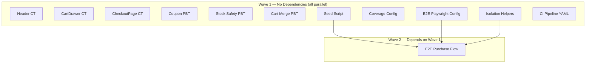

# Design Document: Testing Expansion

## Overview

This design expands the test suite for the white-label e-commerce monorepo with three parallel tracks:

1. **Component Tests** — Playwright CT tests for Header, CartDrawer, and CheckoutPage rendered in a real browser
2. **Property-Based Tests** — fast-check PBT for coupon discount calculation, stock decrement safety, and cart merge idempotency
3. **E2E + Infrastructure** — Full purchase flow browser test, test data seeding, coverage reporting, parallel isolation helpers, GitHub Actions CI, and E2E Playwright config

All deliverables are designed for maximum parallelism — each test file, script, and config can be implemented independently with minimal cross-dependencies.

## Architecture

```
ecommerce-latest/
├── .github/workflows/test.yml                    # CI pipeline
├── scripts/seed-test-data.ts                     # Idempotent DB seeder
├── vitest.workspace.ts                           # Updated workspace (add env-test project)
├── artifacts/
│   ├── api-server/
│   │   ├── vitest.config.ts                      # Updated: coverage config
│   │   └── tests/
│   │       ├── helpers/
│   │       │   └── isolation.ts                  # Phone/session ID generators
│   │       ├── coupon-calc.property.test.ts      # Coupon PBT
│   │       ├── stock-safety.property.test.ts     # Stock PBT
│   │       └── cart-merge.property.test.ts       # Cart merge PBT
│   └── store/
│       ├── playwright.config.ts                  # E2E config (separate from CT)
│       ├── playwright-ct.config.ts               # Existing CT config
│       └── tests/
│           ├── components/
│           │   ├── Header.spec.tsx               # Header CT
│           │   ├── CartDrawer.spec.tsx           # CartDrawer CT
│           │   └── CheckoutPage.spec.tsx         # CheckoutPage CT
│           └── e2e/
│               └── purchase-flow.spec.ts         # E2E happy path
```

### Dependency Graph (Parallel Waves)



Wave 1 contains 11 independent tasks. Only the E2E purchase flow test (Wave 2) depends on the seed script, E2E config, and isolation helpers being in place first.

## Components and Interfaces

### 1. Coupon Discount Calculator (Extracted Pure Function)

The coupon discount logic currently lives inline in `routes/coupons.ts`. For property testing, we extract a pure function:

```typescript
// artifacts/api-server/src/lib/coupon-calc.ts

export interface Coupon {
  discount_type: "percentage" | "fixed";
  discount_value: number;
  min_order_amount: number | null;
}

export interface DiscountResult {
  ok: true;
  discount_amount: number;
} | {
  ok: false;
  error: string;
}

export function calculateDiscount(coupon: Coupon, subtotal: number): DiscountResult {
  if (coupon.min_order_amount != null && subtotal < coupon.min_order_amount) {
    return { ok: false, error: `Minimum order amount of ${coupon.min_order_amount} AZN required` };
  }

  let discount: number;
  if (coupon.discount_type === "percentage") {
    discount = (subtotal * coupon.discount_value) / 100;
  } else {
    discount = coupon.discount_value;
  }

  discount = Math.min(discount, subtotal);
  discount = Math.round(discount * 100) / 100;

  return { ok: true, discount_amount: discount };
}
```

### 2. Stock Decrement Model (For Property Testing)

The actual `decrement_stock_safe` is a Postgres RPC function. For PBT, we model its expected behavior in TypeScript:

```typescript
// artifacts/api-server/tests/helpers/stock-model.ts

export class StockModel {
  private stock: number;

  constructor(initialStock: number) {
    this.stock = initialStock;
  }

  decrement(qty: number): { ok: boolean; remaining: number } {
    if (qty > this.stock) {
      return { ok: false, remaining: this.stock };
    }
    this.stock -= qty;
    return { ok: true, remaining: this.stock };
  }

  get current(): number {
    return this.stock;
  }
}
```

### 3. Cart Merge Logic (Extracted Pure Function)

Extract the merge logic from the route handler into a testable pure function:

```typescript
// artifacts/api-server/src/lib/cart-merge.ts

export interface CartEntry {
  product_id: string;
  quantity: number;
}

export interface MergeResult {
  mergedCart: CartEntry[];
  itemsMerged: number;
}

const MAX_QUANTITY = 99;

export function mergeGuestCart(
  userCart: CartEntry[],
  guestCart: CartEntry[],
): MergeResult {
  const result = new Map<string, number>(
    userCart.map((item) => [item.product_id, item.quantity])
  );

  let itemsMerged = 0;

  for (const guestItem of guestCart) {
    const existing = result.get(guestItem.product_id) ?? 0;
    result.set(
      guestItem.product_id,
      Math.min(existing + guestItem.quantity, MAX_QUANTITY)
    );
    itemsMerged++;
  }

  return {
    mergedCart: Array.from(result.entries()).map(([product_id, quantity]) => ({
      product_id,
      quantity,
    })),
    itemsMerged,
  };
}
```

### 4. Test Isolation Helpers

```typescript
// artifacts/api-server/tests/helpers/isolation.ts

export function generatePhone(workerId?: number): string {
  const id = workerId ?? (process.pid ^ Math.floor(Math.random() * 10000));
  const workerPart = String(id % 1000).padStart(3, "0");
  const randomPart = String(Math.floor(Math.random() * 10000)).padStart(4, "0");
  return `+99450${workerPart}${randomPart}`;
}

export function generateSessionId(workerId?: number): string {
  const id = workerId ?? process.pid;
  const timestamp = Date.now().toString(36);
  const random = Math.random().toString(36).slice(2, 14);
  return `sess_w${id}_${timestamp}_${random}`;
  // Length: "sess_w" (6) + id digits (1-5) + "_" (1) + timestamp (~8) + "_" (1) + random (12) = 29-33 base
  // Ensure minimum 36 chars by padding
}
```

### 5. Seed Script

```typescript
// scripts/seed-test-data.ts
// Uses @supabase/supabase-js with service role key
// Upserts: 3+ products (test- prefix slugs), 2 categories (test- prefix), 2 coupons (TEST_ prefix)
// Idempotent via ON CONFLICT on slug/code columns
```

### 6. E2E Playwright Config

```typescript
// artifacts/store/playwright.config.ts
import { defineConfig } from "@playwright/test";

export default defineConfig({
  testDir: "./tests/e2e",
  outputDir: "./test-results",
  use: {
    baseURL: "http://localhost:3000",
    trace: "on-first-retry",
  },
  projects: [{ name: "chromium", use: { browserName: "chromium" } }],
  webServer: {
    command: "pnpm --filter @workspace/store run dev",
    url: "http://localhost:3000",
    timeout: 30_000,
    reuseExistingServer: true,
  },
});
```

### 7. Coverage Configuration

Update `artifacts/api-server/vitest.config.ts` to add coverage settings:

```typescript
coverage: {
  provider: "v8",
  reporter: ["lcov", "text"],
  reportsDirectory: "./coverage",
  include: ["src/routes/**"],
  exclude: ["**/*.test.ts", "**/setup.ts", "**/helpers/**", "**/*.d.ts"],
  thresholds: {
    perFile: true,
    lines: 80,
  },
}
```

### 8. GitHub Actions CI Pipeline

```yaml
# .github/workflows/test.yml
name: Test
on:
  push: { branches: [main] }
  pull_request: { branches: [main] }
jobs:
  test:
    runs-on: ubuntu-latest
    timeout-minutes: 15
    steps:
      - uses: actions/checkout@v4
      - uses: pnpm/action-setup@v4
      - uses: actions/setup-node@v4
        with: { node-version: 20, cache: pnpm }
      - run: pnpm install --frozen-lockfile
      - run: pnpm exec playwright install --with-deps
      - run: pnpm run seed:test
      - run: pnpm --filter @workspace/api-server run start &
      - run: # wait for health endpoint
      - run: pnpm test
```

### Interfaces

| Module | Export | Signature | Purpose |
|--------|--------|-----------|---------|
| `lib/coupon-calc.ts` | `calculateDiscount` | `(coupon: Coupon, subtotal: number) => DiscountResult` | Pure discount calculation |
| `lib/cart-merge.ts` | `mergeGuestCart` | `(userCart: CartEntry[], guestCart: CartEntry[]) => MergeResult` | Pure cart merge logic |
| `tests/helpers/isolation.ts` | `generatePhone` | `(workerId?: number) => string` | Unique phone per worker |
| `tests/helpers/isolation.ts` | `generateSessionId` | `(workerId?: number) => string` | Unique session ID per worker |
| `tests/helpers/stock-model.ts` | `StockModel` | `class` | In-memory stock model for PBT |

## Data Models

No new persistent tables are introduced. The seed script populates existing tables:

| Table | Seed Data | Key Column |
|-------|-----------|-----------|
| `products` | 3+ products with `test-` slug prefix, stock ≥ 10 | `slug` (upsert key) |
| `product_translations` | At least 1 translation per product (lang_code: `en`) | `product_id` + `lang_code` |
| `categories` | 2 categories with `test-` slug prefix | `slug` (upsert key) |
| `product_categories` | Link products to categories | `product_id` + `category_id` |
| `coupons` | 2 coupons: `TEST_10PCT` (10% off) and `TEST_5AZN` (5 AZN fixed) | `code` (upsert key) |

### CartItem Interface (used in CT tests)

```typescript
interface CartItem {
  product_id: string;
  slug: string;
  title: string;
  price: number;
  image: string | null;
  quantity: number;
}
```

### Coupon Interface (used in PBT)

```typescript
interface Coupon {
  discount_type: "percentage" | "fixed";
  discount_value: number;
  min_order_amount: number | null;
}
```

## Correctness Properties

*A property is a characteristic or behavior that should hold true across all valid executions of a system — essentially, a formal statement about what the system should do. Properties serve as the bridge between human-readable specifications and machine-verifiable correctness guarantees.*

### Property 1: Percentage discount matches model formula

*For any* percentage value in the range (0, 100] and any subtotal in the range [0.01, 99,999,999.99] with no min_order_amount constraint, the `calculateDiscount` function SHALL produce a discount equal to `round((subtotal × percentage) / 100, 2)`.

**Validates: Requirements 4.2, 4.6**

### Property 2: Fixed discount is capped at subtotal

*For any* fixed-amount coupon with discount_value in the range (0, 99,999,999.99] and any subtotal in the range [0.01, 99,999,999.99] with no min_order_amount constraint, the `calculateDiscount` function SHALL produce a discount equal to `min(discount_value, subtotal)`.

**Validates: Requirements 4.3**

### Property 3: Discount never exceeds subtotal (safety invariant)

*For any* coupon of either type (percentage or fixed) with any valid discount_value and any subtotal in [0.01, 99,999,999.99], the `calculateDiscount` function SHALL produce a discount_amount that satisfies `0 ≤ discount_amount ≤ subtotal`.

**Validates: Requirements 4.7**

### Property 4: Below min_order_amount produces error

*For any* coupon with a min_order_amount > 0 and any subtotal strictly less than that min_order_amount, the `calculateDiscount` function SHALL return `{ ok: false }` with an error message containing the min_order_amount value.

**Validates: Requirements 4.4**

### Property 5: At min_order_amount boundary, coupon is accepted

*For any* coupon with a min_order_amount > 0 and subtotal set exactly equal to min_order_amount, the `calculateDiscount` function SHALL return `{ ok: true }` with a valid discount_amount.

**Validates: Requirements 4.5**

### Property 6: Stock decrement reduces by exact quantity

*For any* initial stock in [1, 1000] and any decrement quantity in [1, initial_stock], the stock model SHALL produce a remaining value equal to `initial_stock - quantity`.

**Validates: Requirements 5.3**

### Property 7: Zero stock rejects all decrements

*For any* decrement quantity ≥ 1 applied to a product with zero stock, the stock model SHALL raise an error and leave stock unchanged at zero.

**Validates: Requirements 5.4**

### Property 8: Stock never goes negative under any operation sequence

*For any* initial stock in [0, 1000] and any sequence of 1 to 20 decrement operations (each with quantity in [1, 100]), after applying the full sequence (skipping operations that would go negative), the stock SHALL remain ≥ 0 at every intermediate step.

**Validates: Requirements 5.2, 5.5**

### Property 9: Disjoint guest cart merge preserves quantities

*For any* user cart and guest cart with completely disjoint product_id sets (each with 1-10 items, quantities in [1, 50]), merging the guest cart into the user cart SHALL produce a result containing every product from both carts with their original quantities unchanged.

**Validates: Requirements 6.2, 6.5**

### Property 10: Overlapping merge is additive with cap at 99

*For any* user cart and guest cart sharing at least one product_id (quantities in [1, 50] each), the merged cart SHALL contain each overlapping product with quantity equal to `min(user_qty + guest_qty, 99)`.

**Validates: Requirements 6.3**

### Property 11: Cart merge is idempotent

*For any* user cart and guest cart, applying the merge once and then applying the same merge again (with guest cart now empty since items were consumed) SHALL produce the same final cart state, with the second merge reporting zero items merged.

**Validates: Requirements 6.4**

### Property 12: Generated phone numbers match validation format

*For any* worker ID in [0, 31] and any invocation count, `generatePhone(workerId)` SHALL return a 13-character string matching the regex `^\+99450\d{7}$` that passes the OTP verify endpoint's phone validation.

**Validates: Requirements 10.1, 10.5**

### Property 13: Generated session IDs have valid length

*For any* worker ID in [0, 31], `generateSessionId(workerId)` SHALL return a string with length between 36 and 64 characters inclusive.

**Validates: Requirements 10.2**

### Property 14: No collisions across workers

*For any* set of up to 32 distinct worker IDs, generating 10,000 phone numbers per worker SHALL produce no duplicate values across the entire set. Same applies to session IDs.

**Validates: Requirements 10.3**

## Error Handling

### Coupon Calculation Errors

| Condition | Behavior |
|-----------|----------|
| Subtotal below `min_order_amount` | Return `{ ok: false, error: "Minimum order amount..." }` |
| Invalid discount_type | TypeScript compiler prevents (discriminated union) |
| Negative subtotal | Not in valid input range; caller validates |

### Stock Decrement Errors

| Condition | Behavior |
|-----------|----------|
| Quantity > available stock | RPC raises exception; model returns `{ ok: false }` |
| Zero stock with any positive quantity | RPC raises exception |
| Concurrent race condition | Postgres `WHERE stock >= qty` guard; rollback order if race detected |

### Seed Script Errors

| Condition | Behavior |
|-----------|----------|
| Missing `SUPABASE_URL` | Exit code 1, stderr: "Missing SUPABASE_URL" |
| Missing `SUPABASE_SERVICE_ROLE_KEY` | Exit code 1, stderr: "Missing SUPABASE_SERVICE_ROLE_KEY" |
| Database connection failure | Exit code 1, log error details |
| Upsert conflict (expected) | Handled by ON CONFLICT — idempotent |

### E2E Test Errors

| Condition | Behavior |
|-----------|----------|
| API server not responding | Playwright webServer config retries for 30s, then test fails |
| Product not found (seed missing) | Test fails with descriptive assertion error |
| Auth flow failure | Test fails at authentication step with clear message |
| Timeout (> 60s) | Playwright test timeout fires, marks test as timed out |

### CI Pipeline Errors

| Condition | Behavior |
|-----------|----------|
| pnpm install failure | Job fails at install step |
| Seed script failure | Job fails before test execution |
| API server doesn't start | Health check loop times out after 30s, job fails |
| Any test failure | `pnpm test` exits non-zero, workflow marked failed |
| Workflow exceeds 15 minutes | GitHub Actions cancels the run |

## Testing Strategy

### Test Organization

| Suite | Runner | Location | Trigger |
|-------|--------|----------|---------|
| Component Tests | Playwright CT via Vitest | `artifacts/store/tests/components/` | `pnpm test` |
| Property Tests | Vitest + fast-check | `artifacts/api-server/tests/*.property.test.ts` | `pnpm test` |
| E2E Tests | Playwright (full browser) | `artifacts/store/tests/e2e/` | Separate `pnpm --filter @workspace/store run test:e2e` |
| Integration Tests | Vitest | `artifacts/api-server/tests/*.test.ts` | `pnpm test` |

### Property-Based Testing Configuration

- **Library**: fast-check (already installed in `@workspace/api-server`)
- **Minimum iterations**: 100 per property test (`{ numRuns: 100 }`)
- **Tag format**: Comment above each test with `Feature: testing-expansion, Property N: <title>`
- **Single test per property**: Each correctness property maps to exactly one `it(...)` block
- **Extracted pure functions**: Coupon calc and cart merge logic extracted into `src/lib/` for direct import in tests without HTTP overhead

### Unit Tests (Example-Based)

Component tests and E2E tests use example-based assertions:
- **Header CT**: Verify specific elements at specific viewports (desktop nav, mobile toggle)
- **CartDrawer CT**: Verify item rendering, remove, increment, empty state
- **CheckoutPage CT**: Verify line totals, form validation attributes, field visibility
- **E2E Purchase Flow**: Single happy-path scenario with seeded data

### Coverage

- **Provider**: v8 (built into Vitest)
- **Threshold**: 80% line coverage per-file for `src/routes/**`
- **Reports**: lcov + text summary in `artifacts/api-server/coverage/`
- **CI integration**: `pnpm test --coverage` in CI pipeline

### Parallel Execution Strategy

All test files are independent. The Vitest workspace runs API integration tests and store CT tests in parallel. E2E tests run separately via their own Playwright config. The isolation helpers ensure no collisions between parallel workers by generating unique phone numbers and session IDs per worker.
