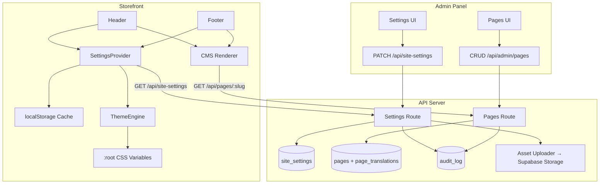

# Design Document: White-Label Customization

## Overview

This design transforms the existing single-store e-commerce platform into a white-label product. The architecture introduces a `site_settings` single-row table and a CMS (`pages` + `page_translations`) as the configuration backbone. A new `SettingsProvider` React context distributes runtime settings to the storefront using a stale-while-revalidate caching strategy. The admin panel gains dedicated UI for branding, typography, contact info, and page management.

**Key design decisions:**
- **Single-row settings pattern** — One `site_settings` row holds all branding/contact/theme config. Simpler than key-value stores for atomic reads and typed validation.
- **Stale-while-revalidate over WebSocket push** — localStorage cache with background refresh balances instant loads against freshness, without requiring persistent connections.
- **CSS custom properties for theming** — Allows runtime color/font changes without rebuilding Tailwind classes or triggering full reloads.
- **HTML sanitization server-side** — DOMPurify on the API server ensures stored content is always safe, regardless of client behavior.
- **Separate `pages` + `page_translations` tables** — Follows the existing translation pattern (product_translations, category_translations) for consistency.

## Architecture



**Data flow:**
1. Admin saves settings → API validates + persists → `updated_at` bumped
2. Storefront loads → SettingsProvider reads localStorage (instant) → background fetches fresh settings
3. If server `updated_at` > cached `updated_at` → update cache + re-apply theme
4. ThemeEngine writes CSS custom properties to `:root` → Tailwind references them via `var(--primary)` etc.

## Components and Interfaces

### API Routes (Express 5)

#### Settings Routes (`routes/site-settings.ts`)

| Method | Path | Auth | Description |
|--------|------|------|-------------|
| `GET` | `/api/site-settings` | Public | Returns full `site_settings` row or defaults |
| `PATCH` | `/api/site-settings` | Admin | Partial update with validation |
| `POST` | `/api/site-settings/upload/logo` | Admin | Upload logo image |
| `POST` | `/api/site-settings/upload/favicon` | Admin | Upload favicon image |

#### Pages Routes (`routes/pages.ts`)

| Method | Path | Auth | Description |
|--------|------|------|-------------|
| `GET` | `/api/pages` | Public | List published pages (with nav flags) |
| `GET` | `/api/pages/:slug` | Public | Get page + translation for locale |
| `GET` | `/api/admin/pages` | Admin | List all pages (including drafts) |
| `POST` | `/api/admin/pages` | Admin | Create page |
| `PATCH` | `/api/admin/pages/:id` | Admin | Update page metadata |
| `DELETE` | `/api/admin/pages/:id` | Admin | Delete non-system page |
| `PUT` | `/api/admin/pages/:id/translations/:locale` | Admin | Upsert page translation |

### Frontend Components

#### `SettingsProvider` (`lib/settings/context.tsx`)

```typescript
interface SiteSettings {
  id: string;
  store_name: Record<string, string>;      // { az, ru, en }
  colors: ColorPalette;
  fonts: FontConfig;
  logo_url: string | null;
  favicon_url: string | null;
  contact: ContactInfo;
  working_hours: Record<string, string>;
  footer_text: Record<string, string>;
  updated_at: string;
}

interface ColorPalette {
  primary: string;    // HSL: "220 70% 50%"
  secondary: string;
  accent: string;
  background: string;
  text: string;
  muted: string;
}

interface FontConfig {
  heading: string;    // Font family name
  body: string;
}

interface ContactInfo {
  phone: string;
  email: string;
  address: string;
  social_links: {
    instagram?: string;
    facebook?: string;
    telegram?: string;
  };
}
```

**Provider behavior:**
1. On mount: read `site_settings` from localStorage → provide immediately
2. Fire background fetch to `/api/site-settings`
3. Compare `updated_at` timestamps → update cache if server is newer
4. Expose `settings` object + `getStoreName(locale)` helper

#### `ThemeEngine` (`lib/settings/theme-engine.ts`)

Pure module (no React) that:
- Receives a `ColorPalette` and `FontConfig`
- Validates HSL ranges before applying
- Sets CSS custom properties on `document.documentElement`
- Manages Google Fonts `<link>` injection/cleanup
- Falls back to system fonts on load failure (3-second timeout)

#### `CmsRenderer` (`pages/storefront/CmsPage.tsx`)

- Fetches page by slug + locale from `/api/pages/:slug?locale=xx`
- Renders sanitized HTML in a prose-styled container
- Handles 404/error states
- Sets document `<title>`, `<meta>`, `<link rel="canonical">`, and hreflang tags

### Admin Pages

#### `SettingsPage` (enhanced at `/admin/settings`)

Three-tab layout:
1. **Branding** — Color pickers (hex input → HSL conversion), logo/favicon upload
2. **Identity & Contact** — Store name (3 locale inputs), phone, email, address, social links, working hours, footer text
3. **Typography** — Font dropdowns (curated 10-30 Google Fonts list)

#### `PagesPage` (`/admin/pages`)

- Table listing all pages with title, slug, status badge, nav flags
- System page badge + delete protection
- Sort order drag/manual edit
- Published toggle with immediate API call

#### `PageEditorPage` (`/admin/pages/:id/edit`)

- TipTap editor with locale tabs (az/ru/en)
- SEO fields: `meta_title`, `meta_description`
- Navigation toggle switches: `show_in_header`, `show_in_footer`

## Data Models

### `site_settings` table

```sql
CREATE TABLE site_settings (
  id UUID PRIMARY KEY DEFAULT gen_random_uuid(),
  store_name JSONB NOT NULL DEFAULT '{"az":"","ru":"","en":""}',
  colors JSONB NOT NULL DEFAULT '{"primary":"220 70% 50%","secondary":"220 20% 20%","accent":"45 93% 47%","background":"0 0% 100%","text":"220 20% 10%","muted":"220 10% 60%"}',
  fonts JSONB NOT NULL DEFAULT '{"heading":"Inter","body":"Inter"}',
  logo_url TEXT,
  favicon_url TEXT,
  contact JSONB NOT NULL DEFAULT '{"phone":"","email":"","address":"","social_links":{}}',
  working_hours JSONB NOT NULL DEFAULT '{"az":"","ru":"","en":""}',
  footer_text JSONB NOT NULL DEFAULT '{"az":"","ru":"","en":""}',
  created_at TIMESTAMPTZ NOT NULL DEFAULT now(),
  updated_at TIMESTAMPTZ NOT NULL DEFAULT now()
);

-- Ensure single-row: constraint + seed
ALTER TABLE site_settings ADD CONSTRAINT single_row CHECK (id = '00000000-0000-0000-0000-000000000001');
INSERT INTO site_settings (id) VALUES ('00000000-0000-0000-0000-000000000001');

-- RLS: public read, service role write
ALTER TABLE site_settings ENABLE ROW LEVEL SECURITY;
CREATE POLICY "public_read" ON site_settings FOR SELECT USING (true);
```

### `pages` table

```sql
CREATE TABLE pages (
  id UUID PRIMARY KEY DEFAULT gen_random_uuid(),
  slug VARCHAR(100) NOT NULL UNIQUE,
  is_system BOOLEAN NOT NULL DEFAULT false,
  published BOOLEAN NOT NULL DEFAULT false,
  show_in_header BOOLEAN NOT NULL DEFAULT false,
  show_in_footer BOOLEAN NOT NULL DEFAULT false,
  sort_order INTEGER NOT NULL DEFAULT 0 CHECK (sort_order >= 0 AND sort_order <= 999),
  created_at TIMESTAMPTZ NOT NULL DEFAULT now(),
  updated_at TIMESTAMPTZ NOT NULL DEFAULT now()
);

-- Slug format constraint
ALTER TABLE pages ADD CONSTRAINT valid_slug CHECK (slug ~ '^[a-z0-9]+(?:-[a-z0-9]+)*$');

-- Pre-seed system pages
INSERT INTO pages (slug, is_system, published, show_in_footer, sort_order) VALUES
  ('delivery', true, true, true, 0),
  ('returns', true, true, true, 1),
  ('terms', true, true, true, 2);

ALTER TABLE pages ENABLE ROW LEVEL SECURITY;
CREATE POLICY "public_read_published" ON pages FOR SELECT USING (published = true);
```

### `page_translations` table

```sql
CREATE TABLE page_translations (
  id UUID PRIMARY KEY DEFAULT gen_random_uuid(),
  page_id UUID NOT NULL REFERENCES pages(id) ON DELETE CASCADE,
  locale VARCHAR(2) NOT NULL CHECK (locale IN ('az', 'ru', 'en')),
  title VARCHAR(200) NOT NULL,
  content TEXT NOT NULL DEFAULT '',
  meta_title VARCHAR(160),
  meta_description VARCHAR(500),
  created_at TIMESTAMPTZ NOT NULL DEFAULT now(),
  updated_at TIMESTAMPTZ NOT NULL DEFAULT now(),
  UNIQUE (page_id, locale)
);

ALTER TABLE page_translations ENABLE ROW LEVEL SECURITY;
CREATE POLICY "public_read" ON page_translations FOR SELECT USING (true);
```

### `site-assets` Storage Bucket

- Bucket name: `site-assets`
- Public: `true` (CDN-served)
- File structure: `logos/{timestamp}-{random}.{ext}`, `favicons/{timestamp}-{random}.{ext}`
- Max file size: 5 MB (enforced in application layer before upload)

## Correctness Properties

*A property is a characteristic or behavior that should hold true across all valid executions of a system — essentially, a formal statement about what the system should do. Properties serve as the bridge between human-readable specifications and machine-verifiable correctness guarantees.*

### Property 1: Partial update preserves unmodified fields

*For any* valid `site_settings` state and *for any* subset of recognized fields in a PATCH request, the resulting stored settings SHALL contain the updated values for submitted fields and the original values for all other fields.

**Validates: Requirements 1.2, 1.8**

### Property 2: Settings validation accepts only well-formed color palettes

*For any* JSONB object submitted as `colors`, the Settings_Service SHALL accept it if and only if it contains exactly the keys `primary`, `secondary`, `accent`, `background`, `text`, `muted`, each as a string matching the HSL format `H S% L%` where H ∈ [0, 360], S ∈ [0, 100], L ∈ [0, 100].

**Validates: Requirements 1.4, 1.6**

### Property 3: Settings validation accepts only well-formed font configurations

*For any* JSONB object submitted as `fonts`, the Settings_Service SHALL accept it if and only if it contains exactly the keys `heading` and `body`, each as a non-empty string of at most 100 characters.

**Validates: Requirements 1.5, 1.6**

### Property 4: Invalid settings mutations do not alter stored state

*For any* PATCH request that fails validation, the stored `site_settings` row SHALL remain identical to its state before the request.

**Validates: Requirements 1.6**

### Property 5: All admin mutations produce audit log entries

*For any* successful admin write operation (settings update, page create/update/delete), an `audit_log` row SHALL be created with the correct `actor_id`, `action`, `entity`, `entity_id`, and `changes` fields.

**Validates: Requirements 1.7, 6.7**

### Property 6: Cache freshness comparison

*For any* pair of cached settings (with `updated_at` = T_cached) and fetched settings (with `updated_at` = T_server), the SettingsProvider SHALL replace the cache if and only if T_server > T_cached.

**Validates: Requirements 2.3, 2.5, 13.2**

### Property 7: Theme engine validates HSL ranges before applying

*For any* color palette containing an HSL value with hue outside [0, 360] or saturation/lightness outside [0, 100], the ThemeEngine SHALL retain the previously applied CSS custom property values for those colors.

**Validates: Requirements 3.6**

### Property 8: Upload validation rejects files outside constraints

*For any* uploaded file, the Asset_Uploader SHALL accept it if and only if: (a) file size ≤ 5 MB, (b) MIME type determined from header bytes is one of image/jpeg, image/png, image/webp, image/avif, and (c) dimensions satisfy the target constraints (logo: ≤ 1024×1024, favicon: 16×16 to 512×512).

**Validates: Requirements 4.1, 4.2, 4.4, 10.1, 10.2, 10.3**

### Property 9: Generated filenames are unique and well-formed

*For any* set of N upload operations, the generated filenames SHALL all be distinct and each SHALL match the pattern `{category}/{timestamp}-{alphanumeric8+}.{ext}`.

**Validates: Requirements 10.4**

### Property 10: Locale fallback chain for store name

*For any* locale and *for any* `store_name` JSONB configuration, the resolved display name SHALL be: the value at the active locale key if non-empty, else the value at the `az` key if non-empty, else the literal string `"Store"`.

**Validates: Requirements 5.4, 5.5**

### Property 11: Social links rendering filter

*For any* `contact.social_links` object, the storefront SHALL render only those entries whose URL value is a non-empty string beginning with `https://`.

**Validates: Requirements 5.3**

### Property 12: Contact field omission

*For any* contact settings object, the Footer SHALL render a contact field (phone, email, address) if and only if its value is a non-null, non-empty string.

**Validates: Requirements 5.8**

### Property 13: CMS slug validation

*For any* string submitted as a page slug, the CMS_Service SHALL accept it if and only if it matches `^[a-z0-9]+(?:-[a-z0-9]+)*$` and has length ≤ 100 characters.

**Validates: Requirements 6.4**

### Property 14: System pages cannot be deleted

*For any* page where `is_system` is `true`, a DELETE request SHALL be rejected with an error response.

**Validates: Requirements 6.3**

### Property 15: Slug uniqueness enforcement

*For any* page create or update operation, if the submitted slug already exists on a different page, the CMS_Service SHALL reject the request.

**Validates: Requirements 6.5**

### Property 16: HTML sanitization preserves only safe elements

*For any* HTML string submitted as page content, the sanitized output SHALL contain only the elements `p`, `h2`, `h3`, `h4`, `strong`, `em`, `ul`, `ol`, `li`, `a`, `img`, `br`, `blockquote` with only safe attributes (`href` on `a`, `src` and `alt` on `img`), and no `<script>`, event handlers, or `<iframe>` elements.

**Validates: Requirements 7.3**

### Property 17: Page translation locale fallback

*For any* page and active locale, the CMS_Renderer SHALL display the translation for the active locale if it exists, else the `az` locale translation if it exists, else a "content not available" message.

**Validates: Requirements 7.5**

### Property 18: Navigation links show only qualifying pages in sort order

*For any* set of pages, the Header/Footer navigation SHALL include exactly those pages where `published = true` AND the respective `show_in_header`/`show_in_footer` flag is `true`, ordered by `sort_order` ascending.

**Validates: Requirements 8.6, 8.7**

### Property 19: Page visibility determines response

*For any* page request by slug, the public endpoint SHALL return the page content if and only if the page exists AND `published = true` AND a translation exists for the resolved locale (after fallback). Otherwise it SHALL return 404.

**Validates: Requirements 8.4**

### Property 20: Hreflang tags match existing translations

*For any* rendered CMS page, the set of `<link rel="alternate" hreflang>` tags SHALL correspond exactly to the set of locales for which a `page_translations` record exists for that page.

**Validates: Requirements 9.5**

### Property 21: Client-side settings validation

*For any* admin settings form submission, the client SHALL reject values where: email does not match standard email format, URLs do not start with `https://`, phone contains characters other than digits and `+`, or text fields exceed their maximum character limits.

**Validates: Requirements 11.7**

## Error Handling

| Scenario | Behavior |
|----------|----------|
| Settings fetch fails on first load (no cache) | Display hardcoded defaults (white bg, black text, sans-serif) |
| Settings fetch fails with stale cache (< 24h) | Continue using cached settings silently |
| Settings fetch fails with very old cache (> 24h) | Fall back to hardcoded defaults |
| Settings PATCH validation failure | Return 400 with field-level error details; no state change |
| Image upload exceeds size | Return 413 with size limit message |
| Image upload wrong MIME type | Return 415 with supported types message |
| CMS page not found / unpublished | Return 404 (public endpoint) |
| CMS page fetch network error | Show error message with retry button |
| Google Font load failure (3s timeout) | Fall back to system font stack |
| Delete system page attempt | Return 400 with "system pages cannot be deleted" |
| Duplicate slug on page create/update | Return 409 with "slug already in use" |
| Old asset deletion fails after new upload | Log warning, return success for new upload |
| Admin save network failure | Show error toast, preserve form state |

## Testing Strategy

### Unit Tests (Example-Based)

- Settings API: default response when no row exists, successful PATCH, 400 on invalid colors
- SettingsProvider: localStorage hydration, background fetch trigger, fallback to defaults
- ThemeEngine: CSS property injection, font link management, fallback on timeout
- CmsRenderer: loading state, HTML rendering, 404 handling, SEO tag injection
- Asset upload: format/size/dimension edge cases
- Admin forms: field validation, save flow, error display

### Property-Based Tests (fast-check)

**Library:** [fast-check](https://github.com/dubzzz/fast-check) (TypeScript PBT library, already compatible with Vitest)

**Configuration:** Minimum 100 iterations per property. Each test tagged with:
```
Feature: white-label-customization, Property {N}: {title}
```

Properties to implement:
1. Partial update field preservation (Property 1)
2. Color palette validation (Property 2)
3. Font config validation (Property 3)
4. Invalid mutation state preservation (Property 4)
5. Cache freshness comparison (Property 6)
6. HSL range validation in ThemeEngine (Property 7)
7. Upload validation (Property 8)
8. Filename uniqueness (Property 9)
9. Locale fallback chain (Property 10)
10. Social links filter (Property 11)
11. Contact field omission (Property 12)
12. Slug pattern validation (Property 13)
13. System page delete protection (Property 14)
14. Slug uniqueness (Property 15)
15. HTML sanitization (Property 16)
16. Translation locale fallback (Property 17)
17. Navigation link filtering + ordering (Property 18)
18. Page visibility logic (Property 19)
19. Hreflang tag correspondence (Property 20)
20. Client-side form validation (Property 21)

### Integration Tests

- Full settings CRUD flow with Supabase (audit log verification)
- Image upload → storage → settings URL update
- CMS page lifecycle: create → translate → publish → render on storefront
- Cache invalidation: update settings → verify storefront picks up changes within TTL

### Smoke Tests

- Database seed: verify `site_settings` row exists after init
- System pages seeded: verify `delivery`, `returns`, `terms` exist
- `site-assets` bucket exists and is public
